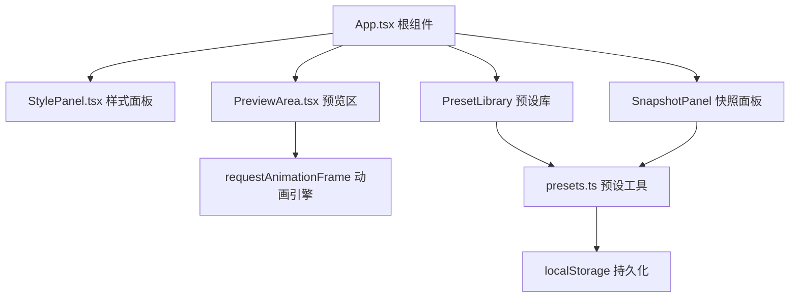

## 1. 架构设计



## 2. 技术说明

- **前端**：React 18 + TypeScript + Vite 5
- **状态管理**：React useState/useCallback（轻量级，无需额外库）
- **动画引擎**：requestAnimationFrame 原生API
- **数据持久化**：localStorage（预设和快照）
- **截图**：HTMLCanvasElement + toDataURL
- **依赖**：uuid（生成唯一ID）、lodash（工具函数）

## 3. 核心类型定义

```typescript
// 弹幕样式配置
interface DanmakuStyle {
  // 文本样式
  fontFamily: string;
  fontSize: number;      // 12-48
  color: string;         // #ff6b6b
  fontWeight: 'normal' | 'bold';
  fontStyle: 'normal' | 'italic';
  textShadow: boolean;
  
  // 弹幕行为
  speed: number;         // 1-10
  duration: number;      // 0.5-5s
  direction: 'left' | 'right' | 'up' | 'down' | 'random';
  
  // 轨迹
  verticalMode: 'auto' | 'fixed';
  verticalOffset: number; // -100 to 100
  randomOffset: boolean;
  
  // 背景特效
  backgroundEffect: 'none' | 'sweep' | 'gradient' | 'particle';
  sweepColor: string;
  gradientAngle: number;  // 0-360
  
  // 边界
  showBorder: boolean;
  borderColor: string;
  borderWidth: number;    // 1-4
}

// 预设模板
interface Preset {
  id: string;
  name: string;
  tag?: '热门' | '新';
  isCustom: boolean;
  style: DanmakuStyle;
  previewColor: string;
}

// 快照
interface Snapshot {
  id: string;
  timestamp: number;
  style: DanmakuStyle;
  thumbnail: string; // base64
}

// 弹幕实例
interface Danmaku {
  id: string;
  text: string;
  style: DanmakuStyle;
  x: number;
  y: number;
  createdAt: number;
}
```

## 4. 文件结构

```
├── package.json
├── index.html
├── tsconfig.json
├── vite.config.js
└── src/
    ├── App.tsx              # 根组件，状态管理，整体布局
    ├── components/
    │   ├── StylePanel.tsx   # 左侧参数面板
    │   └── PreviewArea.tsx  # 中央预览区 + 快照面板
    └── utils/
        └── presets.ts       # 预设数据和localStorage工具
```

## 5. 性能要求

- 同时显示20条弹幕时FPS ≥ 55
- 样式参数调整到生效延迟 ≤ 16ms
- 使用requestAnimationFrame而非setInterval驱动动画
- 弹幕移出屏幕后立即从DOM和内存中清除
