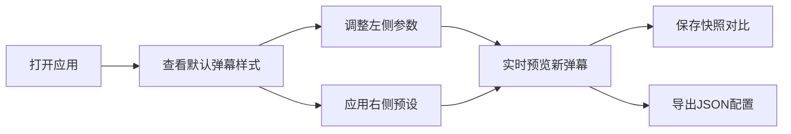

## 1. 产品概述

弹幕样式设计器是一款面向独立游戏主播和小型直播团队的浏览器端工具，旨在快速生成、编辑并预览直播间的动态弹幕互动样式模板。

- 解决主播在直播时手动调整弹幕颜色、大小、速度、进出动画和背景特效时效率低下、无法实时预览对比不同方案效果的问题
- 让弹幕样式设计像更换主题皮肤一样直观高效，提升直播间视觉品质和观众互动体验

## 2. 核心功能

### 2.1 功能模块

1. **样式参数面板**：文本样式、弹幕行为、轨迹、背景特效、边界五大可折叠控制区
2. **实时弹幕预览区**：弹幕动画渲染、FPS计数、手动/自动弹幕生成
3. **预设样式库**：内置6+预设模板、自定义预设保存/删除、localStorage持久化
4. **快照对比系统**：参数快照保存、缩略图展示、回放对比、配置导出JSON

### 2.2 页面详情

| 页面名称 | 模块名称 | 功能描述 |
|-----------|-------------|---------------------|
| 主界面 | 样式参数面板 | 280px宽深色面板，包含5个可折叠控制区，参数变更即时通知父组件 |
| 主界面 | 实时预览区 | 中央区域弹幕动画渲染，requestAnimationFrame驱动，支持手动/自动弹幕模式 |
| 主界面 | 预设样式库 | 240px宽预设卡片展示，内置6个主题，支持自定义保存删除 |
| 主界面 | 快照对比区 | 底部缩略图卡片，参数快照对比回放，JSON配置导出 |

## 3. 核心流程

用户打开应用 → 查看默认弹幕样式 → 调整左侧参数（实时预览新弹幕）→ 或点击右侧预设一键应用 → 满意后保存快照对比 → 导出JSON配置用于直播平台

## 4. 用户界面设计

### 4.1 设计风格
- **主色调**：深色主题，主背景#1a1a2e，次要面板#232341，交互元素#6c5ce7
- **按钮样式**：圆角设计，hover时0.2s过渡亮度1.1
- **字体**：系统无衬线（-apple-system, BlinkMacSystemFont），标签13px，数值14px
- **布局风格**：三栏Flex横向布局，左侧面板280px，右侧库240px，中央自适应
- **滑块**：轨道#3a3a5a，手柄#6c5ce7，hover放大1.2倍
- **颜色拾取器**：圆形设计，直径28px

### 4.2 页面设计概览

| 页面名称 | 模块名称 | UI元素 |
|-----------|-------------|-------------|
| 主界面 | 样式参数面板 | 折叠面板组、滑块、颜色拾取器、开关按钮、下拉选择 |
| 主界面 | 实时预览区 | 圆角16px容器、弹幕动画层、FPS计数器、控制按钮 |
| 主界面 | 预设样式库 | 160x100px卡片、预设名称、热门/新标签、删除按钮 |
| 主界面 | 快照对比区 | 120x80px缩略图卡片、时间戳水印、翻页控件、导出按钮 |

### 4.3 响应式
- Desktop优先设计，中央预览区支持自适应尺寸变化
- 三栏布局在窄屏下保持最小可用宽度
