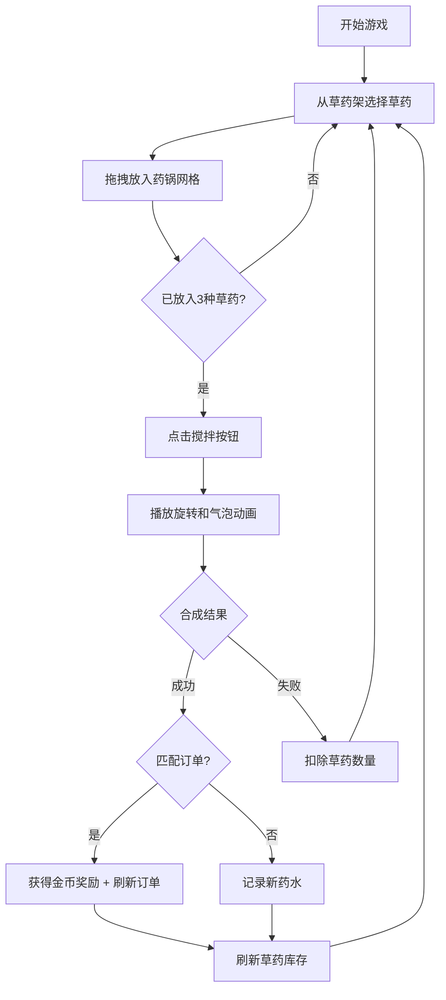

## 1. 产品概述
魔法药水工坊是一款基于浏览器的2D像素风魔法药水合成模拟游戏，玩家扮演炼金术士，通过采集草药、混合药剂、完成订单来赚取金币并解锁稀有配方。
- 面向休闲游戏爱好者，提供轻松有趣的合成玩法和精美的像素艺术体验
- 市场价值：填补浏览器端像素风炼金模拟游戏的空白，具有高度可扩展性

## 2. 核心功能

### 2.1 功能模块
1. **游戏主界面**：工坊区域、草药架、订单板、金币计数器、配方书按钮
2. **草药采集与库存管理**：4种初始草药，横向滚动展示，拖拽放入药锅
3. **药水合成系统**：3x3药锅网格、搅拌动画、气泡粒子特效、成功/失败反馈
4. **订单系统**：固定展示订单，匹配成功获得金币奖励
5. **配方图鉴系统**：已解锁/未解锁配方展示，进度解锁机制
6. **草药刷新机制**：完成订单后自动补充库存，稀有度概率机制

### 2.2 页面详情
| 页面名称 | 模块名称 | 功能描述 |
|---------|---------|-----------|
| 游戏主界面 | 工坊区域 | 480x360px居中显示，3x3药锅网格，每格60x60px，白色虚线边框，间距8px |
| 游戏主界面 | 草药架 | 底部横向滚动，展示4种初始草药（月光草、火焰蕨、冰晶苔、暗影菇），32x32像素图标，稀有度边框区分（白/蓝/金） |
| 游戏主界面 | 订单板 | 右上角展示当前待完成订单，包含药水名称和所需草药组合 |
| 游戏主界面 | 金币计数器 | 左上角显示当前金币数量，获得金币时播放漂浮动画 |
| 游戏主界面 | 配方书 | 左侧按钮，点击展开360x500px半透明浮层，深褐色背景，圆角12px，卡片网格展示配方 |
| 游戏主界面 | 搅拌按钮 | 圆角4px，高32px，背景#5a3a2a，悬停#6a4a3a |

## 3. 核心流程
玩家从底部草药架拖拽草药到药锅网格（最多3种），点击搅拌按钮触发合成动画。合成成功后，若药水匹配当前订单则获得金币奖励，同时消耗草药、刷新订单和草药库存。每成功合成5瓶新药水自动解锁一个新配方。

## 4. 用户界面设计

### 4.1 设计风格
- **主色调**：暗紫色 #1a0a2e（背景），深褐色 #3a2a1a（面板），金色 #e8b830（稀有高亮）
- **按钮风格**：圆角4px，高度32px，背景#5a3a2a，文字白色，悬停#6a4a3a
- **字体**：像素风格字体，白色带微弱紫色光晕用于标题
- **布局风格**：居中工坊，顶部标题，左右两侧功能面板，底部草药架
- **像素艺术**：16x16px原始像素，Canvas缩放至32x32px显示

### 4.2 页面设计概述
| 页面名称 | 模块名称 | UI元素 |
|---------|---------|---------|
| 游戏主界面 | 星空背景 | 暗紫色#1a0a2e，微弱星点闪烁动画 |
| 游戏主界面 | 标题区域 | 顶部居中"魔法药水工坊"，白色像素字体，紫色光晕效果 |
| 游戏主界面 | 药锅格子 | 60x60px，白色虚线边框，间距8px，3x3网格居中 |
| 游戏主界面 | 草药图标 | 32x32px像素画，稀有度边框：普通(白)、稀有(蓝)、传说(金) |
| 游戏主界面 | 合成动画 | 草药顺时针旋转2秒，底部气泡粒子上升，成功金色闪光/失败灰色烟雾 |
| 游戏主界面 | 金币动画 | +10/+20/+50从订单位置漂浮至金币计数器 |
| 配方书浮层 | 配方卡片 | 药水名称、草药图标组合、颜色圆点、稀有度标签、未解锁显示剪影和锁头 |

### 4.3 响应式
- 桌面端优先设计，固定画布尺寸
- 草药架支持横向滚动以适配未来扩展

### 4.4 动画与性能
- 所有动画帧率保持30fps以上，目标60fps
- 气泡粒子峰值不超过30个
- 单帧运算时间控制在16ms以内
