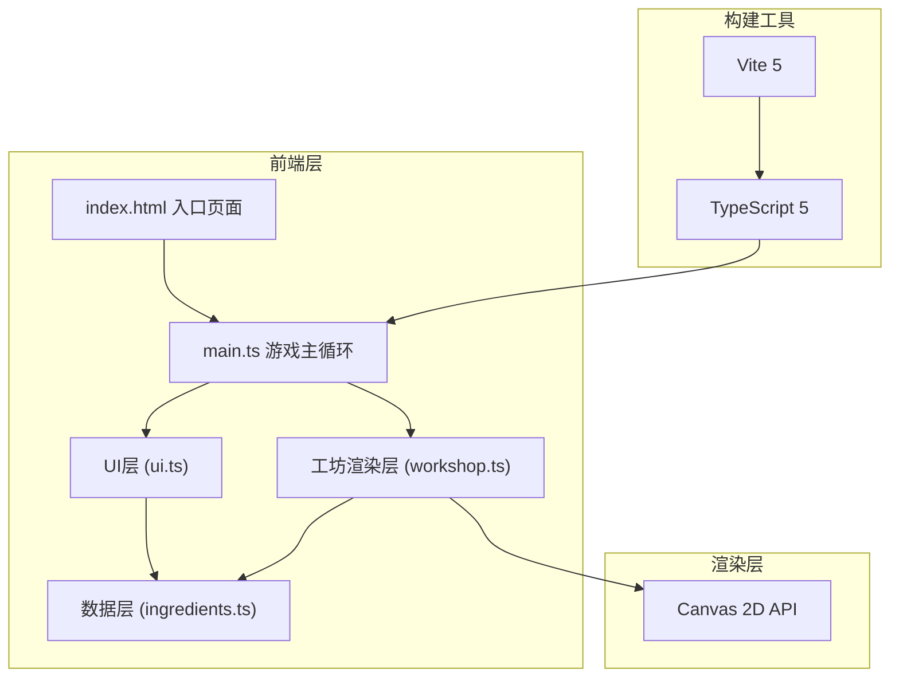
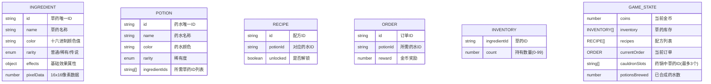

## 1. 架构设计



## 2. 技术描述
- **前端框架**: 纯TypeScript实现，无额外UI框架
- **渲染引擎**: Canvas 2D API原生实现
- **构建工具**: Vite@5
- **语言**: TypeScript@5（严格模式，ES2020目标）
- **工具库**: lodash（数据处理）、uuid（唯一标识生成）
- **开发服务器端口**: 3000

## 3. 项目文件结构

| 文件路径 | 职责描述 |
|---------|---------|
| `/package.json` | 项目依赖与脚本配置 |
| `/index.html` | 入口页面，暗紫色星空背景 |
| `/tsconfig.json` | TypeScript严格模式配置 |
| `/vite.config.js` | Vite构建配置，开发端口3000 |
| `/src/main.ts` | 游戏主循环和入口，Canvas初始化，动画循环 |
| `/src/ingredients.ts` | 草药/药剂数据定义、库存管理、配方解锁逻辑 |
| `/src/workshop.ts` | 工坊渲染：3x3药锅网格、火焰动画、冒泡特效、搅拌时序 |
| `/src/ui.ts` | UI系统：金币计数器、订单板、配方图鉴、结果弹窗 |

## 4. 核心数据模型

### 4.1 数据模型定义



### 4.2 类型定义

```typescript
// 稀有度枚举
enum Rarity {
  COMMON = 'common',
  RARE = 'rare',
  LEGENDARY = 'legendary'
}

// 草药接口
interface Ingredient {
  id: string;
  name: string;
  color: string;
  rarity: Rarity;
  effects: Record<string, number>;
  pixels: number[][]; // 16x16 像素矩阵 (0透明, 1填充)
}

// 药水接口
interface Potion {
  id: string;
  name: string;
  color: string;
  rarity: Rarity;
  ingredients: string[];
}

// 配方接口
interface Recipe {
  id: string;
  potionId: string;
  unlocked: boolean;
}

// 订单接口
interface Order {
  id: string;
  potionId: string;
  reward: number;
}

// 游戏状态
interface GameState {
  coins: number;
  inventory: Record<string, number>;
  recipes: Recipe[];
  currentOrder: Order | null;
  cauldronSlots: (string | null)[];
  potionsBrewed: number;
}

// 气泡粒子
interface Bubble {
  x: number;
  y: number;
  radius: number;
  speed: number;
  color: string;
  alpha: number;
}

// 漂浮金币动画
interface FloatingCoin {
  x: number;
  y: number;
  value: number;
  alpha: number;
  vy: number;
}
```

## 5. 核心算法与渲染流程

### 5.1 合成匹配算法
```typescript
// 将放入的草药ID排序后与配方进行匹配
function matchRecipe(slotIds: string[], recipes: Recipe[]): Potion | null {
  const sorted = [...slotIds].filter(Boolean).sort().join(',');
  for (const recipe of recipes) {
    if (!recipe.unlocked) continue;
    const potion = getPotionById(recipe.potionId);
    const recipeKey = [...potion.ingredients].sort().join(',');
    if (sorted === recipeKey) return potion;
  }
  return null;
}
```

### 5.2 渲染循环流程
```
requestAnimationFrame →
  1. 更新粒子状态 (气泡上升、金币漂浮)
  2. 清空Canvas
  3. 绘制星空背景
  4. 绘制工坊区域 (药锅网格、火焰)
  5. 绘制草药与搅拌动画
  6. 绘制粒子特效
  7. 绘制UI层
```

### 5.3 性能优化策略
- 粒子对象池复用，避免频繁GC
- Canvas分层渲染（静态背景预渲染）
- requestAnimationFrame固定帧率控制
- 离屏Canvas预渲染草药像素图
