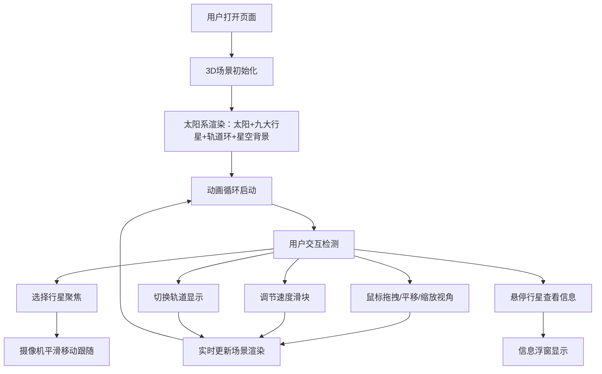

## 1. 产品概述

太阳系公转模拟器是一个基于浏览器的3D交互式天文教学工具，旨在帮助天文爱好者和科技馆教育工作者直观地探索和理解太阳系行星公转轨道的特性。

- 解决传统天文软件过于复杂、图片动画缺乏交互性的痛点，让用户可以自由操控、旋转视角、调整时间流速、点击行星查看详细数据。
- 提供沉浸式、可交互的太阳系沙盘体验，帮助用户直观理解相对速度、轨道倾角、近日点/远日点等天文概念。

## 2. 核心功能

### 2.1 用户角色

| 角色 | 使用方式 | 核心需求 |
|------|----------|----------|
| 天文爱好者 | 个人浏览器访问 | 自由探索太阳系，了解行星轨道参数 |
| 科技馆教育工作者 | 教学演示 | 清晰展示行星公转特性，辅助教学 |

### 2.2 功能模块

1. **3D太阳系场景**：太阳发光粒子球体、九大行星按比例轨道运动、轨道环显示
2. **交互控制系统**：鼠标视角控制（旋转/平移/缩放）、速度控制、行星聚焦、轨道显示开关
3. **行星信息展示**：悬停发光效果、信息浮窗实时跟随
4. **背景星空系统**：深邃太空氛围
5. **控制面板UI**：速度滑块、聚焦下拉菜单、轨道开关、折叠按钮
6. **响应式适配**：桌面端和移动端自适应布局

### 2.3 页面详情

| 页面名称 | 模块名称 | 功能描述 |
|-----------|-------------|---------------------|
| 主页面 | 3D太阳系场景 | 太阳发光脉动球体、九大行星轨道运动、半透明椭圆轨道环、行星运动尾迹线、日期标记点 |
| 主页面 | 视角控制 | 鼠标左键旋转、右键平移、滚轮缩放、行星自动聚焦跟随 |
| 主页面 | 行星信息浮窗 | 行星名称、公转周期、轨道倾角、距太阳距离、近日点/远日点、表面温度范围 |
| 主页面 | 控制面板 | 速度滑块(0.1x-10x)、聚焦下拉菜单、轨道显示开关、收起/展开按钮 |
| 主页面 | 背景星空 | 2000个随机粒子、闪烁动画 |

## 3. 核心流程

## 4. 用户界面设计

### 4.1 设计风格

- **主色调**：深空黑背景(#000000)，太阳金色(#ffaa00)，行星各自特色颜色
- **控制面板**：半透明深蓝背景(#0a1628ee)，圆角12px
- **信息浮窗**：半透明黑底(#000000cc)，白色文字，圆角8px
- **字体**：简洁现代无衬线字体，标题24px白色居中
- **布局**：全屏3D画布+左上角控制面板+行星信息浮窗跟随

### 4.2 页面设计概览

| 页面名称 | 模块名称 | UI元素 |
|-----------|-------------|-------------|
| 主页面 | 3D场景 | 太阳发光脉动、行星球体、半透明椭圆轨道、尾迹线、日期标记 |
| 主页面 | 控制面板 | 速度滑块、聚焦下拉、轨道开关、收起/展开三角形按钮、0.3s过渡动画 |
| 主页面 | 行星信息浮窗 | 行星名称、公转周期、轨道倾角、平均距离、近日点/远日点、温度范围 |
| 主页面 | 背景星空 | 随机分布粒子、大小1-3px、颜色#ffffff到#aaaadd、随机闪烁 |

### 4.3 响应式设计

- **桌面端**：桌面端优先设计，宽度>=768px时控制面板位于左上角
- **移动端**：宽度<768px时，控制面板折叠为右侧边栏模式，信息浮窗字体缩小到14px
- **触摸优化**：支持触摸手势旋转/缩放

### 4.4 3D场景设计

- **环境**：深空黑色背景，2000颗随机闪烁星点粒子
- **光照**：太阳作为点光源(#ffaa00)，环境光补光
- **摄像机**：透视相机，支持OrbitControls交互控制
- **构图**：太阳位于场景中心，行星按真实比例轨道环绕
- **动画**：太阳脉动光晕周期2s，行星按1:100万倍真实周期公转，尾迹显示最近90天路径，金色光晕悬停0.3s渐隐，聚焦过渡1.5s easeInOut
- **后处理**：发光效果、光晕
