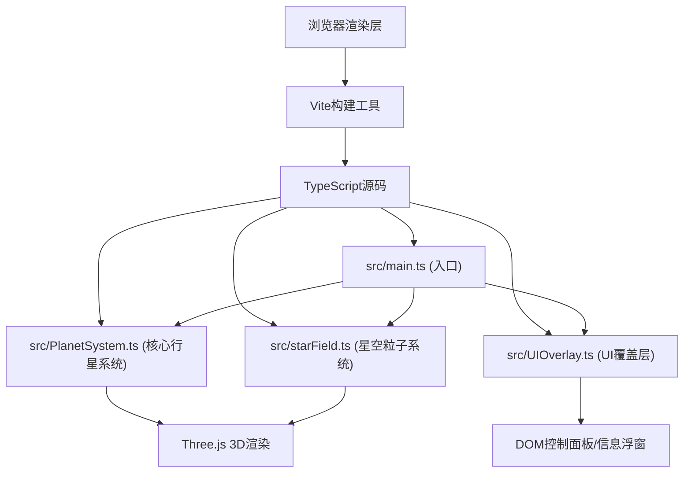

## 1. 架构设计



## 2. 技术描述

- **前端框架**: TypeScript 5 + Three.js 0.160
- **构建工具**: Vite 5
- **UI工具**: Tweakpane 4 (参数面板)
- **工具库**: Lodash
- **类型定义**: @types/three

## 3. 文件结构

| 文件路径 | 用途 |
|---------|------|
| package.json | 项目依赖和启动脚本 |
| index.html | 入口页面 |
| tsconfig.json | TypeScript配置 |
| vite.config.js | Vite构建配置 |
| src/main.ts | 初始化场景、相机、渲染器，启动动画循环 |
| src/PlanetSystem.ts | 核心类：行星对象、轨道环、尾迹线、公转动画、聚焦逻辑 |
| src/UIOverlay.ts | 控制面板DOM、事件绑定、行星信息浮窗 |
| src/starField.ts | 星空粒子系统生成与动画 |

## 4. 核心数据模型

### 4.1 行星数据定义

```typescript
interface PlanetData {
  name: string;
  color: string;
  orbitColor: string;
  radius: number;           // 行星球体半径 (缩放后)
  orbitRadius: number;      // 轨道半径
  eccentricity: number;     // 轨道离心率
  orbitalPeriod: number;    // 公转周期 (地球年)
  inclination: number;      // 轨道倾角 (度)
  avgDistance: number;      // 平均距离 (AU)
  perihelion: number;       // 近日点 (AU)
  aphelion: number;         // 远日点 (AU)
  tempMin: number;          // 最低温度 (°C)
  tempMax: number;          // 最高温度 (°C)
}
```

## 5. 核心类定义

### 5.1 PlanetSystem

| 方法 | 用途 |
|------|------|
| constructor(scene: THREE.Scene) | 创建行星系统 |
| getPlanetList(): string[] | 获取所有行星名称列表 |
| setSpeed(speed: number): void | 设置公转速度倍数 |
| setOrbitsVisible(visible: boolean): void | 设置轨道可见性 |
| focusPlanet(name: string): THREE.Vector3 | 获取聚焦目标位置 |
| update(delta: number): void | 更新动画 |
| checkHover(camera: THREE.Camera, mouse: THREE.Vector2): string \| null | 检测悬停行星 |

### 5.2 UIOverlay

| 方法 | 用途 |
|------|------|
| constructor(planetSystem: PlanetSystem) | 创建UI |
| onSpeedChange(callback: (speed: number) => void) | 速度变化回调 |
| onFocusChange(callback: (name: string) => void) | 聚焦变化回调 |
| onOrbitToggle(callback: (visible: boolean) => void) | 轨道显示开关回调 |
| updatePlanetInfo(name: string, position: THREE.Vector3, camera: THREE.Camera) | 更新信息浮窗 |
| hidePlanetInfo(): void | 隐藏信息浮窗 |
| setHoveredPlanet(name: string \| null) | 设置悬停行星高亮 |

## 6. 动画与交互

- **太阳脉动**: 2秒周期，光晕缩放动画
- **行星公转**: 按真实周期1:100万倍缩放，椭圆轨道计算
- **尾迹线**: 保留最近90天位置点
- **摄像机聚焦**: 1.5秒easeInOut缓动过渡
- **悬停光晕**: 0.3秒渐入金色环形光效
- **面板收起**: 0.3秒旋转动画
