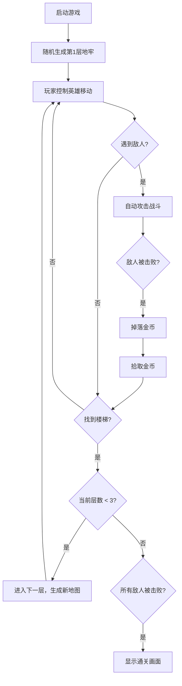

## 1. 产品概述

"地牢寻宝"是一款基于浏览器的2D像素风地牢探险游戏。玩家操控英雄在随机生成的迷宫地牢中探索、战斗并收集宝物，挑战3层地牢后获得最终胜利。

- 主要目的：提供轻量化、快节奏的休闲冒险体验，适合所有年龄段玩家
- 产品价值：低门槛、高重复可玩性的浏览器小游戏

## 2. 核心功能

### 2.1 功能模块

1. **游戏主界面**：地牢地图渲染、玩家控制、状态面板
2. **地图生成系统**：随机迷宫生成、房间与走廊、层级切换
3. **玩家系统**：移动控制、碰撞检测、生命值、背包
4. **战斗系统**：敌人AI追逐、自动攻击、伤害计算、掉落系统
5. **收集系统**：金币拾取、背包容量、收集特效

### 2.2 页面详情

| 页面名称 | 模块名称 | 功能描述 |
|-----------|-------------|---------------------|
| 游戏主页面 | 地牢渲染区 | 居中显示10x10网格地牢地图，支持探索迷雾效果 |
| 游戏主页面 | 状态面板 | 右上角半透明面板，显示生命值、金币数、当前层数 |
| 游戏主页面 | 粒子特效层 | 移动轨迹、攻击特效、收集动画 |
| 通关画面 | 胜利展示 | 全屏显示胜利文字及金币总数统计 |

## 3. 核心流程

玩家启动游戏 → 进入第1层地牢 → 探索地图/击败敌人/收集金币 → 找到楼梯进入下一层 → 第3层击败所有敌人 → 通关胜利

## 4. 用户界面设计

### 4.1 设计风格

- **主色调**：暗灰色(#1a1a2e)背景，深紫(#3a3a5a)墙壁，浅灰(#5a5a7a)地板，亮橙(#ff8c00)英雄
- **点缀色**：红色(#cc3333)敌人、黄色(#ffd700)金币、绿色(#00ff7f)楼梯
- **按钮风格**：像素风方块按钮，圆角8px
- **字体**：Press Start 2P 像素风格字体
- **布局**：左侧居中地牢俯视图，右上角状态面板
- **图标**：红色心形(生命值)、黄色菱形(金币)

### 4.2 页面设计概览

| 页面名称 | 模块名称 | UI元素 |
|-----------|-------------|-------------|
| 游戏主页面 | 地牢渲染区 | 10x10网格、方块瓦片、探索迷雾淡入淡出 |
| 游戏主页面 | 状态面板 | 半透明深色(#2a2a4a)背景、圆角8px、像素字体文字 |
| 游戏主页面 | 标题 | 白色带微弱橙色光晕的"地牢寻宝"文字 |
| 通关画面 | 胜利展示 | 全屏淡入、大字"通关！"、金币统计 |

### 4.3 响应式

- Desktop-first设计
- 画布自适应窗口大小，保持16:9比例
- 左右留有暗色边界填充
- 状态面板固定右上角，不随画布缩放

## 5. 性能要求

- 游戏帧率稳定60fps
- 每帧计算时间(地图生成+AI+碰撞检测)不超过2ms
- Canvas 2D渲染优化，减少不必要的重绘
