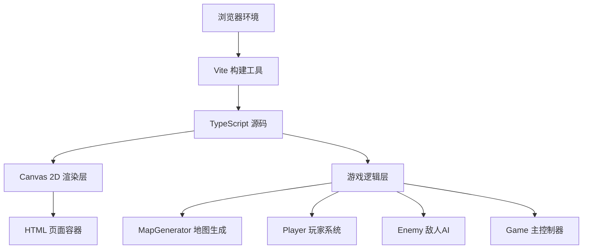

## 1. 架构设计



## 2. 技术描述

- **前端框架**：无框架，纯TypeScript + Canvas 2D API
- **构建工具**：Vite@5
- **编程语言**：TypeScript@5（严格模式）
- **辅助库**：lodash（工具函数）、uuid（唯一标识生成）
- **字体**：Google Fonts - Press Start 2P（像素风格字体）

## 3. 文件结构

| 文件路径 | 用途 |
|-------|---------|
| `/package.json` | 项目依赖与脚本配置 |
| `/index.html` | 游戏入口页面 |
| `/tsconfig.json` | TypeScript编译配置（严格模式） |
| `/vite.config.js` | Vite构建配置 |
| `/src/MapGenerator.ts` | 地牢地图生成器（递归分割/BSP算法） |
| `/src/Player.ts` | 玩家实体类（移动、输入、生命值、背包） |
| `/src/Game.ts` | 游戏主循环（初始化、渲染、AI、碰撞、状态管理） |

## 4. 核心数据结构

### 4.1 瓦片类型
```typescript
enum TileType {
  WALL = 0,      // 墙壁 #3a3a5a
  FLOOR = 1,     // 地板 #5a5a7a
  FLOOR_LIT = 2, // 已探索地板 #7a7a9a
  STAIRS = 3     // 楼梯 #00ff7f
}
```

### 4.2 玩家数据
```typescript
interface PlayerState {
  x: number;          // 格子X坐标
  y: number;          // 格子Y坐标
  hp: number;         // 生命值 (0-5)
  maxHp: number;      // 最大生命值
  gold: number;       // 金币数量
  bagCapacity: number; // 背包容量 (默认20)
  trail: TrailParticle[]; // 移动轨迹粒子
}
```

### 4.3 敌人数据
```typescript
interface Enemy {
  id: string;
  x: number;
  y: number;
  hp: number;         // 生命值 (3)
  lastMoveTime: number; // 上次移动时间戳
  attackEffect?: AttackEffect; // 攻击特效
}
```

### 4.4 金币数据
```typescript
interface Coin {
  id: string;
  x: number;
  y: number;
  collectAnim?: number; // 收集动画进度
}
```

## 5. 性能优化策略

- **地图缓存**：生成后的数据结构只读，不重复计算
- **渲染优化**：只渲染视口内瓦片，使用离屏Canvas预渲染瓦片
- **AI节流**：敌人每2秒移动一次，非每帧计算
- **碰撞检测**：使用网格坐标直接查询，O(1)复杂度
- **粒子系统**：限制最大粒子数量，自动回收过期粒子
- **RAF循环**：requestAnimationFrame驱动，固定时间步长更新逻辑
