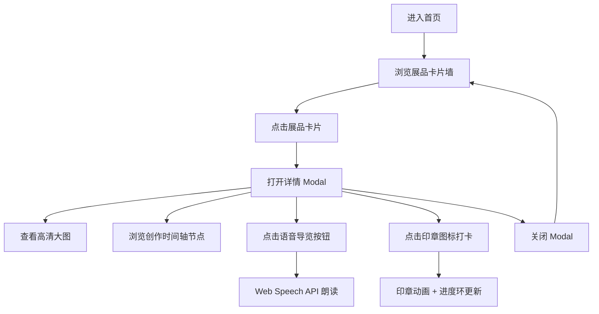

## 1. 产品概述

PASSPORT · 艺术护照是一款为数字艺术展览打造的交互式展品导览应用。参观者通过扫描作品旁的二维码，即可浏览每件展品的创作过程时间线、高清细节图、艺术家语音导览，并点亮虚拟印章完成打卡收集。

- 目标用户：独立策展人、艺术空间运营者、数字艺术展览参观者
- 核心价值：将传统静态观展体验升级为沉浸式、可收集的数字互动，提升观众参与度与展览记忆点

## 2. 核心功能

### 2.1 功能模块

1. **展品卡片墙**：以响应式网格展示全部展品缩略图卡片，支持悬停动效与点击查看详情
2. **展品详情 Modal**：全屏蒙层展示高清大图、创作时间轴、语音导览按钮
3. **创作时间轴**：横向展示从构思到完成的多阶段节点，点击展开阶段详情面板
4. **语音导览**：基于 Web Speech API 的语音朗读功能，支持播放/暂停控制与旋转动画
5. **打卡收藏机制**：点击印章图标完成打卡，已打卡展品显示金色角标
6. **收藏进度可视化**：顶部 SVG 进度环实时展示已打卡数量/总展品数

### 2.2 页面详情

| 页面名称 | 模块名称 | 功能描述 |
|-----------|-------------|---------------------|
| 主页面 | 顶部导航栏 | 左侧标题「PASSPORT · 艺术护照」，右侧圆形进度环展示打卡进度 |
| 主页面 | 展品卡片墙 | CSS Grid 响应式网格，3:4 卡片宽高比，悬停上浮与遮罩提示 |
| 详情 Modal | 高清大图区域 | 全屏展示作品高清图片，右上角语音导览按钮 |
| 详情 Modal | 作品信息区 | 标题、艺术家、年份、技术、描述文本 |
| 详情 Modal | 创作时间轴 | 横向节点时间轴，点击展开带淡入动画的阶段描述面板 |
| 详情 Modal | 打卡印章 | 右下角圆形印章图标，点击完成打卡与脉冲动画 |

## 3. 核心流程

参观者进入页面 → 浏览展品卡片墙 → 点击感兴趣的展品卡片 → 打开详情 Modal 查看高清图与时间轴 → 点击语音导览按钮聆听艺术家讲解 → 点击印章完成打卡 → 顶部进度环更新 → 关闭 Modal 继续探索其他展品

## 4. 用户界面设计

### 4.1 设计风格

- 主色调：深灰黑 `#121212`，卡片 `#1e1e1e`，文字白 `#f0f0f0`
- 强调色：印章金色渐变 `#e8c55b` → `#d4a373`，语音按钮深红 `#b33a3a`
- 字体：`system-ui` 无衬线体，标题字重 300（纤细优雅）
- 动效时长统一 0.3–0.5s，framer-motion 实现淡入/脉冲/旋转/位移动画

### 4.2 页面设计概述

| 页面名称 | 模块名称 | UI 元素 |
|-----------|-------------|-------------|
| 主页面 | 顶部导航 | 左侧纤细标题，右侧 SVG 进度环（半径 36px，内部显示 x/7 数字并带弹跳动画） |
| 主页面 | 卡片墙 | Grid minmax(200px,1fr)，gap 24px，3:4 卡片，悬停上浮 8px 阴影加深，半透明遮罩显示「查看护照」 |
| 详情 Modal | 蒙层 | `#00000088` 半透明，点击外部关闭 |
| 详情 Modal | 语音按钮 | 直径 48px 圆形深红 `#b33a3a`，播放时 2s/圈持续旋转 |
| 详情 Modal | 时间轴 | 水平节点布局，展开面板自下而上淡入（duration 0.3s） |
| 详情 Modal | 印章 | 初始灰色 `#555` 虚线圆环，点击后金色渐变 + 0.4s 脉冲缩放（1.2 倍） |

### 4.3 响应式

- Desktop (>1024px)：三列卡片
- Tablet (600–1024px)：两列卡片
- Mobile (<600px)：单列卡片
- 页面左右留白 16px，最大宽度 1000px 居中
