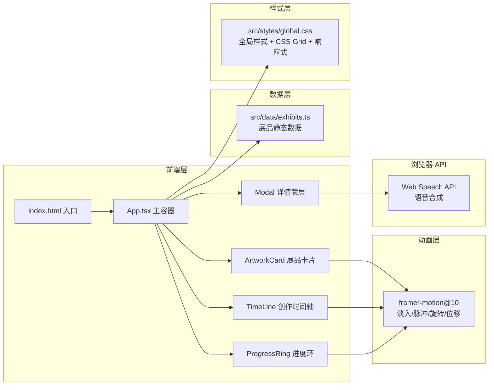

## 1. 架构设计



## 2. 技术描述

- 前端：React@18 + TypeScript + Vite@5
- 构建工具：Vite@5 + @vitejs/plugin-react
- 动画：framer-motion@10
- 工具库：lodash
- 后端：无，使用静态 dummy 数据
- 浏览器 API：Web Speech API（SpeechSynthesis）

## 3. 路由定义

| 路由 | 用途 |
|-------|---------|
| / | 单页应用，无路由切换；所有交互通过 Modal 与组件状态控制 |

## 4. 数据模型

### 4.1 展品类型定义

```typescript
interface CreationStage {
  id: string;
  title: string;
  date: string;
  description: string;
}

interface Exhibit {
  id: string;
  title: string;
  artist: string;
  year: number;
  technique: string;
  description: string;
  thumbnail: string;
  hdImages: string[];
  stages: CreationStage[];
  audioGuideText: string;
  isCollected: boolean;
}
```

### 4.2 文件数据结构

`src/data/exhibits.ts` 导出 5–7 个展品的静态数组，涵盖：
- 每件作品 4–6 个创作阶段（构思 → 草图 → 制作 → 完成等）
- 语音导览文本（用于 Web Speech API 朗读）
- 缩略图与高清图片 URL（使用公共占位图服务）

## 5. 文件职责与调用关系

| 文件 | 职责 | 被调用方 |
|------|------|----------|
| `package.json` | 依赖声明与脚本（react@18, vite@5, framer-motion@10, lodash） | - |
| `index.html` | 应用入口，设置标题与深色渐变背景 | 加载 `src/main.tsx` |
| `vite.config.js` | Vite 构建配置，React 插件，路径别名 `@/` → `src/` | - |
| `tsconfig.json` | TypeScript 严格模式，ES2020 目标，jsx: react-jsx | - |
| `src/App.tsx` | 主容器：状态管理（展品列表、选中展品、打卡状态、语音播放），渲染卡片墙与详情 Modal | `exhibits.ts`, `ArtworkCard.tsx`, `TimeLine.tsx`, `global.css` |
| `src/components/ArtworkCard.tsx` | 单个展品卡片：缩略图、标题、艺术家、年份、印章、悬停动效、点击回调 | `framer-motion`，接收 `App` 传入 props |
| `src/components/TimeLine.tsx` | 横向时间轴：节点列表、展开面板、淡入动画 | `framer-motion`，接收 `App` 传入 stages |
| `src/data/exhibits.ts` | 静态 dummy 展品数据（5–7 件） | 被 `App.tsx` 导入 |
| `src/styles/global.css` | 深色主题、字体、CSS Grid 响应式布局、动画基础样式 | 被 `App.tsx` 导入 |

## 6. 状态管理与数据流

- 状态在 `App.tsx` 中集中管理（useState）：
  - `exhibits: Exhibit[]` — 展品列表（含 isCollected）
  - `selectedExhibit: Exhibit \| null` — 当前打开详情的展品
  - `isSpeaking: boolean` — 语音是否正在朗读
- 单向数据流：
  - `App → ArtworkCard`：exhibit 数据 + `onSelect` 回调 + `onCollect` 回调
  - `App → TimeLine`（通过 Modal 内 props）：`stages` 数组
  - 用户点击卡片 → `onSelect` 触发 → `selectedExhibit` 更新 → Modal 打开
  - 用户点击印章 → `onCollect` 触发 → 对应展品 `isCollected=true` → 进度环重新渲染
