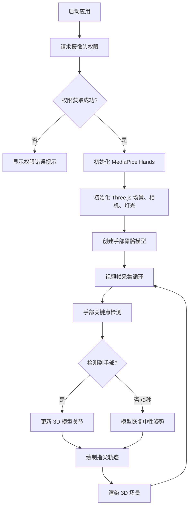

## 1. 产品概述

基于浏览器的手部骨骼动画实时映射可视化应用，通过摄像头捕捉用户手势，实时驱动 3D 手部骨骼模型，并以赛博朋克美学风格展示关节运动与运动轨迹。

- 面向开发者、设计师、动效爱好者，用于手势交互可视化与教育演示
- 提供高精度的 21 关键点手部跟踪，实现流畅的手势到 3D 模型的映射

## 2. 核心功能

### 2.1 功能模块

1. **实时手势跟踪**：MediaPipe Hands 驱动的摄像头手部关键点识别
2. **3D 手部模型渲染**：Three.js 构建的骨骼+关节球体手部模型，实时同步姿态
3. **运动轨迹可视化**：半透明线条绘制指尖运动轨迹，支持淡出效果
4. **控制面板**：手势冻结、轨迹清除、轨迹时长调节
5. **智能恢复机制**：无手势时自动恢复中性姿势并显示提示

### 2.2 页面详情

| 页面名称 | 模块名称 | 功能描述 |
|-----------|-------------|---------------------|
| 主页面 | 3D 场景区域 | 径向渐变背景 + 半透明网格地面 + 3D 手部骨骼模型 + 指尖轨迹 |
| 主页面 | 摄像头预览 | 右下角 240x180px 视频窗口，发光边框，实时显示摄像头画面 |
| 主页面 | 控制面板 | 左上角毛玻璃面板，含冻结按钮、清除按钮、时长滑块 |
| 主页面 | 提示文字 | 无手势时在模型上方淡入显示"请做出手势" |
| 主页面 | 标题区域 | 页面顶部居中偏下位置显示"手势映射实验室"标题 |

## 3. 核心流程

启动应用 → 请求摄像头权限 → 初始化 MediaPipe Hands 与 Three.js 场景 → 实时视频帧处理与手部关键点检测 → 关键点驱动 3D 模型关节旋转 → 绘制指尖运动轨迹 → 用户通过控制面板交互

## 4. 用户界面设计

### 4.1 设计风格

- **主色调**：深空灰 `#1a1a2e`，径向渐变背景 `#0a0a1a` → `#1a1a3a`
- **强调色**：青绿 `#4ecdc4`，暖红 `#ff6b6b`，轨迹橙 `#ffa07a`，骨骼白 `#ffffff`
- **按钮样式**：圆角按钮，毛玻璃背景（`backdrop-filter: blur(8px)`），悬停放大 1.05 倍
- **字体**：白色无衬线字体，标题 24px，正文 14px，提示 16px
- **布局**：全屏自适应，3D 场景铺满可用区域，控制元素悬浮定位
- **视觉特效**：关节球自发光材质，骨骼渐变颜色，轨迹淡出动画，发光边框

### 4.2 页面设计概述

| 页面名称 | 模块名称 | UI 元素 |
|-----------|-------------|-------------|
| 主页面 | 3D 场景 | 径向渐变背景、半透明网格（10x10单位）、21个发光关节球、骨骼圆柱、轨迹线条 |
| 主页面 | 控制面板 | 背景 `rgba(30,30,46,0.7)`、圆角 12px、毛玻璃效果、3个功能控件 |
| 主页面 | 视频预览 | 240x180px、圆角 8px、`#4ecdc4` 发光边框、固定右下角 |
| 主页面 | 标题 | 白色字体、居中偏下、赛博朋克风格 |

### 4.3 响应性

- 桌面端优先设计，3D 场景自适应窗口尺寸
- 控制面板与视频预览固定定位，不受窗口缩放影响
- 触摸设备保留基本交互功能

### 4.4 3D 场景指导

- **环境**：径向渐变深空背景，营造赛博朋克空间感
- **灯光**：环境光 + 方向光，突出关节自发光效果
- **相机**：PerspectiveCamera，初始距离 3 单位，看向原点
- **构图**：手部模型居中于场景，地面网格提供空间参考
- **动画**：关节平滑插值（60Hz），无手势时 1 秒线性插值恢复中性姿势
- **性能**：帧率 30FPS+，轨迹顶点上限 5000 个
