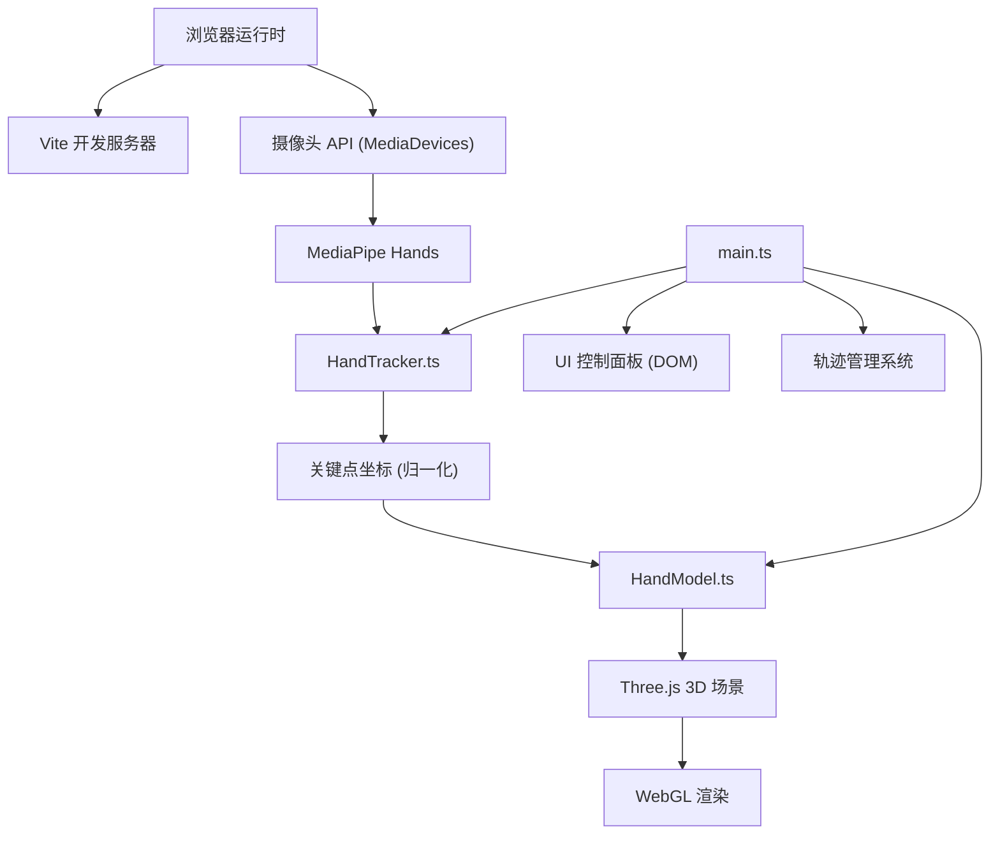

## 1. 架构设计



## 2. 技术说明

- **前端框架**：TypeScript 5 + Vite 5（纯 TypeScript，无 React/Vue）
- **3D 渲染**：Three.js 0.160
- **手部跟踪**：@mediapipe/hands@0.4 + @mediapipe/camera_utils@0.3 + @mediapipe/drawing_utils@0.3
- **工具库**：lodash（节流、防抖、深拷贝等辅助函数）
- **类型定义**：@types/three

## 3. 模块划分

| 文件路径 | 职责 |
|---------|------|
| `src/HandTracker.ts` | 封装 MediaPipe Hands 初始化、视频帧处理、摄像头流管理，输出归一化关键点 |
| `src/HandModel.ts` | 创建 21 关节球体 + 骨骼圆柱的 3D 手部模型，提供 updateLandmarks 方法 |
| `src/main.ts` | 初始化 Three.js 场景、相机、灯光，串联 HandTracker 与 HandModel，管理轨迹与 UI |

## 4. 核心数据结构

### 4.1 手部关键点

MediaPipe Hands 输出 21 个 3D 归一化关键点，索引对应：

```typescript
interface Landmark {
  x: number;  // 0~1，图像宽度归一化
  y: number;  // 0~1，图像高度归一化
  z: number;  // 相对于手腕的深度
}

type LandmarkArray = Landmark[];  // 长度 21
```

关节索引分组：
- 手腕：0
- 拇指：1-4
- 食指：5-8
- 中指：9-12
- 无名指：13-16
- 小指：17-20

### 4.2 骨骼连接关系

```typescript
const BONE_CONNECTIONS: [number, number][] = [
  [0, 1], [1, 2], [2, 3], [3, 4],           // 拇指
  [0, 5], [5, 6], [6, 7], [7, 8],           // 食指
  [5, 9], [9, 10], [10, 11], [11, 12],      // 中指
  [9, 13], [13, 14], [14, 15], [15, 16],    // 无名指
  [13, 17], [17, 18], [18, 19], [19, 20],   // 小指
  [0, 17]                                    // 掌缘
];
```

## 5. 文件结构

```
auto244/
├── package.json
├── index.html
├── tsconfig.json
├── vite.config.js
└── src/
    ├── HandModel.ts
    ├── HandTracker.ts
    └── main.ts
```

## 6. 性能优化策略

- **关节插值**：使用 requestAnimationFrame 以 60Hz 频率在目标关键点间线性插值，保证平滑过渡
- **轨迹优化**：指尖每移动 1cm 才添加新顶点，设置 5000 顶点上限，超出时移除最早顶点
- **渲染节流**：MediaPipe 检测帧与 Three.js 渲染帧解耦，保证渲染帧率稳定
- **材质复用**：关节球与骨骼圆柱复用几何体和材质实例，减少内存占用
