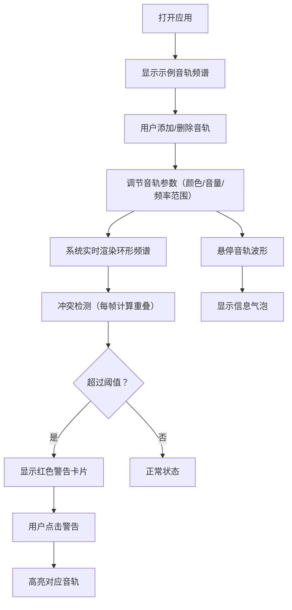

## 1. 产品概述

光谱混音台是一个面向独立录音棚和音乐制作人的浏览器端音频可视化工具，帮助混音师直观查看各音轨的频率分布，快速发现并解决频率冲突问题。

- 解决传统混音工作中"靠耳朵反复听、靠EQ插件逐个看"的低效问题，提供全局实时频率对比视图
- 目标用户：独立音乐制作人、专业混音师、音频工程师
- 市场价值：降低混音门槛，提升混音效率，减少频率冲突导致的音质问题

## 2. 核心功能

### 2.1 用户角色
本产品为单用户工具，无需用户注册和角色区分。

### 2.2 功能模块
1. **环形频谱图模块**：四色带环形频率展示、音轨波形曲线、悬停高亮与信息气泡
2. **音轨管理模块**：添加/删除音轨（最多8条）、自定义颜色、音量调节、频率范围拖拽
3. **冲突检测模块**：实时频率重叠计算、阈值警告、冲突建议高亮

### 2.3 页面详情
| 页面名称 | 模块名称 | 功能描述 |
|-----------|-------------|---------------------|
| 主页 | 顶部标题区 | "光谱混音台"发光标题，冷白字体带脉冲光晕动画 |
| 主页 | 环形频谱图 | 四色带环形图（低/中低/中高/高频），展示音轨频率分布与能量 |
| 主页 | 音轨面板 | 添加/删除音轨、自定义颜色、音量滑块、频率范围拖拽手柄 |
| 主页 | 冲突检测面板 | 实时频率重叠警告卡片，点击高亮对应音轨 |

## 3. 核心流程

混音师打开应用后，默认看到两条示例音轨（鼓组和贝斯）的环形频谱展示。用户可以通过右侧面板添加更多音轨，每条音轨可自定义名称、颜色、音量和频率范围。系统实时检测音轨间的频率重叠，当冲突超过阈值时在底部面板显示警告。用户悬停音轨波形可查看详细信息，点击警告卡片可快速定位冲突音轨。

## 4. 用户界面设计

### 4.1 设计风格
- **主色调**：深色背景 #1a1a2e，面板 #16213e
- **频率色带**：低频深蓝 #0a3d62 渐变、中低频青绿 #1abc9c 渐变、中高频橙红 #e67e22 渐变、高频淡紫 #9b59b6 渐变
- **字体**：发光冷白标题（文字阴影 #0ff 0 0 10px），1秒脉冲光晕动画
- **交互元素**：悬停放大 1.05 倍 + 阴影增强，点击 0.1 秒缩放回弹
- **动画**：添加音轨淡入 0.3s，删除左滑消失，警告卡片左滑入，气泡弹跳过渡

### 4.2 页面设计概览
| 页面名称 | 模块名称 | UI 元素 |
|-----------|-------------|-------------|
| 主页 | 顶部标题 | 发光冷白字体、脉冲光晕动画、居中 |
| 主页 | 环形频谱图 | Canvas 2D 绘制、四色环带、波形曲线、悬停高亮、信息气泡 |
| 主页 | 音轨面板 | 卡片式列表、颜色拾色器、音量滑块、拖拽手柄、添加/删除按钮 |
| 主页 | 冲突检测面板 | 红色警告卡片、冲突描述文字、滑入动画 |

### 4.3 响应式设计
- **宽屏（≥768px）**：环形频谱图占左侧 60%，音轨面板与冲突面板占右侧 40%
- **窄屏（<768px）**：环形图缩放至 80% 并居中，右侧面板折叠到下方
- Canvas 自适应容器尺寸，保持图形比例

### 4.4 性能要求
- 画面帧率稳定 ≥ 50fps
- 使用 requestAnimationFrame 进行渲染
- 纯 Canvas 2D 绘制，避免 DOM 重绘瓶颈
