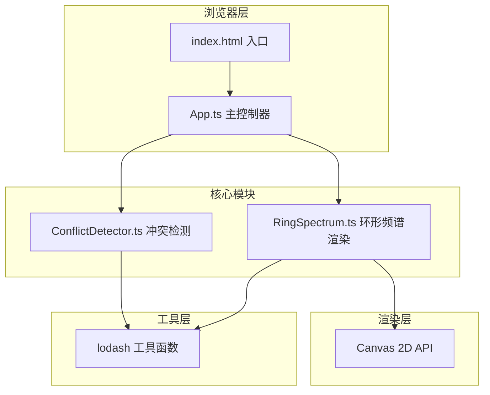

## 1. 架构设计



## 2. 技术选型

- **前端框架**：无框架（纯 TypeScript + DOM 操作）
- **构建工具**：Vite@5
- **语言**：TypeScript@5（严格模式，target ES2020）
- **图形渲染**：纯 Canvas 2D API
- **工具库**：lodash
- **样式**：原生 CSS（内联在 index.html）

## 3. 文件结构与职责

| 文件路径 | 职责 |
|----------|------|
| package.json | 项目依赖与启动脚本 |
| index.html | 入口 HTML，深色主题基础样式，Canvas 容器与面板布局 |
| tsconfig.json | TypeScript 严格模式配置 |
| vite.config.js | Vite 基础构建配置 |
| src/App.ts | 主控制器：初始化页面、管理音轨列表、协调模块、事件绑定 |
| src/RingSpectrum.ts | 环形频谱类：四色带绘制、波形曲线、悬停高亮、气泡、动画循环 |
| src/ConflictDetector.ts | 冲突检测：频率重叠计算、阈值判断、警告输出 |

## 4. 核心数据模型

### 4.1 音轨数据结构
```typescript
interface Track {
  id: string;
  name: string;
  color: string;
  volume: number;           // 0-100
  startFreq: number;        // Hz, 起始频率
  endFreq: number;          // Hz, 结束频率
  peakEnergy: number;       // dBFS, 能量峰值
  waveformData: number[];   // 波形能量数组，用于绘制曲线
}
```

### 4.2 频率分段
```typescript
const FREQ_BANDS = [
  { name: '低频', min: 20, max: 250, gradient: ['#0a3d62', '#1e6091'] },
  { name: '中低频', min: 250, max: 2000, gradient: ['#1abc9c', '#16a085'] },
  { name: '中高频', min: 2000, max: 8000, gradient: ['#e67e22', '#d35400'] },
  { name: '高频', min: 8000, max: 20000, gradient: ['#9b59b6', '#8e44ad'] },
];
```

### 4.3 冲突警告结构
```typescript
interface ConflictWarning {
  id: string;
  track1Id: string;
  track2Id: string;
  overlapStart: number;
  overlapEnd: number;
  totalEnergy: number;
  suggestion: string;
}
```

## 5. 关键实现说明

### 5.1 环形频谱渲染
- 使用对数频率映射（20Hz-20kHz 映射到环形角度）
- 每条音轨绘制为一条起伏的波形曲线，线宽随能量变化
- 使用离屏 Canvas 缓存四色带底图，每帧仅重绘音轨波形

### 5.2 冲突检测算法
- 遍历所有音轨对，计算频率区间交集
- 交集内能量求和，超过 6dBFS 触发警告
- 根据重叠频段生成文字建议（如"建议衰减吉他3-5kHz频段"）

### 5.3 交互与动画
- requestAnimationFrame 驱动渲染循环，目标 60fps
- CSS transition 处理面板动画（淡入、滑入）
- Canvas 内实现悬停检测（极坐标命中测试）与高亮效果

### 5.4 性能优化
- 缓存静态元素（频率色带）到离屏 Canvas
- 脏标记机制，仅在音轨参数变化时重算波形
- 节流冲突检测（每 100ms 计算一次，而非每帧）
