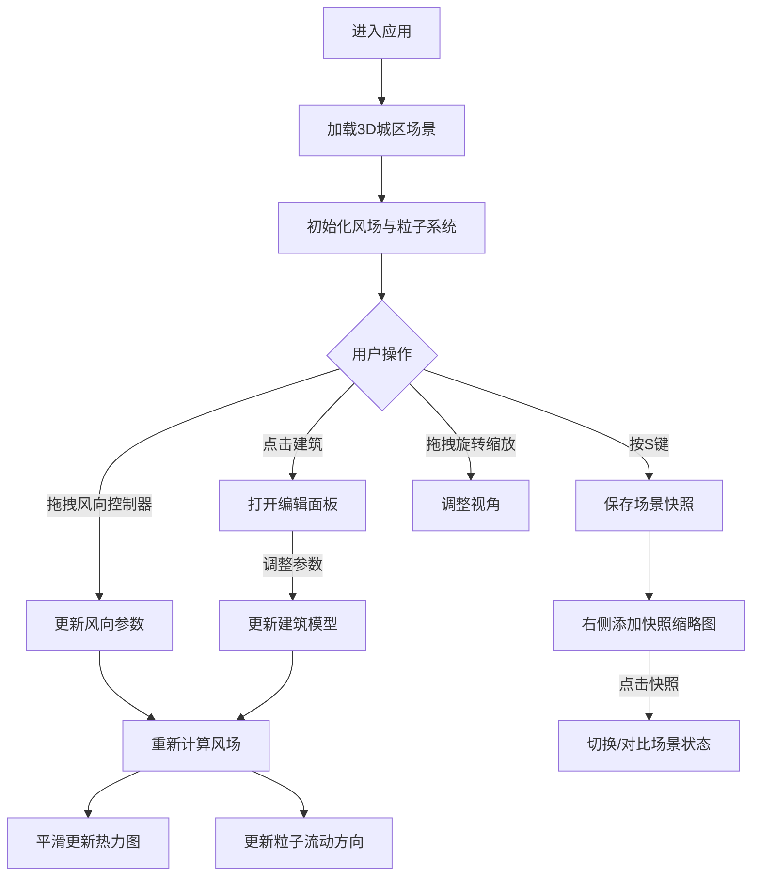

## 1. 产品概述

城市风环境3D交互可视化应用，为城市规划师和环境研究员提供直观、低门槛的建筑群风环境评估工具。通过可交互的3D沙盘场景，让用户能够实时探索不同风向、建筑高度和布局对行人层风速及空气流通的影响。

- **目标用户**：城市规划师、环境研究员、建筑设计师
- **核心价值**：将传统高门槛、慢反馈的CFD分析转化为像玩沙盘游戏一样直观可交互的体验

## 2. 核心功能

### 2.1 功能模块

1. **3D城区场景与风向控制**：6×6建筑网格街区，半球形风向控制器，建筑顶部风向标
2. **行人层风速热力图**：0.5m高度处动态热力图，256×256采样点，风速颜色渐变
3. **交互式建筑编辑**：点击建筑弹出控制面板，高度/旋转滑块，删除复制功能
4. **风场粒子系统**：300个半透明白色小球粒子流动，建筑绕流与拖尾轨迹
5. **场景状态快照与比较**：S键保存快照（最多5个），分屏对比模式

### 2.2 页面详情

| 页面名称 | 模块名称 | 功能描述 |
|---------|---------|---------|
| 主场景 | 3D城区网格 | 6×6随机高度建筑（15-120m），色阶表示楼层，顶部半透明色块 |
| 主场景 | 风向控制器 | 半球形可拖拽控制器，同步旋转风向标与风场粒子 |
| 主场景 | 风速热力图 | 地面0.5m高度256×256网格，蓝→绿→红颜色渐变，实时平均风速显示 |
| 主场景 | 建筑编辑面板 | 高度滑块(15-120m,步长5m)、旋转滑块(0-360°)、删除/复制按钮 |
| 主场景 | 粒子系统 | 300个粒子随风场流动，速度变化颜色，1.5秒拖尾轨迹 |
| 主场景 | 快照系统 | S键保存，右侧缩略图列表，分屏半透明叠加对比 |
| 主场景 | 视角标尺 | 右上角悬浮显示视角高度和水平距离 |

## 3. 核心流程

## 4. 用户界面设计

### 4.1 设计风格

- **主色调**：深蓝灰色渐变背景 `#0b1a2e` → `#1a2d4a`
- **建筑样式**：柔和圆角立方体，边缘亮蓝色描边（0.5px）
- **热力图颜色**：深蓝 `#1a3a6a`(0-0.5m/s) → 绿 `#44cc66`(1-2m/s) → 红 `#ff5544`(3m/s+)
- **粒子颜色**：慢速青色 `#88ccff`，快速暖色 `#ffaa66`
- **动画过渡**：所有交互反馈 0.2s 弹性过渡，热力图更新 500ms 平滑过渡，建筑更新后 800ms 重新计算

### 4.2 页面设计概述

| 页面名称 | 模块名称 | UI元素 |
|---------|---------|---------|
| 主场景 | 标题 | 白色无衬线字体"城市风环境模拟器"居中顶部 |
| 主场景 | 风向控制器 | 场景上方半球形，带方向箭头 |
| 主场景 | 热力图 | 地面半透明覆盖层，不遮挡建筑 |
| 主场景 | 风速显示 | 左下角实时平均风速数值 |
| 主场景 | 建筑编辑面板 | 浮动卡片式，滑块+按钮 |
| 主场景 | 快照列表 | 右侧垂直缩略图卡片 |
| 主场景 | 视角标尺 | 右上角悬浮小面板 |
| 主场景 | 分屏对比 | 左右各50%透明度叠加 |

### 4.3 响应式

- Desktop-first 设计，最小宽度 1024px
- 窗口缩放时场景自动适配视口

### 4.4 3D场景指导

- **环境氛围**：深蓝灰色渐变背景，柔和环境光 + 方向光模拟日光
- **光照设置**：AmbientLight(0x404060, 0.6) + DirectionalLight(0xffffff, 0.8)
- **相机设置**：PerspectiveCamera，初始俯视角45°，OrbitControls支持旋转缩放平移
- **交互动画**：建筑选中高亮，粒子流动动画，热力图平滑过渡
- **性能预算**：建筑数36个，粒子≤500个，帧率≥40fps
