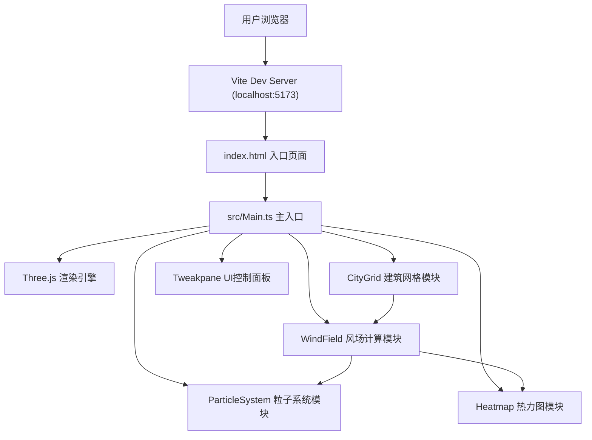

## 1. 架构设计



## 2. 技术描述

- **前端框架**：原生 TypeScript + Three.js (0.160.0)
- **构建工具**：Vite 5.x
- **UI控件**：Tweakpane 4.x
- **工具库**：lodash
- **类型定义**：@types/three
- **初始化方式**：手动创建项目结构（用户指定了精确的文件结构）

## 3. 项目文件结构

| 文件路径 | 用途 |
|---------|------|
| package.json | 依赖管理与启动脚本 |
| index.html | 入口HTML页面 |
| tsconfig.json | TypeScript配置（严格模式，ES2020） |
| vite.config.js | Vite构建配置（HMR开启） |
| src/Main.ts | 主入口：初始化场景、相机、渲染器，整合所有模块 |
| src/CityGrid.ts | 建筑网格：6×6建筑生成、编辑、事件发射 |
| src/WindField.ts | 风场计算：矢量场生成、简化CFD算法 |
| src/ParticleSystem.ts | 粒子系统：300个粒子的生成、更新、拖尾 |
| src/Heatmap.ts | 热力图：256×256网格采样、Canvas GPU渲染 |

## 4. 核心数据模型

### 4.1 建筑数据结构

```typescript
interface BuildingData {
  id: string;
  gridX: number;      // 0-5 网格X坐标
  gridZ: number;      // 0-5 网格Z坐标
  height: number;     // 15-120m
  rotation: number;   // 0-360度
  position: { x: number; z: number };
  color: number;      // 根据高度计算的色阶
}
```

### 4.2 风场数据结构

```typescript
interface WindVector {
  x: number;  // X方向速度分量
  z: number;  // Z方向速度分量
  speed: number;  // 合成速度
}

interface WindFieldData {
  direction: number;     // 风向角度（弧度）
  baseSpeed: number;     // 基础风速 m/s
  gridSize: number;      // 采样网格大小
  vectors: WindVector[][];  // 2D矢量场数组
}
```

### 4.3 快照数据结构

```typescript
interface SceneSnapshot {
  id: string;
  timestamp: number;
  buildings: BuildingData[];
  windDirection: number;
  thumbnail: string;  // base64缩略图
}
```

## 5. 核心算法说明

### 5.1 简化风场计算算法

采用基于建筑影响矩阵的预计算方法，避免逐格点迭代：

1. 初始化基础风向矢量场
2. 对每个建筑计算其对周围格点的遮挡和绕流影响
3. 使用距离衰减函数叠加建筑影响
4. 建筑间距和高度差引入文丘里效应加速修正
5. 输出最终风速矢量场

### 5.2 热力图颜色插值

```
风速 0.0m/s → 深蓝 #1a3a6a
风速 0.5m/s → 蓝 #3366aa
风速 1.0m/s → 青 #44aacc
风速 2.0m/s → 绿 #44cc66
风速 2.5m/s → 黄 #cccc44
风速 3.0m/s+ → 红 #ff5544
```

### 5.3 粒子运动系统

- 粒子在风场矢量场内进行双线性插值采样
- 每个粒子维护过去30帧位置历史用于绘制拖尾
- 碰到建筑时计算法向量反弹并减速
- 超出场景边界时从对侧重新进入
