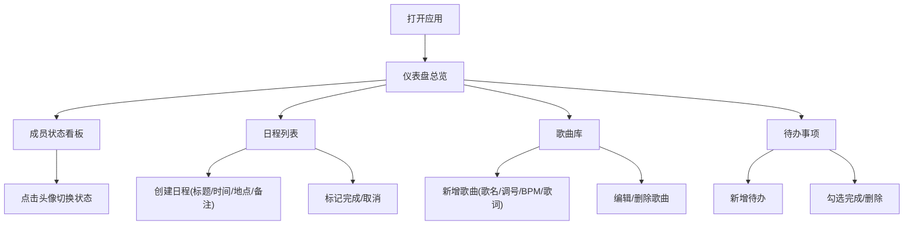

## 1. 产品概述
面向小型独立乐队的一站式排练协作与演出管理工具，解决乐队成员间排练时间协调、歌曲资料分散管理、演出计划混乱等痛点。
- 目标用户：独立乐队成员（2-6人小型团体）
- 核心价值：集中管理乐队日程、歌曲库、成员状态及待办事项，提升排练与演出协作效率

## 2. 核心功能

### 2.1 用户角色
本产品无注册登录机制，所有乐队成员使用同一界面共享数据（纯前端本地状态）。

### 2.2 功能模块
1. **仪表盘总览**：成员状态条、日程看板、歌曲库、待办事项
2. **日程管理**：创建排练/演出日程，按日期分组展示，完成/取消标记
3. **歌曲库管理**：增删改查歌曲条目（歌名、调号、BPM、歌词/和弦谱）
4. **成员状态看板**：预设4位成员，可切换空闲/排练中/休息中状态
5. **待办事项看板**：新增、勾选完成、删除待办事项

### 2.3 页面详情
| 页面名称 | 模块名称 | 功能描述 |
|---------|---------|---------|
| 仪表盘 | 成员状态看板 | 顶部展示Alex、Blake、Casey、Dylan四位成员的彩色圆形头像及状态，点击切换状态 |
| 仪表盘 | 日程列表 | 左侧展示按日期分组的日程卡片，紫色左边条装饰，高亮今天/明天日程，带完成/取消按钮 |
| 仪表盘 | 歌曲库 | 中间展示可滚动歌曲列表，绿色左边条装饰，每条带编辑/删除按钮，编辑弹模态框 |
| 仪表盘 | 待办事项 | 右侧展示待办列表，勾选框+描述文本，完成后变灰加删除线，可新增删除 |

## 3. 核心流程

乐队成员打开应用 → 查看仪表盘总览（成员状态、今日日程、歌曲、待办）
→ 创建排练/演出日程（填写标题、时间、地点、备注）→ 按日期分组展示
→ 管理歌曲库（新增歌曲、编辑歌词和弦谱、删除歌曲）
→ 切换个人状态（空闲→排练中→休息中）
→ 管理待办事项（新增、勾选完成、删除）

## 4. 用户界面设计

### 4.1 设计风格
- **主色**：紫色系霓虹（按钮#7c4dff，悬停#651fff，焦点环#bb86fc）
- **辅助色**：绿色#69f0ae（歌曲库装饰）、蓝色#448aff、橙色#ff6d00
- **背景**：暗色渐变#1a1a2e→#16213e，卡片背景#2a2a40
- **圆角**：统一12px
- **字体**：现代无衬线字体，清晰易读的层级
- **阴影**：卡片微弱投影，悬停时加深并上移3px
- **装饰元素**：日程卡4px紫色左边条，歌曲条目4px绿色左边条

### 4.2 页面设计概览
| 页面名称 | 模块名称 | UI元素 |
|---------|---------|-------|
| 仪表盘 | 成员状态 | 圆形头像（4种颜色）+ 状态文字，0.3s颜色过渡动画 |
| 仪表盘 | 日程卡片 | 紫色左边条、日期分组标题、今天/明天高亮、完成后变淡+绿对勾 |
| 仪表盘 | 歌曲列表 | 绿色左边条、可滚动容器、悬停上移3px、编辑模态框缩放淡入动画 |
| 仪表盘 | 待办列表 | 滑入动画、完成后文字变灰加删除线 |

### 4.3 响应式
- 桌面端（≥768px）：左侧日程 + 中间歌曲库 + 右侧待办三列布局
- 移动端（<768px）：单列堆叠布局，按钮堆叠显示
