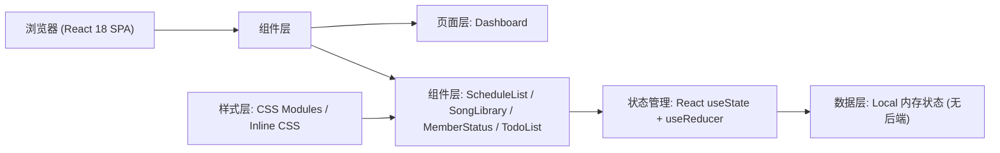
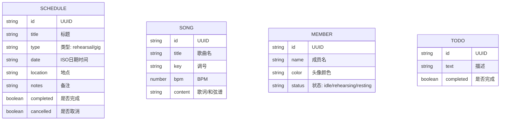

## 1. 架构设计



## 2. 技术描述
- **前端框架**: React@18 + TypeScript@5 + Vite@5
- **构建工具**: Vite 5 + @vitejs/plugin-react
- **状态管理**: React 内置 useState/useReducer（无需额外库）
- **日期处理**: date-fns
- **唯一ID生成**: uuid
- **样式方案**: 纯CSS（全局样式 + CSS变量 + 内联样式动态值），不引入额外CSS框架
- **后端**: 无，纯前端应用，数据保存在内存中
- **数据库**: 无，使用Mock初始数据

## 3. 路由定义
| Route | 用途 |
|-------|------|
| / | 仪表盘主页，展示所有功能模块 |

## 4. API定义
无后端API，所有操作通过本地状态管理。

## 5. 数据模型

### 5.1 数据模型定义



### 5.2 TypeScript 类型定义

```typescript
type ScheduleType = 'rehearsal' | 'gig';
type MemberStatus = 'idle' | 'rehearsing' | 'resting';

interface Schedule {
  id: string;
  title: string;
  type: ScheduleType;
  date: string;
  location: string;
  notes: string;
  completed: boolean;
  cancelled: boolean;
}

interface Song {
  id: string;
  title: string;
  key: string;
  bpm: number;
  content: string;
}

interface Member {
  id: string;
  name: string;
  color: string;
  status: MemberStatus;
}

interface TodoItem {
  id: string;
  text: string;
  completed: boolean;
}
```

### 5.3 初始Mock数据

**成员预设**:
- Alex: #7c4dff (紫)
- Blake: #448aff (蓝)
- Casey: #69f0ae (绿)
- Dylan: #ff6d00 (橙)

## 6. 组件结构

```
src/
├── App.tsx                 # 根组件，状态容器，路由
├── pages/
│   └── Dashboard.tsx       # 仪表盘主页面
├── components/
│   ├── ScheduleList.tsx    # 日程列表（含创建表单、卡片）
│   ├── SongLibrary.tsx     # 歌曲库（含新增、编辑模态框）
│   └── MemberStatus.tsx    # 成员状态看板
└── types/
    └── index.ts            # 类型定义
```

## 7. 性能优化策略
- **歌曲库滚动性能**: 使用CSS `overflow-y: auto` + `contain: layout paint` 优化长列表滚动
- **动画性能**: 优先使用 `transform` 和 `opacity` 属性实现动画，避免触发回流
- **状态切换**: 成员状态颜色过渡使用 CSS `transition: background-color 0.3s ease`
- **避免布局抖动**: 动画元素使用 `will-change` 提示，固定容器尺寸
