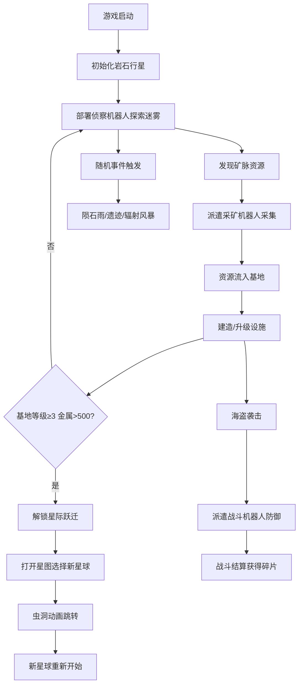

## 1. 产品概述

星际矿机是一款基于浏览器的2D模拟经营游戏，玩家在不同类型星球上部署采矿机器人，管理资源循环，建设基地设施，抵御太空海盗袭击，并探索跨星球跃迁。

- **目标用户**：独立游戏爱好者、模拟经营游戏玩家
- **核心价值**：沉浸式星际采矿体验，策略性资源管理与战斗防御

## 2. 核心功能

### 2.1 功能模块

1. **主游戏界面**：星球地图视角、资源面板、机器人控制面板、事件通知
2. **星球探索系统**：16x16网格地图、迷雾探索、资源分布（金属矿/冰矿/氦-3）
3. **机器人管理系统**：侦察型/采矿型/战斗型三种机器人，能量/背包管理
4. **基地建设系统**：机器人工厂、能量塔、仓库扩容，支持升级
5. **海盗战斗系统**：随机海盗袭击、自动战斗计算、射线交火动画
6. **跨星球跃迁系统**：星际地图、虫洞动画、多星球切换
7. **突发事件与成就系统**：陨石雨/外星遗迹/辐射风暴、8项成就

### 2.2 页面详情

| 页面名称 | 模块名称 | 功能描述 |
|-----------|-------------|---------------------|
| 主游戏界面 | 星球地图 | 16x16网格，缩放0.5x-3x，鼠标拖拽平移，资源区块着色 |
| 主游戏界面 | 资源统计面板 | 左侧半透明卡片，显示金属/冰矿/能量/钛合金进度条 |
| 主游戏界面 | 机器人控制面板 | 底部可折叠抽屉，机器人头像、能量格、血条，拖拽排序 |
| 主游戏界面 | 事件通知弹窗 | 顶部淡入淡出，金/红/蓝三色背景，雾化模糊 |
| 主游戏界面 | 速度控制按钮 | 右上角1x/2x/4x切换 |
| 星图界面 | 星球选择 | 3颗可探索星球，显示资源类型和难度星级 |
| 建造菜单 | 设施选择 | 工厂/能量塔/仓库，显示消耗和效果 |
| 成就面板 | 成就展示 | 半透明磨砂玻璃效果，彩带粒子动画 |

## 3. 核心流程

## 4. 用户界面设计

### 4.1 设计风格

- **主色调**：深蓝紫色星空背景 #0b0f2a
- **强调色**：青色光晕、金属#c0a060、冰矿#a0c8f0、能量蓝、工厂橙
- **字体**：白色像素字体带微弱青色光晕
- **视觉风格**：暗夜星空、动态闪烁星点、半透明磨砂玻璃UI

### 4.2 页面设计概览

| 页面名称 | 模块名称 | UI元素 |
|-----------|-------------|-------------|
| 主游戏界面 | 星球地图 | 细白网格线(0.15透明度)、资源渐变着色、能量塔呼吸发光、工厂脉冲动画 |
| 主游戏界面 | 资源面板 | rgba(10,15,40,0.85)深蓝卡片、圆角进度条渐变填充、像素图标 |
| 主游戏界面 | 机器人面板 | 展开120px/收拢25px、头像框按类型着色(绿/黄/红)、能量格/血条 |
| 主游戏界面 | 事件通知 | 淡入淡出滑入、金/红/蓝背景色、背景雾化模糊 |
| 主游戏界面 | 区块浮窗 | 圆角6px、0.3s缩放进入、资源量百分比/机器人状态/辐射状态 |

### 4.3 响应式设计

- **桌面端**：左侧资源面板、底部机器人面板、中央地图区域
- **平板端(≤768px)**：资源面板和机器人面板合并为全宽底部导航栏(高50px)，地图填充视口
- **触摸支持**：触摸拖拽平移、双指缩放

### 4.4 动画特效

- 星点按随机时序渐变透明度0.2-0.8
- 能量塔蓝色边框呼吸发光动画
- 工厂橙色动态脉冲
- 建造设施地面升起+绿色边框闪烁
- 资源沿L形路径飞向基地
- 战斗红蓝射线交火动画
- 虫洞由外向内收缩动画(5秒)
- 成就彩带粒子动画
- 0.3s缩放进入的区块浮窗
