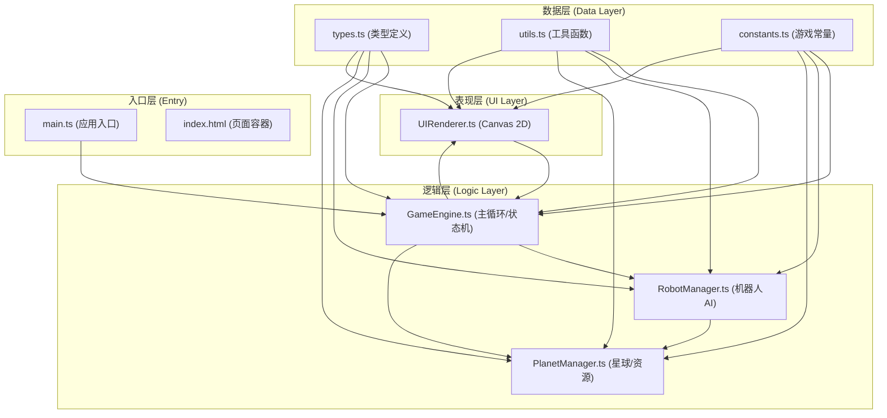

## 1. 架构设计



**数据流向说明：**
1. 用户输入 → UIRenderer → GameEngine（用户交互事件向上传递）
2. GameEngine → PlanetManager/RobotManager（业务逻辑调用）
3. PlanetManager/RobotManager → GameEngine（状态变化反馈）
4. GameEngine → UIRenderer（渲染状态每帧下发）

## 2. 技术描述

- **前端框架**：原生 TypeScript + Canvas 2D API（无UI框架，纯Canvas渲染）
- **构建工具**：Vite@5 + @vitejs/plugin-basic-ssl
- **编程语言**：TypeScript@5（严格模式，目标ES2020）
- **工具库**：lodash（数据处理）、uuid（唯一ID生成）
- **初始化方式**：Vite vanilla-ts 模板手动配置

## 3. 项目文件结构

```
项目根目录/
├── package.json              # 项目依赖与脚本配置
├── vite.config.js            # Vite构建配置（HTTPS）
├── tsconfig.json             # TypeScript编译配置（严格模式）
├── index.html                # 入口HTML页面
└── src/
    ├── main.ts               # 应用入口，初始化游戏引擎
    ├── GameEngine.ts         # 主游戏引擎：60FPS主循环、状态机、资源池、事件系统
    ├── PlanetManager.ts      # 星球管理：16x16网格、资源分布、随机事件
    ├── RobotManager.ts       # 机器人管理：机器人队列、移动AI、采矿/战斗逻辑
    ├── UIRenderer.ts         # Canvas渲染器：地图/UI/粒子/动画
    ├── types/
    │   └── index.ts          # 全局TypeScript类型定义
    ├── utils/
    │   └── index.ts          # 工具函数（数学、随机、碰撞检测等）
    └── constants/
        └── index.ts          # 游戏常量配置（资源数值、时间间隔、颜色值）
```

## 4. 核心类型定义

```typescript
// 资源类型
type ResourceType = 'metal' | 'ice' | 'helium3' | 'energy' | 'titanium';

// 区块类型
type SectorType = 'empty' | 'metal' | 'ice' | 'helium3' | 'mountain' | 'base';

// 机器人类型
type RobotType = 'scout' | 'miner' | 'fighter';

// 游戏状态
type GameState = 'mining' | 'building' | 'defending' | 'exploring' | 'starmap';

// 星球类型
type PlanetType = 'rocky' | 'gas_giant' | 'ice_moon' | 'lava';

// 事件类型
type EventType = 'meteor' | 'ruin' | 'radiation' | 'pirate_attack';

// 设施类型
type BuildingType = 'factory' | 'energy_tower' | 'warehouse';

// 机器人状态
type RobotStatus = 'idle' | 'moving' | 'mining' | 'fighting' | 'returning' | 'disabled';
```

## 5. 核心模块接口

### 5.1 GameEngine 接口
```typescript
interface IGameEngine {
  start(): void;
  pause(): void;
  setSpeed(speed: 1 | 2 | 4): void;
  getState(): GameState;
  on(event: string, callback: Function): void;
  emit(event: string, data: any): void;
}
```

### 5.2 PlanetManager 接口
```typescript
interface IPlanetManager {
  init(seed: number, planetType: PlanetType): void;
  getResourcesInSector(x: number, y: number): SectorResource;
  applyDrillDamage(x: number, y: number, amount: number): number;
  isRevealed(x: number, y: number): boolean;
  revealArea(cx: number, cy: number, radius: number): void;
  getSector(x: number, y: number): Sector;
}
```

### 5.3 RobotManager 接口
```typescript
interface IRobotManager {
  addRobot(type: RobotType): Robot;
  removeRobot(id: string): void;
  assignTask(robotId: string, task: RobotTask): void;
  update(dt: number): void;
  getRobots(): Robot[];
  getRobotById(id: string): Robot | undefined;
}
```

### 5.4 UIRenderer 接口
```typescript
interface IUIRenderer {
  render(state: RenderState): void;
  handleInput(event: UIEvent): void;
  setViewport(zoom: number, offsetX: number, offsetY: number): void;
}
```

## 6. 性能约束方案

| 约束项 | 指标 | 实现方案 |
|--------|------|----------|
| 帧率 | 60FPS稳定 | requestAnimationFrame + 固定时间步长累加器 |
| 地图渲染 | ≤256区块 | 视口裁剪，只渲染可见区域；离屏Canvas缓存静态地图 |
| 机器人AI | ≤0.5ms/帧 | 批量更新，简单状态机，避免复杂路径规划(A*用曼哈顿距离) |
| 活动机器人 | ≤20个 | 硬上限限制，工厂产能封顶 |
| 粒子数量 | ≤80个 | 对象池复用，超出自动回收最旧粒子 |
| 事件弹窗 | 不阻塞主循环 | CSS过渡/Canvas独立层渲染，异步处理 |
| 首屏加载 | ≤3秒 | 无第三方UI框架，纯TypeScript，Vite ESM热更新 |

## 7. 状态管理方案

采用**集中式事件总线 + 单向数据流**：
- GameEngine 持有唯一真相源（游戏状态）
- 所有状态变更通过 GameEngine 接口触发
- 每帧 GameEngine 将渲染快照传递给 UIRenderer
- UI 事件通过回调传回 GameEngine 处理
- RobotManager/PlanetManager 为纯逻辑模块，不持有渲染状态
