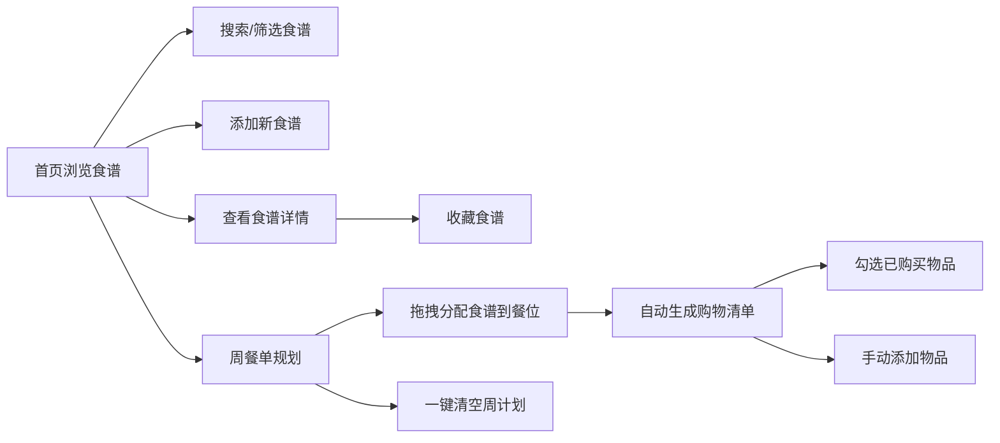

## 1. 产品概述

一款个人食谱收藏与烹饪计划管理应用，帮助用户解决日常饮食规划缺乏灵感、食材浪费和菜谱散落在各处的问题。
- 核心目标：提供食谱管理、周餐单规划、智能购物清单生成的一体化解决方案
- 目标用户：家庭主妇/夫、美食爱好者、注重健康饮食的人群
- 市场价值：通过数字化饮食规划，减少食材浪费，提升烹饪效率和乐趣

## 2. 核心功能

### 2.1 功能模块

1. **食谱管理模块**：添加、查看、搜索、筛选食谱，支持收藏功能
2. **每周餐单规划**：周视图日历，拖拽分配食谱到早/午/晚餐
3. **智能购物清单**：基于周餐单自动生成去重购物清单，支持勾选和手动添加
4. **搜索与筛选**：按名称、食材、难易度、菜系实时搜索筛选

### 2.2 页面详情

| 页面名称 | 模块名称 | 功能描述 |
|-----------|-------------|---------------------|
| 首页 | 顶部导航栏 | 应用标题、搜索框、筛选器、添加食谱按钮、餐单规划入口、购物清单入口 |
| 首页 | 食谱卡片网格 | 响应式卡片展示（桌面4列/平板2列/手机1列），懒加载滚动加载 |
| 食谱详情页 | 食谱详情 | 封面图、名称、难易度、食材清单、烹饪步骤、收藏/删除按钮 |
| 添加食谱表单 | 表单模块 | 名称、封面图（上传/URL）、动态食材行、拖拽排序步骤、星级难易度、菜系选择 |
| 周餐单规划页 | 周视图日历 | 周一至周日 × 早午晚 槽位，支持拖拽分配，彩色标签，一键清空 |
| 购物清单页 | 清单模块 | 按分类分组、复选框勾选、手动添加、全选/清空功能 |

## 3. 核心流程

用户打开应用 → 在首页浏览食谱卡片 → 通过搜索/筛选快速定位食谱 → 点击卡片查看详情或收藏 → 进入周餐单规划页拖拽分配食谱 → 系统自动生成购物清单 → 用户勾选已购买物品

## 4. 用户界面设计

### 4.1 设计风格
- 主色调：浅米色（#F5F0E8）作为背景主色
- 强调色：橄榄绿（#6B8E23）和陶土橙（#CD853F）
- 按钮风格：圆角设计，悬停时有颜色过渡和缩放效果
- 字体：使用优雅的衬线字体搭配无衬线字体，标题突出、正文易读
- 布局风格：卡片式布局，大量留白，视觉层次清晰
- 图标风格：使用简洁的线性图标或emoji

### 4.2 页面设计概览

| 页面名称 | 模块名称 | UI 元素 |
|-----------|-------------|-------------|
| 首页 | 导航栏 | 固定顶部、浅米色背景、橄榄绿强调按钮 |
| 首页 | 食谱卡片 | 圆角卡片、悬停上浮阴影+scale(1.05)、0.2s过渡 |
| 详情页 | 内容区 | 大封面图、步骤有序列表、食材清单分组 |
| 表单页 | 输入框 | 圆角输入框、错误时红色边框+shake动画0.3s |
| 周视图 | 日历格 | 网格布局、拖拽时半透明幽灵副本、餐单标签渐入动画0.4s |
| 购物清单 | 清单项 | 分类分组、复选框自定义样式、勾选后划线效果 |

### 4.3 响应式设计
- 桌面端（≥1024px）：食谱卡片4列布局，周视图完整展示
- 平板端（768px-1023px）：食谱卡片2列布局，周视图水平滚动
- 移动端（<768px）：食谱卡片1列布局，周视图垂直堆叠，触控优化
