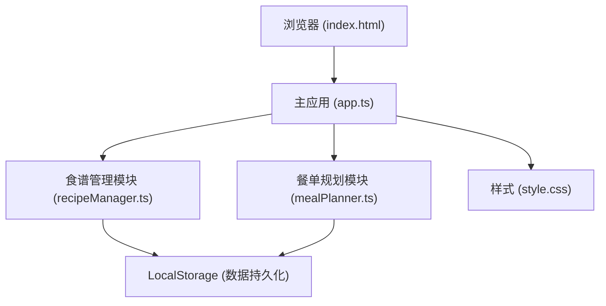
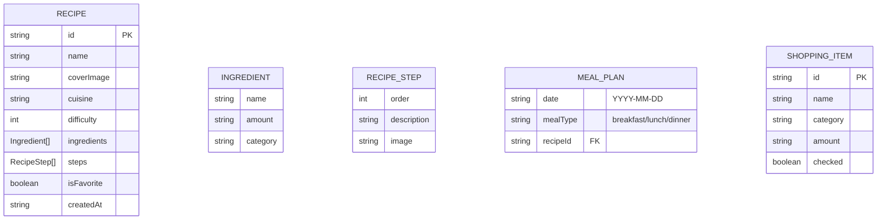

## 1. 架构设计



## 2. 技术说明
- 前端：TypeScript + 原生 JavaScript（模块化，无框架）+ Web Components 思想
- 构建工具：Vite 5.x（端口3000）
- 数据存储：LocalStorage 浏览器本地存储
- 不依赖第三方UI库，纯原生DOM操作
- 拖拽使用 HTML5 Drag and Drop API
- 无后端、无数据库

## 3. 文件结构

| 文件路径 | 用途 |
|-------|------|
| `/package.json` | 项目依赖与脚本配置 |
| `/vite.config.js` | Vite 构建配置 |
| `/tsconfig.json` | TypeScript 编译配置（严格模式、ES2020、DOM类型） |
| `/index.html` | 入口页面 |
| `/src/app.ts` | 主逻辑入口：初始化模块、全局状态管理、路由分发 |
| `/src/recipeManager.ts` | 食谱 CRUD、搜索筛选、收藏功能 |
| `/src/mealPlanner.ts` | 周餐单拖拽、购物清单生成 |
| `/src/style.css` | 全局样式、响应式布局、动画关键帧 |

## 4. 数据模型

### 4.1 数据模型定义



### 4.2 核心 TypeScript 类型定义

```typescript
interface Ingredient {
  name: string;
  amount: string;
  category: '蔬菜' | '肉类' | '调味品' | '主食' | '海鲜' | '乳制品' | '其他';
}

interface RecipeStep {
  order: number;
  description: string;
  image?: string;
}

interface Recipe {
  id: string;
  name: string;
  coverImage: string;
  cuisine: '中式' | '意式' | '日式' | '韩式' | '西式' | '其他';
  difficulty: 1 | 2 | 3 | 4 | 5;
  ingredients: Ingredient[];
  steps: RecipeStep[];
  isFavorite: boolean;
  createdAt: string;
}

interface MealSlot {
  date: string;
  mealType: 'breakfast' | 'lunch' | 'dinner';
  recipeId: string | null;
}

interface ShoppingItem {
  id: string;
  name: string;
  category: string;
  amount: string;
  checked: boolean;
}
```

## 5. 性能优化

| 优化项 | 实现方案 | 目标 |
|-------|---------|------|
| 搜索响应 | debounce 防抖 300ms | < 300ms |
| 购物清单生成 | 同步内存计算 | < 500ms |
| 卡片渲染 | 懒加载：首屏4张，滚动触发加载 | 首屏快速渲染 |
| 动画效果 | CSS transition / animation 硬件加速 | 60fps |
| DOM操作 | 虚拟列表思想 / DocumentFragment | 减少重排 |
