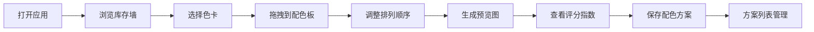

## 1. 产品概述
织色 - 毛线配色工坊是一款面向小型独立手作编织工作室和编织爱好者的可视化毛线库存管理与配色方案设计工具。通过电子线柜的形式直观展示毛线库存，支持拖拽式配色设计和预览，解决传统毛线管理和配色搭配不直观、效率低的问题。

- 核心目标：将毛线库存管理数字化、可视化，让配色设计变得轻松有趣
- 目标用户：编织爱好者、小型独立手作编织工作室

## 2. 核心功能

### 2.1 功能模块
1. **库存墙面板**：按色系分类展示毛线卡片，支持点击查看详情和拖拽选色
2. **配色方案板**：拖拽添加色卡、调整排列顺序、生成预览图、计算温暖指数和对比度
3. **已保存方案列表**：保存/加载配色方案，支持时间倒序浏览

### 2.2 页面详情
| 页面名称 | 模块名称 | 功能描述 |
|---------|----------|----------|
| 主页 | 库存墙面板 | 按暖色系/冷色系/中性色系/黑白灰分类展示60张毛线色卡，每卡显示彩色圆形样本、名称、克数、批次号 |
| 主页 | 配色方案板 | 支持最多4个色块拖拽排列，生成几何图案预览，计算温暖指数和对比度评分 |
| 主页 | 已保存方案列表 | 以时间倒序展示已保存方案，显示名称、缩略图、保存时间，点击可重新加载 |
| 主页 | 浮动详情窗 | 点击色卡弹出详细信息（使用记录、购买链接等），半透明遮罩渐入渐出 |

## 3. 核心流程
用户打开应用 → 浏览按色系分类的库存墙 → 点击或拖拽色卡添加到配色方案板（最多4个）→ 在方案板中拖拽调整色块顺序 → 点击"生成预览"查看几何图案效果和配色评分 → 输入方案名称和备注后保存 → 在已保存方案列表中查看和重新加载历史方案

## 4. 用户界面设计

### 4.1 设计风格
- **主背景色**：#f5f0e8（亚麻色）
- **面板底色**：#ffffff 带轻微阴影
- **色系边框**：暖色#c97c5d / 冷色#5d7c97 / 中性#8a7968
- **配色板背景**：柔和米白色
- **字体**：使用优雅的衬线/无衬线字体组合，体现手作工作室的自然温暖质感
- **交互反馈**：卡片悬停上浮放大1.03倍、脉冲光晕、色块拖拽0.2秒平滑过渡、点击放大反馈、遮罩0.3秒渐入渐出

### 4.2 页面设计概览
| 页面名称 | 模块名称 | UI元素 |
|---------|----------|--------|
| 主页 | 库存墙面板 | 圆角卡片、3cm彩色圆形样本、1px细边框、悬停上浮+脉冲光晕、色系标题带颜色标识 |
| 主页 | 配色方案板 | 米白色背景、120×80px矩形色块、白底黑字标注色值名称、拖拽平滑过渡、点击放大反馈 |
| 主页 | 预览生成区 | SVG几何图案（北欧条纹/菱形格纹）、温暖指数数值、对比度评分 |
| 主页 | 保存方案区 | 方案名称输入框、备注输入框、保存按钮 |
| 主页 | 方案列表 | 时间倒序卡片、缩略图、保存时间 |

### 4.3 响应式设计
- **桌面端（>1280px）**：三栏布局（左配色板 + 中库存墙 + 右方案列表）
- **平板端（768-1280px）**：两栏布局，库存墙和配色板上下排列
- **手机端（<768px）**：单栏堆叠布局，圆形样本缩小为2.4cm直径

## 5. 性能要求
- 库存墙渲染时间 < 1.5秒（60张卡片）
- 拖拽操作响应延迟 < 100ms
- 配色预览图生成 < 2秒
