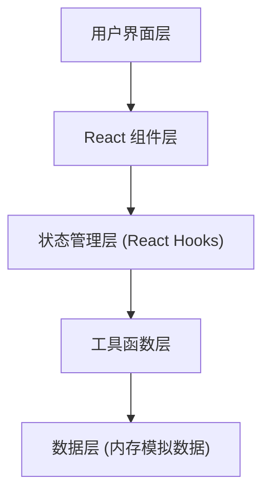
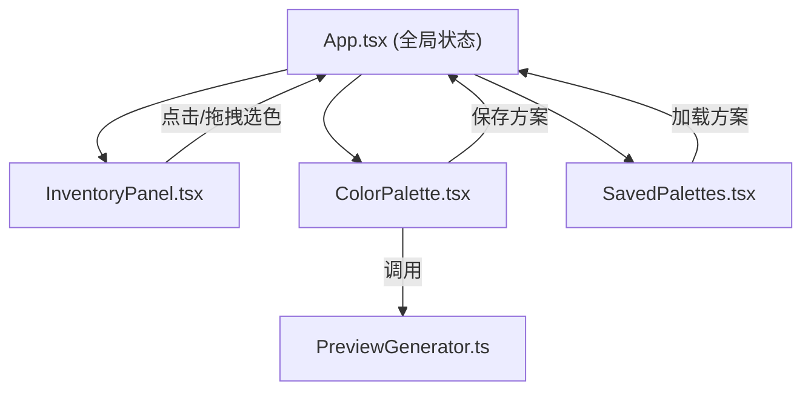

## 1. 架构设计



## 2. 技术说明
- **前端框架**：React 18 + TypeScript 5
- **构建工具**：Vite 5
- **动画库**：framer-motion 10
- **工具库**：lodash, uuid
- **数据存储**：内存变量（无需后端）

## 3. 项目结构

```
├── index.html              # 入口HTML
├── package.json            # 依赖配置
├── tsconfig.json           # TypeScript配置
├── vite.config.js          # Vite构建配置
└── src/
    ├── App.tsx             # 主应用组件，管理状态和布局
    ├── InventoryPanel.tsx  # 库存墙面板组件
    ├── ColorPalette.tsx    # 配色方案板组件
    ├── PreviewGenerator.ts # 预览图生成和评分计算工具
    └── SavedPalettes.tsx   # 已保存方案列表组件
```

## 4. 数据模型定义

### 4.1 毛线数据模型
```typescript
interface Yarn {
  id: string;
  name: string;
  color: string;           // 十六进制颜色值
  hexCode: string;         // 同color，用于标注
  grams: number;           // 剩余克数
  batch: string;           // 批次号
  category: 'warm' | 'cool' | 'neutral' | 'monochrome'; // 色系分类
  brand?: string;          // 品牌
  purchaseLink?: string;   // 购买链接
  usageHistory?: string[]; // 使用记录
}
```

### 4.2 配色方案数据模型
```typescript
interface Palette {
  id: string;
  name: string;
  note: string;
  colors: Yarn[];          // 最多4个颜色
  createdAt: number;       // 保存时间戳
}
```

## 5. 组件数据流



## 6. 核心算法

### 6.1 温暖指数计算
- 基于色相(H)和饱和度(S)的加权计算
- 色相0-60°(红橙黄)为暖色，180-300°(蓝青紫)为冷色
- 公式参考：warmth = (sin(H * π/180) * 0.6 + S * 0.4) * 100，范围0-100

### 6.2 对比度评分
- 计算每对颜色之间的相对亮度对比度
- 取最小对比度值作为评分参考
- 符合WCAG对比度标准的线性映射

### 6.3 几何图案生成
- 使用SVG生成北欧风格条纹或菱形格纹图案
- 4个颜色循环使用于图案元素
- 输出Base64编码的SVG字符串
