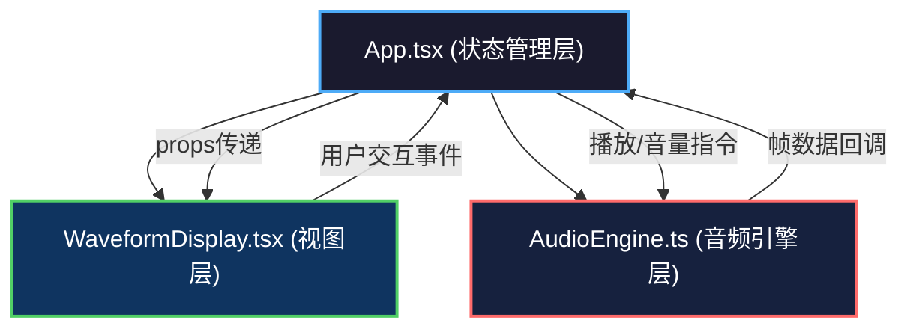

## 1. 架构设计



## 2. 技术栈说明

- **前端框架**：React@18 + ReactDOM@18
- **开发语言**：TypeScript@5（严格模式，ES2020目标）
- **构建工具**：Vite@5 + @vitejs/plugin-react
- **动画库**：framer-motion@10
- **音频处理**：Web Audio API（原生）
- **波形绘制**：Canvas 2D API（原生）

## 3. 文件结构与职责

```
e:\solo\VersionFast\tasks\auto259\
├── .trae/documents/
│   ├── PRD.md                  # 产品需求文档
│   └── Tech-Architecture.md    # 技术架构文档（本文件）
├── index.html                  # 入口页面，深灰渐变背景
├── package.json                # 依赖配置与启动脚本
├── tsconfig.json               # TypeScript严格模式配置
├── vite.config.js              # Vite构建配置（React插件）
└── src/
    ├── main.tsx                # React应用入口
    ├── App.tsx                 # 主应用组件：状态管理、组件协调
    ├── AudioEngine.ts          # 音频引擎：Web Audio API封装、帧分析
    ├── WaveformDisplay.tsx     # 波形显示：Canvas绘制、UI控件
    └── types.ts                # 类型定义文件
```

## 4. 数据流向与调用关系

### 4.1 核心数据流向

```
用户操作(UI) → App.tsx(状态) → AudioEngine(指令) → Web Audio API
                                                         ↓
                                              音频分析数据(每帧)
                                                         ↓
App.tsx(更新状态) ← AudioEngine(回调) ← requestAnimationFrame
        ↓
WaveformDisplay.tsx(重绘) ← Props变化
```

### 4.2 模块间接口

**AudioEngine.ts → App.tsx**

| 回调 | 参数 | 说明 |
|-----|------|------|
| onFrameUpdate | `{ waveforms: Float32Array[3], volumes: number[3], currentTime: number }` | 每帧音频数据 |
| onDurationChange | `duration: number` | 音频总时长变化 |
| onPlayStateChange | `isPlaying: boolean` | 播放状态变化 |

**App.tsx → AudioEngine.ts**

| 方法 | 参数 | 说明 |
|-----|------|------|
| loadTrack | `index: number, file: File` | 加载指定轨道音频 |
| play | 无 | 播放所有轨道 |
| pause | 无 | 暂停所有轨道 |
| stop | 无 | 停止并回到起始 |
| setVolume | `index: number, value: number` | 设置轨道音量(0-1) |
| setMuted | `index: number, muted: boolean` | 设置轨道静音 |
| seek | `time: number` | 跳转到指定时间 |

**App.tsx → WaveformDisplay.tsx (Props)**

| 属性 | 类型 | 说明 |
|-----|------|------|
| trackNames | `string[3]` | 三轨道名称 |
| trackColors | `string[3]` | 三轨道颜色 |
| waveforms | `Float32Array[3]` | 当前帧时域波形数据 |
| volumes | `number[3]` | 当前帧音量(0-1) |
| trackVolumes | `number[3]` | 用户设置的音量(0-1) |
| isMuted | `boolean[3]` | 各轨道静音状态 |
| currentTime | `number` | 当前播放时间(秒) |
| duration | `number` | 音频总时长(秒) |
| zoomLevel | `number` | 波形缩放倍数(1-10) |
| trackSpacing | `number` | 轨道间距系数 |
| isPlaying | `boolean` | 是否正在播放 |
| tracksLoaded | `boolean[3]` | 各轨道是否已加载 |

**WaveformDisplay.tsx → App.tsx (Callbacks)**

| 回调 | 参数 | 说明 |
|-----|------|------|
| onVolumeChange | `index: number, value: number` | 轨道音量滑块变化 |
| onMuteToggle | `index: number` | 静音按钮点击 |
| onSeek | `time: number` | 进度条点击跳转 |
| onZoomChange | `value: number` | 缩放滑块变化 |
| onSpacingChange | `value: number` | 间距滑块变化 |
| onUploadTrack | `index: number, file: File` | 轨道文件上传 |

## 5. 核心类与接口定义

### 5.1 AudioEngine 类

```typescript
interface Track {
  buffer: AudioBuffer | null;
  source: AudioBufferSourceNode | null;
  gainNode: GainNode;
  analyser: AnalyserNode;
  volume: number;
  muted: boolean;
}

interface FrameData {
  waveforms: Float32Array[];
  volumes: number[];
  currentTime: number;
}

class AudioEngine {
  constructor(onFrame: (data: FrameData) => void);
  loadTrack(index: number, file: File): Promise<void>;
  play(): void;
  pause(): void;
  stop(): void;
  setVolume(index: number, value: number): void;
  setMuted(index: number, muted: boolean): void;
  seek(time: number): void;
  getDuration(index: number): number;
  destroy(): void;
}
```

### 5.2 App.tsx 状态接口

```typescript
interface AppState {
  isPlaying: boolean;
  currentTime: number;
  duration: number;
  trackVolumes: [number, number, number];
  isMuted: [boolean, boolean, boolean];
  tracksLoaded: [boolean, boolean, boolean];
  waveforms: [Float32Array | null, Float32Array | null, Float32Array | null];
  realtimeVolumes: [number, number, number];
  zoomLevel: number;
  trackSpacing: number;
}
```

## 6. 性能优化策略

1. **Canvas 绘制优化**：使用 `requestAnimationFrame` 同步绘制，避免频繁重绘
2. **音频分析复用**：三轨道共享同一 AudioContext，独立 AnalyserNode
3. **数据缓冲**：时域数据使用 Float32Array 预分配，避免每帧 GC
4. **React 渲染优化**：Canvas 绘制通过 ref 直接操作 DOM，不触发 React 重渲染
5. **节流处理**：滑块事件使用 requestAnimationFrame 节流，确保 <50ms 延迟
6. **内存管理**：组件卸载时调用 AudioEngine.destroy() 释放资源
