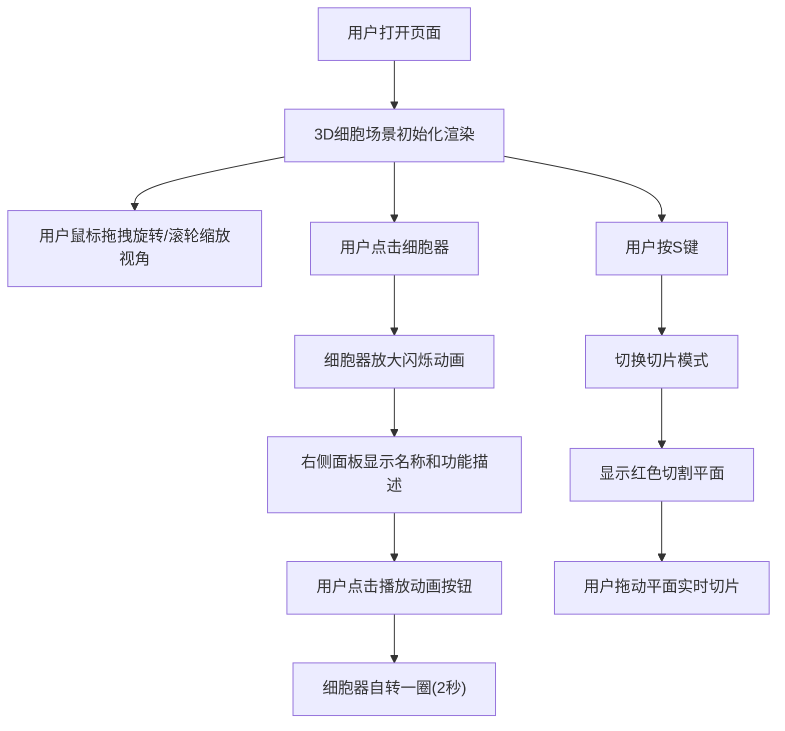

## 1. 产品概述
基于浏览器的3D生物细胞内部结构交互可视化应用，让用户通过显微镜般的体验探索细胞内部结构。
- 主要用途：教育展示、生物学习、科学可视化
- 目标用户：学生、教师、生物爱好者、科普工作者
- 产品价值：提供沉浸式的3D交互体验，使抽象的细胞结构变得直观可感

## 2. 核心功能

### 2.1 用户角色
| 角色 | 注册方式 | 核心权限 |
|------|----------|----------|
| 访客用户 | 无需注册 | 浏览3D细胞场景、交互操作、查看细胞器信息 |

### 2.2 功能模块
1. **3D细胞场景**: 质膜球体、多种细胞器模型、动态粒子系统
2. **交互控制**: 鼠标旋转、滚轮缩放、点击选中、切片模式
3. **信息展示面板**: 细胞器名称、功能描述、动画播放控制
4. **操作提示**: 左上角快捷提示图标

### 2.3 页面详情
| 页面名称 | 模块名称 | 功能描述 |
|---------|---------|---------|
| 主页面 | 3D渲染区域 | 占视口85%宽度，展示细胞3D模型，支持旋转缩放点击 |
| 主页面 | 信息面板 | 右侧250px固定宽度，展示选中细胞器信息 |
| 主页面 | 操作提示 | 左上角显示鼠标旋转、滚轮缩放、点击选中、按S切片提示 |
| 主页面 | 切片模式 | 按S键切换，红色线框切割平面可拖动切片 |

## 3. 核心流程
用户打开应用后看到完整的3D细胞模型，可通过鼠标旋转缩放从各角度观察。点击任意细胞器触发选中动画并在右侧面板显示详细信息，可播放细胞器自转动画。按S键进入切片模式，拖动切割平面观察细胞器内部结构。

## 4. 用户界面设计

### 4.1 设计风格
- **主色调**: 深蓝色渐变背景(#0a0a2e → #1a1a4e)，营造显微镜下的深邃感
- **细胞器配色**: 细胞核紫色(#8b5cf6)、线粒体橙色(#f97316)、高尔基体青色(#06b6d4)、内质网绿色(#10b981)、溶酶体红色(#ef4444)
- **面板样式**: 半透明深灰色(#1e1e3e, 透明度0.85)，白色文字
- **按钮风格**: 圆角矩形，hover时有淡蓝色光晕效果
- **字体**: 无衬线细体，标题带淡蓝色光晕(text-shadow)
- **布局**: 桌面端左右布局(85% + 250px)，移动端上下布局(底部150px横向面板)
- **动画过渡**: 所有交互0.3s ease-in-out平滑过渡

### 4.2 页面设计概览
| 页面名称 | 模块名称 | UI元素 |
|---------|---------|--------|
| 主页面 | 3D场景 | 深蓝色渐变背景、半透明质膜球体、彩色细胞器、漂浮发光粒子、边缘发光效果 |
| 主页面 | 信息面板 | 固定宽度侧边栏、细胞器名称(1.2em)、功能描述(0.9em行高1.6)、播放动画按钮 |
| 主页面 | 操作提示 | 左上角4个图标(旋转/缩放/选中/切片)，CSS绘制的纯图标 |
| 主页面 | 切片平面 | 红色线框网格半透明平面，可上下拖动 |

### 4.3 响应式设计
- 桌面端(>768px): 左侧85%为3D场景，右侧固定250px信息面板
- 移动端(≤768px): 3D场景占满全屏，信息面板变为底部150px高度的横向滑动面板

### 4.4 3D场景指导
- **环境**: 深色背景模拟显微镜视野，点光源+环境光组合营造立体感
- **光照**: AmbientLight(0xffffff, 0.4) + 两个PointLight分别在场景上方和侧方
- **相机**: PerspectiveCamera，初始距离15单位，可轨道控制
- **交互**: OrbitControls支持旋转缩放，Raycaster实现点击检测
- **后处理**: 所有物体使用EdgesGeometry实现边缘发光效果
- **性能目标**: 60fps稳定运行，切片响应<100ms
