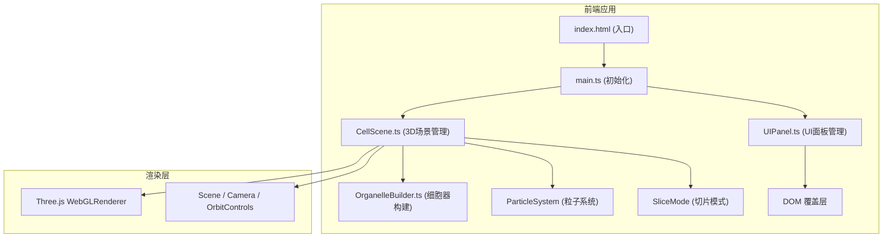
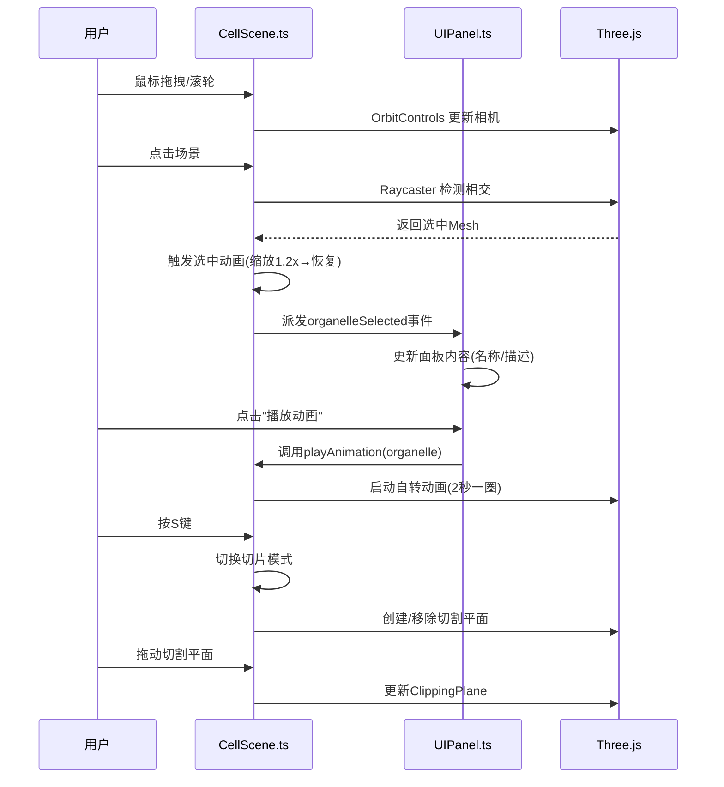

## 1. 架构设计


## 2. 技术说明
- **前端框架**: 原生 TypeScript (无框架)，直接操作DOM和Three.js
- **构建工具**: Vite@5
- **3D渲染库**: Three.js@0.160 + @types/three
- **辅助库**: lodash、uuid
- **后端**: 无后端，纯前端应用
- **数据**: 硬编码的细胞器元数据(名称、颜色、功能描述、位置)

## 3. 模块说明

### 3.1 文件结构
| 文件 | 职责 |
|------|------|
| package.json | 项目依赖和脚本(npm run dev) |
| index.html | 入口HTML，包含深蓝色渐变背景和标题 |
| tsconfig.json | TypeScript配置(严格模式，ES2020目标) |
| vite.config.js | Vite构建配置 |
| src/CellScene.ts | 场景主控制器：创建Scene/Camera/Renderer/OrbitControls，加载细胞器，处理点击事件，管理粒子系统和切片模式 |
| src/OrganelleBuilder.ts | 细胞器几何体工厂：构建各种细胞器的Mesh，返回带边界框信息的对象用于点击检测 |
| src/UIPanel.ts | UI管理器：创建HTML覆盖层，监听CellScene事件，更新面板内容，控制动画播放 |

### 3.2 数据流


## 4. 核心类与接口

### 4.1 OrganelleInfo 接口
```typescript
interface OrganelleInfo {
  id: string;
  name: string;
  nameEn: string;
  color: number;
  position: THREE.Vector3;
  description: string;
}
```

### 4.2 BuiltOrganelle 接口
```typescript
interface BuiltOrganelle {
  mesh: THREE.Mesh;
  boundingBox: THREE.Box3;
  info: OrganelleInfo;
  innerStructure?: THREE.Object3D; // 切片时显示的内部结构
}
```

### 4.3 CellScene 核心方法
- `constructor(container: HTMLElement)`: 初始化场景
- `on(event: 'organelleSelected', callback: (info: OrganelleInfo) => void)`: 事件监听
- `playOrganelleAnimation(id: string)`: 播放指定细胞器自转动画
- `toggleSliceMode()`: 切换切片模式

## 5. 性能优化策略
- 使用BufferGeometry替代Geometry
- 粒子系统使用Points + BufferGeometry批量渲染
- 切片使用Three.js内置ClippingPlane，避免几何体修改
- 边缘发光使用EdgesGeometry，避免后期处理开销
- 限制粒子数量为200个
- 动画使用requestAnimationFrame，避免setInterval
