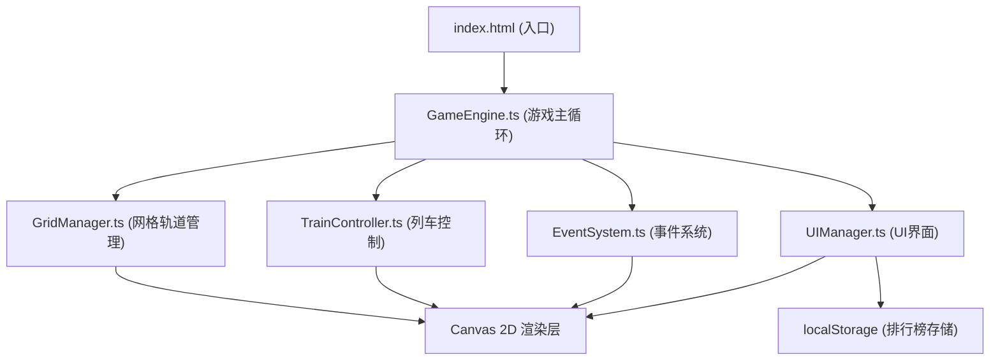

## 1. 架构设计



## 2. 技术栈描述

- **前端框架**：无框架，原生 TypeScript + Canvas 2D API
- **构建工具**：Vite@5（ES模块输出，HMR热更新）
- **类型系统**：TypeScript@5（严格模式，目标ES2020）
- **工具库**：lodash（工具函数）、uuid（唯一标识符生成）
- **数据存储**：浏览器 localStorage（排行榜本地持久化）

## 3. 模块职责与文件结构

| 文件路径 | 模块职责 |
|----------|----------|
| `src/GameEngine.ts` | 游戏主循环控制器，管理游戏状态机，协调各子模块工作，处理关卡切换、回放控制、积分计算 |
| `src/GridManager.ts` | 9x9网格数据结构，轨道CRUD操作（放置/旋转/删除/查询），网格与轨道Canvas绘制 |
| `src/TrainController.ts` | 列车实例管理，路径跟随算法，平滑插值动画，信号灯响应逻辑，碰撞检测算法 |
| `src/EventSystem.ts` | 随机信号灯生成与状态切换，动物横穿事件触发与生命周期，事件回调与UI通知 |
| `src/UIManager.ts` | DOM UI元素构建（工具栏/信息面板/按钮），Canvas UI层绘制，响应式布局计算，CSS动画管理 |

## 4. 核心数据结构定义

```typescript
// 方向枚举
enum Direction { UP = 0, RIGHT = 1, DOWN = 2, LEFT = 3 }

// 轨道类型
type TrackType = 'straight' | 'curve' | 'switch'

// 轨道单元格
interface TrackCell {
  type: TrackType | null
  rotation: number // 0, 90, 180, 270
  connections: Direction[] // 可通行方向
}

// 网格位置
interface GridPos { x: number; y: number }

// 列车状态
interface Train {
  id: string
  color: 'green' | 'red'
  position: GridPos
  pixelOffset: { x: number; y: number }
  direction: Direction
  speed: number // 秒/格
  isMoving: boolean
  isWaiting: boolean
  waitTimer: number
  path: GridPos[]
  reachedDestination: boolean
}

// 信号灯
interface SignalLight {
  id: string
  position: GridPos
  state: 'green' | 'red'
  timer: number
  duration: number
}

// 动物事件
interface AnimalEvent {
  id: string
  position: GridPos
  direction: Direction
  moveTimer: number
  duration: number
  active: boolean
}

// 关卡配置
interface LevelConfig {
  level: number
  gridSize: number
  stations: { green: GridPos; red: GridPos }
  obstacles: GridPos[]
  maxTracks: number
  signalCount: number
  eventFrequency: number
  timeLimit: number
}

// 回放帧
interface ReplayFrame {
  timestamp: number
  trains: Train[]
  signals: SignalLight[]
  events: AnimalEvent[]
  logs: string[]
}

// 游戏状态
type GameState = 'editing' | 'running' | 'paused' | 'finished' | 'replaying'
```

## 5. 核心算法说明

### 5.1 轨道连接与路径计算
- 每种轨道类型预定义4个旋转状态的连接方向
- 列车行驶时根据当前格子的连接方向和进入方向计算下一格
- 道岔（switch）支持多方向，根据预设优先级选择

### 5.2 碰撞检测
- 每帧更新后检查两辆列车的网格坐标
- 同一格判定为碰撞；相邻格互换位置也判定为碰撞
- 碰撞触发红色闪烁警告并结束运行

### 5.3 平滑动画
- 使用 requestAnimationFrame 主循环（目标60fps）
- 列车位置 = 起始格像素 + (目标格像素 - 起始格像素) × 插值系数
- 插值系数 = 已用时间 / 每格耗时（0.1-1.0秒可调）

### 5.4 事件系统
- 信号灯：随机时间间隔（2-8秒）切换状态，红色持续3-5秒
- 动物事件：运行过程中每帧5%概率触发，触发后动物横穿轨道持续2秒
- 事件触发时更新右侧事件日志（绿色滚动文字）

## 6. 性能优化策略

| 优化项 | 实现方式 |
|--------|----------|
| 帧率稳定 | requestAnimationFrame + deltaTime计算，避免setInterval漂移 |
| 渲染优化 | 网格和轨道使用离屏Canvas缓存，仅重绘变化区域 |
| 计算优化 | 碰撞检测和状态更新每帧耗时控制在5ms内，避免阻塞主线程 |
| 内存管理 | 回放帧数据采用环形缓冲，限制最大帧数防止内存溢出 |
| 响应式 | Canvas使用devicePixelRatio适配高清屏，布局使用CSS媒体查询 |
