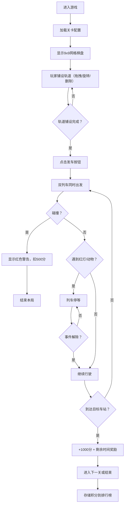

## 1. 产品概述
"铁轨铺排与调度"是一款在浏览器中运行的2D像素风策略解谜游戏。玩家需要在9x9网格上合理规划有限的轨道资源（直轨、弯轨、道岔），让两辆不同颜色的列车在固定站点间安全高效运行，同时应对信号灯故障和动物横穿等随机干扰事件。

- 核心玩法：策略规划 + 资源优化 + 实时调度
- 目标用户：休闲益智游戏爱好者、策略游戏玩家
- 产品价值：提供兼具思考深度与操作乐趣的解谜体验，考验玩家的空间规划能力与应变能力

## 2. 核心功能

### 2.1 功能模块

1. **轨道编辑模块**：9x9网格轨道铺设，支持拖拽放置、90度旋转、删除操作
2. **列车调度模块**：双列车自动行驶、路径跟随、平滑动画、碰撞检测
3. **事件系统模块**：随机信号灯切换、动物横穿干扰事件、事件生命周期管理
4. **关卡积分模块**：5个递进难度关卡、限时挑战、积分计算、本地排行榜
5. **回放控制模块**：0.5倍速运行轨迹回放、棋盘重置功能

### 2.2 功能详情

| 模块名称 | 功能描述 |
|-----------|-------------|
| 轨道编辑 | 左侧工具栏拖拽三种轨道（直轨/弯轨/道岔）到网格，点击已有轨道旋转（每次90度），Delete键移除，障碍物禁止铺设 |
| 列车调度 | 发车按钮触发双列车（绿/红）同时从对应车站出发，沿轨道自动行驶，每格0.3秒（可调0.1-1.0秒），检测碰撞并显示红色闪烁警告 |
| 信号灯系统 | 棋盘上3-5个随机信号灯，初始绿色，运行中随机变红（最长5秒），列车需在信号灯前一格停等 |
| 动物事件 | 5%概率触发动物横穿，棕色小动物在轨道上移动，列车需等待2秒，否则判定撞停 |
| 关卡系统 | 5个关卡，轨道数/障碍物密度/信号灯数/干扰频率递增，每关限时120秒 |
| 积分系统 | 正确到达+1000分，每秒剩余时间+10分，碰撞-500分，累计分localStorage存储 |
| 回放系统 | 结束后可0.5倍速回放全程（含停车等待事件），重置棋盘一键清除轨道保留车站障碍物 |

## 3. 核心流程

## 4. 用户界面设计

### 4.1 设计风格
- **主色调**：深灰渐变背景（#1a1a2e → #16213e），银色轨道（#c0c0c0）
- **强调色**：绿色车站（#00ff88）、红色车站（#ff4466）、绿色信号灯、红色信号灯
- **按钮风格**：半透明磨砂玻璃效果（backdrop-filter: blur），圆角卡片，悬停上浮阴影，点击弹性动画
- **字体**：像素风等宽字体，数字倒计时大号加粗
- **布局**：左侧工具栏 + 中央棋盘区 + 右侧信息面板，移动端工具栏收缩到底部

### 4.2 页面设计

| 区域名称 | UI元素 | 设计说明 |
|-----------|-------------|-------------|
| 左侧工具栏 | 三种轨道图标（直轨/弯轨/道岔），选中外发光 | 半透明玻璃卡片，圆角12px，悬停阴影上浮 |
| 中央棋盘区 | 9x9浅灰网格线（#2c2c44），绿色/红色发光脉冲车站，障碍物，银色轨道 | 像素风渲染，列车平滑移动动画 |
| 右侧信息面板 | 当前关卡、倒计时（大号数字）、积分、信号灯状态圆点（红/绿）、事件日志（绿色滚动文字） | 面板右上角"回放"和"重置"按钮，点击弹性动画 |
| 底部控制区 | "发车"按钮（移动端） | 渐变绿色按钮，悬停放大 |

### 4.3 响应式设计
- **桌面端**：左-中-右三栏布局，工具栏和信息面板固定宽度，棋盘居中自适应
- **移动端**：工具栏收缩为底部横排，棋盘按屏幕宽度比例缩放，信息面板移至顶部
- **触摸优化**：增大可点击区域，支持触摸拖拽放置轨道

### 4.4 动画效果
- 车站发光脉冲动画（box-shadow + opacity）
- 按钮悬停上浮（translateY + box-shadow）
- 按钮点击弹性（scale 1.1 → 1.0）
- 列车平滑移动（requestAnimationFrame + 插值计算）
- 碰撞警告红色闪烁（backgroundColor 快速交替）
- 事件日志滚动文字（CSS animation + translateY）
