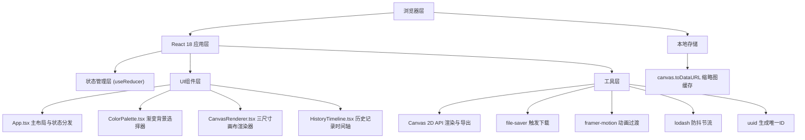

## 1. 架构设计

本项目为纯前端应用，无需后端服务，所有渲染、导出、历史记录均在浏览器端完成。



## 2. 技术说明

- **前端框架**：React 18 + TypeScript 5
- **构建工具**：Vite 5 + @vitejs/plugin-react
- **状态管理**：React useReducer 管理 formState 和 history 状态树
- **动画库**：framer-motion 10（滑条过渡、弹出对话框、进度条动画）
- **工具库**：lodash 4（debounce/throttle 性能优化）、uuid 9（历史记录唯一标识）、file-saver 2（触发浏览器下载）
- **渲染技术**：原生 HTML5 Canvas 2D API，通过 useMemo 缓存渲染结果
- **无后端、无数据库**：历史记录保存在组件内存中（刷新丢失），缩略图使用 canvas.toDataURL 序列化

## 3. 页面路由定义

本项目为单页面应用，无需路由配置。

| 路由 | 用途 |
|------|------|
| / | 主工作台（配置面板 + 画布区域 + 历史时间轴） |

## 4. 数据模型

### 4.1 核心状态类型

```typescript
// 单集表单配置
interface FormState {
  title: string;
  subtitle: string;
  guest: string;
  date: string;
  backgroundType: 'gradient' | 'image';
  gradientId: string;
  backgroundImage: string | null; // base64 dataURL
  textStyle: TextStyle;
}

// 文字样式
interface TextStyle {
  fontSize: number;       // 12-48px
  offsetX: number;        // ±50px
  offsetY: number;        // ±50px
  color: string;          // hex color
  colorPresetId: string;
}

// 历史记录
interface HistoryItem {
  id: string;
  timestamp: number;
  thumbnail: string;      // dataURL 48x48
  formState: FormState;
}

// 画布尺寸配置
interface CanvasSize {
  id: 'square' | 'story' | 'banner';
  name: string;
  width: number;
  height: number;
  ratio: string;
}
```

### 4.2 预设数据

```typescript
// 10种渐变背景预设
const GRADIENT_PRESETS = [
  { id: 'g1', name: '温暖橙黄', colors: ['#ff6b6b', '#feca57'] },
  { id: 'g2', name: '深邃蓝紫', colors: ['#2b2d42', '#8d99ae'] },
  { id: 'g3', name: '清新薄荷', colors: ['#a8e6cf', '#dcedc1'] },
  { id: 'g4', name: '玫瑰金粉', colors: ['#ff8a80', '#ffd1dc'] },
  { id: 'g5', name: '暗夜星空', colors: ['#0f0c29', '#302b63', '#24243e'] },
  { id: 'g6', name: '日落海滩', colors: ['#ff7e5f', '#feb47b'] },
  { id: 'g7', name: '森林晨雾', colors: ['#134e5e', '#71b280'] },
  { id: 'g8', name: '薰衣草田', colors: ['#c471f5', '#fa71cd'] },
  { id: 'g9', name: '极简黑白', colors: ['#434343', '#000000'] },
  { id: 'g10', name: '海洋深蓝', colors: ['#2193b0', '#6dd5ed'] },
];

// 8种播客封面文字配色预设
const COLOR_PRESETS = [
  { id: 'c1', name: '珊瑚红+白', textColor: '#ffffff', accentColor: '#ff6b6b' },
  { id: 'c2', name: '深夜蓝+柔和白', textColor: '#edf2f4', accentColor: '#2b2d42' },
  { id: 'c3', name: '明黄+深灰', textColor: '#2d2d2d', accentColor: '#feca57' },
  { id: 'c4', name: '青绿+白', textColor: '#ffffff', accentColor: '#1abc9c' },
  { id: 'c5', name: '纯白+深灰', textColor: '#2d2d2d', accentColor: '#ffffff' },
  { id: 'c6', name: '纯黑+米白', textColor: '#f5f5dc', accentColor: '#000000' },
  { id: 'c7', name: '粉紫+白', textColor: '#ffffff', accentColor: '#c471f5' },
  { id: 'c8', name: '金色+深蓝', textColor: '#2b2d42', accentColor: '#f39c12' },
];
```

## 5. 组件拆分与职责

| 组件文件 | 核心职责 | 关键Props / Hooks |
|----------|----------|-------------------|
| src/App.tsx | 主布局、useReducer 状态管理、事件分发、响应式布局切换 | useReducer<AppState, Action>，窗口尺寸监听 |
| src/CanvasRenderer.tsx | 三卡片 Canvas 渲染、文字绘制、导出按钮、导出对话框与进度动画 | formState, onExport, canvasRefs |
| src/ColorPalette.tsx | 10种渐变预设网格渲染、选中态、点击回调 | selectedId, onSelect |
| src/HistoryTimeline.tsx | 最近5条历史横向展示、缩略图渲染、相对时间计算、点击恢复 | history, onRestore |

## 6. 性能优化策略

1. **Canvas 渲染优化**：使用 useMemo 缓存背景绘制结果，仅在背景相关依赖变化时重绘背景层
2. **文字调整防抖**：使用 lodash.debounce(16ms ≈ 60fps) 包装滑条 onChange，避免每帧多次重绘
3. **三卡片并行渲染**：三个独立 canvas 元素，利用浏览器多线程排版能力
4. **缩略图缓存**：历史记录缩略图在导出时一次性生成（48x48px），使用 dataURL 存入 history 状态，避免重复渲染
5. **组件级 memo**：ColorPalette、HistoryTimeline 使用 React.memo 包裹，避免无关状态变更导致重渲染
