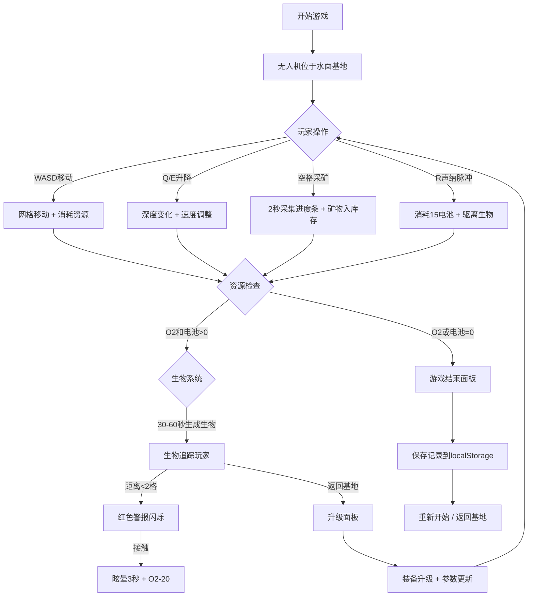

## 1. 产品概述

《深海矿工》是一款以深海采矿为主题的2D模拟经营浏览器游戏。玩家操控水下无人机在随机生成的海底地形中勘探矿物、采集样本、应对深海生物威胁，并通过升级装备探索更深的海沟，挑战自身策略规划能力。

- 目标用户：模拟经营类游戏爱好者、独立游戏玩家
- 产品价值：提供沉浸式深海探索体验，融合资源管理、风险决策与装备升级玩法

## 2. 核心功能

### 2.1 用户角色

无需注册，单玩家单机游戏，玩家即为无人机操作员。

### 2.2 功能模块

1. **主游戏界面**：9x9海底网格地图、无人机、HUD信息栏
2. **采矿系统**：矿物勘探、采集动画、库存管理
3. **无人机操控**：WASD移动、Q/E升降、空格采矿、R声纳脉冲
4. **资源管理**：氧气消耗、电池消耗、矿物库存
5. **深海生物威胁**：随机生成生物、追踪玩家、眩晕机制
6. **装备升级系统**：推进器、机械臂、氧气罐升级面板
7. **游戏结算系统**：游戏结束面板、历史记录保存(localStorage)

### 2.3 页面详情

| 页面名称 | 模块名称 | 功能描述 |
|---------|---------|---------|
| 主游戏界面 | 海底网格地图 | 9x9随机生成地形，显示矿物丰富度叠加层，当前格子高亮 |
| 主游戏界面 | 无人机角色 | 像素风圆形机体，推进器粒子效果，采矿动画 |
| 主游戏界面 | 顶部HUD栏 | 氧气条(蓝)、电池条(黄)、矿物库存图标、深度计 |
| 主游戏界面 | 警报系统 | 生物接近时红色闪烁警告条 |
| 升级面板 | 升级菜单 | 左侧滑入动画，三项升级选项，显示升级所需矿物 |
| 结算面板 | 游戏结束 | 半透明遮罩，矿物统计条形图、最高深度、游戏时长、重新开始/返回基地 |
| 历史记录 | 记录列表 | 按日期查看历史游戏记录 |

## 3. 核心流程

玩家开始游戏，无人机位于水面基地(深度0)。使用WASD移动无人机在9x9网格中探索，Q键下潜、E键上浮。在有矿物的格子上按空格键开始2秒采矿进度条，成功后矿物加入库存。每隔30-60秒随机生成深海生物向玩家移动，近距离触发警报，接触造成眩晕和氧气损失，可按R键消耗电池发射声纳脉冲驱离。氧气或电池耗尽则游戏结束，显示结算面板。可随时返回水面基地进入升级面板，使用矿物库存升级装备参数。

## 4. 用户界面设计

### 4.1 设计风格

- **主色调**：深海蓝绿，背景径向渐变从#0a1628(顶部)到#001d3d(底部)
- **强调色**：青色#00d4ff(标题投影)、蓝色#00bfff(氧气条)、黄色#ffaa00(电池条)
- **矿物色**：铁#b5651d(菱形)、铜#cd7f32(方形)、钴#008080(六边形)
- **地形色**：砂岩#8b7355、礁石#4a3f34、裂缝#2d1b1b
- **字体**：白色像素字体，标题带青色投影
- **UI元素**：半透明白色圆角矩形HUD背景rgba(255,255,255,0.08)，1px白色细线边框(0.3透明度)
- **动效**：所有交互元素0.3秒缓动过渡，屏幕震动效果(translateX随机2px持续0.2秒)

### 4.2 页面设计概览

| 页面名称 | 模块名称 | UI元素 |
|---------|---------|--------|
| 主游戏界面 | 海底网格 | 9x9格子，地形色块，矿物丰富度透明叠加，0.3透明度白色边框 |
| 主游戏界面 | 无人机 | 圆形#87ceeb机体，底部蓝色火焰粒子，当前格子高亮 |
| 主游戏界面 | 顶部HUD | 半透明白色圆角矩形，氧气/电池渐变条，矿物图标，深度计(-50m~-1000m) |
| 主游戏界面 | 警告条 | 生物接近时HUD边缘红色闪烁 |
| 升级面板 | 升级菜单 | opacity 0→1淡入，左侧滑入，三项升级卡片，显示所需矿物 |
| 结算面板 | 结束界面 | 半透明黑色遮罩，居中面板，三色条形图统计，操作按钮 |

### 4.3 响应式

- 桌面端优先，最小宽度768px
- 手机端自动缩放至80%，锁定横屏显示
- Canvas自适应容器尺寸

## 5. 性能约束

- 游戏帧率维持55-60 FPS
- 网格更新和生物AI单帧计算量≤2ms
- localStorage读写频率≤1次/秒
