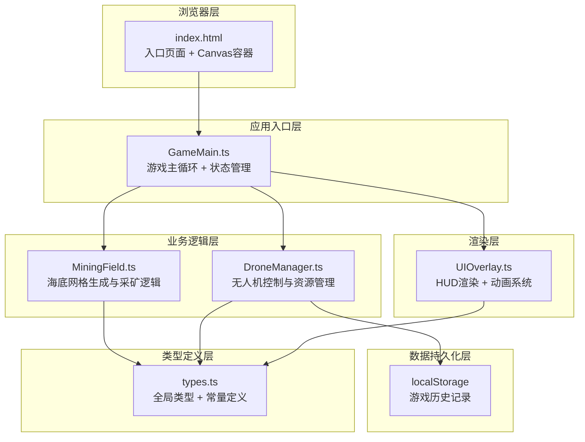

## 1. 架构设计



## 2. 技术选型说明

| 技术 | 版本 | 用途 |
|-----|------|------|
| TypeScript | 5.x | 类型安全的应用逻辑 |
| Vite | 5.x | 构建工具与开发服务器 |
| Canvas 2D | 原生 | 游戏画面渲染 |
| lodash | 最新 | 工具函数(深拷贝、防抖等) |
| uuid | 最新 | 生成唯一标识符(生物、记录ID) |
| localStorage | 原生 | 游戏历史记录持久化 |

## 3. 模块职责与数据流向

### 3.1 文件结构
```
project-root/
├── package.json
├── vite.config.js
├── tsconfig.json
├── index.html
└── src/
    ├── types.ts          # 全局类型定义、常量、接口
    ├── GameMain.ts       # 游戏入口、主循环、事件协调
    ├── MiningField.ts    # 9x9网格地图生成、矿物分布、采矿接口
    ├── DroneManager.ts   # 无人机移动/升降/采矿动画、氧气/电池管理
    └── UIOverlay.ts      # HUD渲染、动画、升级面板、结算面板
```

### 3.2 调用关系
- **GameMain.ts**: 导入并实例化 MiningField、DroneManager、UIOverlay；接收键盘输入分发给各模块；主循环(requestAnimationFrame)中驱动逻辑更新与渲染
- **MiningField.ts**: 定义 GridCell、TerrainType、MineralType；提供 getCell(x,y)、mineAt(x,y)、generateMap() 接口；采矿完成时通过回调向 DroneManager 发送矿物采集事件
- **DroneManager.ts**: 定义 DroneState；处理移动(WASD)、升降(Q/E)、采矿(空格)、声纳(R)；向 UIOverlay 输出状态数据(氧气、电池、位置、深度、库存)
- **UIOverlay.ts**: 接收 DroneManager 状态数据渲染 HUD；渲染升级面板/结算面板 DOM；处理面板按钮点击回调 GameMain

### 3.3 数据流向
```
键盘输入 → GameMain.dispatch() → DroneManager.update()
                                     ↓
                              DroneState变更
                               ↙         ↘
                 MiningField.mineAt()   UIOverlay.render()
                        ↓
              矿物采集事件回调 → Drone库存更新 → UIOverlay刷新HUD
```

## 4. 核心类型定义

```typescript
// types.ts
export type TerrainType = 'sandstone' | 'reef' | 'fissure';
export type MineralType = 'iron' | 'copper' | 'cobalt';
export type CreatureType = 'eel' | 'jellyfish';

export interface MineralDeposit {
  type: MineralType;
  amount: number; // 0-10
}

export interface GridCell {
  x: number;
  y: number;
  terrain: TerrainType;
  minerals: MineralDeposit[];
}

export interface DroneState {
  gridX: number;
  gridY: number;
  depth: number; // -50 to -1000 meters
  oxygen: number; // 0 - maxOxygen
  battery: number; // 0 - maxBattery
  maxOxygen: number;
  maxBattery: number;
  moveSpeed: number;
  miningTime: number; // seconds
  stunnedUntil: number; // timestamp
  inventory: Record<MineralType, number>;
}

export interface Creature {
  id: string;
  type: CreatureType;
  gridX: number;
  gridY: number;
  speed: number;
}

export interface UpgradeState {
  thrusterLevel: number;
  armLevel: number;
  oxygenTankLevel: number;
}

export interface GameRecord {
  id: string;
  date: string;
  duration: number; // seconds
  maxDepth: number;
  minerals: Record<MineralType, number>;
  upgradesUnlocked: number;
}
```

## 5. 性能优化策略

1. **Canvas渲染**: 
   - 分层渲染：静态网格预渲染到离屏Canvas，动态元素(无人机、生物、粒子)每帧重绘
   - 脏矩形优化：仅重绘变化区域
   
2. **逻辑计算**:
   - 生物AI使用 requestAnimationFrame 帧内插值，单帧计算<2ms
   - 资源消耗使用时间累积而非每帧递减，减少浮点运算
   
3. **localStorage**:
   - 写入使用防抖(1秒节流)，游戏结束时立即写入
   - 读取仅在初始化时执行一次

4. **动画**:
   - CSS transition处理面板切换
   - Canvas内动画使用requestAnimationFrame + deltaTime
