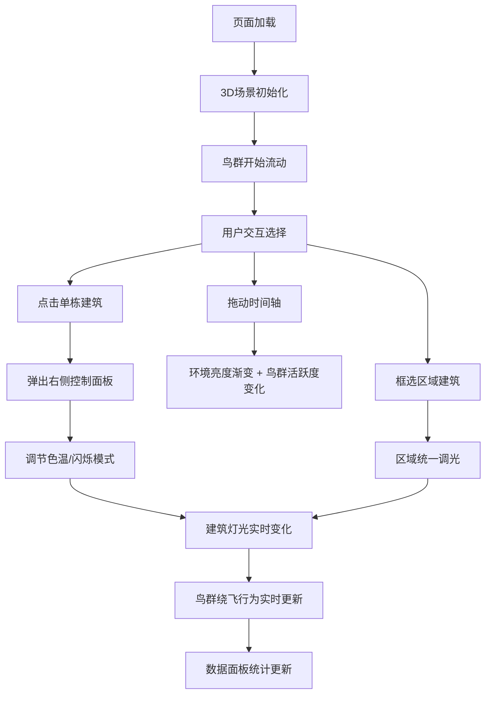

## 1. 产品概述

候鸟与光是一个面向城市规划师和环境教育者的3D交互可视化沙盘，用于模拟和展示夜间候鸟迁徙路线与城市灯光之间的相互影响。通过直观的3D场景，用户可以实时调整建筑灯光参数，观察鸟群飞行路径的变化，从而理解光污染对候鸟的影响并探索优化方案。

## 2. 核心功能

### 2.1 功能模块
1. **3D城市夜景场景**: 20-30栋随机高度高层建筑，外立面网格状发光窗户，支持整体或单栋建筑灯光参数调节
2. **鸟群模拟系统**: 3-5群候鸟粒子（50-200只/群），南北向主路径流动，遇高亮度/闪烁灯光自动绕飞
3. **数据面板与时间控制**: 实时统计鸟群数据，时间轴滑块切换黄昏/深夜/黎明时段
4. **区域框选调光**: 鼠标框选区域内建筑统一调光，观察鸟群绕飞程度变化

### 2.2 功能详情
| 模块名称 | 子模块 | 功能描述 |
|---------|-------|---------|
| 3D城市夜景 | 建筑生成 | 20-30栋随机高度高层建筑，深灰色外立面 |
| | 发光窗户 | 网格状窗户，黄/白/蓝色发光，亮度可调 |
| | 单栋控制 | 点击建筑弹出右侧面板，调节色温(2700K-6500K)和闪烁模式(常亮/慢闪/快闪) |
| | 区域控制 | 鼠标框选区域，统一变暗或切换暖色 |
| 鸟群模拟 | 粒子系统 | 半透明光点带拖尾效果，羽色渐变 |
| | 路径流动 | 南北向主路径平滑流动 |
| | 绕飞行为 | 高亮度/闪烁建筑触发偏移，低亮度/暖色几乎不影响 |
| 数据面板 | 实时统计 | 鸟群总数、受影响百分比、平均飞行速度 |
| 时间控制 | 时间轴 | 黄昏/深夜/黎明三时段切换，整体亮度和鸟群活跃度变化 |

## 3. 核心流程

用户打开页面后，3D城市夜景场景自动加载，鸟群开始沿主路径流动。用户可以：
1. 拖动时间轴切换时段，观察整体环境和鸟群活跃度变化
2. 点击单栋建筑，在右侧面板调整色温和闪烁模式，实时观察鸟群绕飞变化
3. 鼠标框选多栋建筑，统一调光，观察区域范围内鸟群飞行路径的改善
4. 查看左下角数据面板，量化了解灯光调整的效果

## 4. 用户界面设计

### 4.1 设计风格
- **主色调**: 深蓝黑色夜空背景(#0a0e27)，深灰色建筑(#1a1e2e)，浅灰文字(#b0b8d0)
- **色彩来源**: 建筑窗户发光为主要色彩来源（黄/白/蓝渐变）
- **面板风格**: 半透明毛玻璃效果(背景模糊8px，白色半透明#ffffff20)
- **字体**: 白色细字体带微弱光晕标题，浅灰正文

### 4.2 页面设计概述
| 区域 | 模块 | UI元素 |
|-----|------|-------|
| 全屏 | 3D场景 | Three.js渲染的城市夜景和鸟群粒子 |
| 顶部 | 时间轴 | 滑块 + 黄昏/深夜/黎明下拉菜单预设 |
| 左下角 | 数据面板 | 鸟群总数、受影响百分比、平均速度 |
| 右侧 | 建筑控制面板 | 色温滑块、闪烁模式开关（点击建筑后弹出） |

### 4.3 响应式适配
- 桌面优先设计，支持1920x1080和1280x720分辨率
- 小屏幕下面板自动折叠为可展开的图标按钮
- 3D场景始终占满窗口

### 4.4 3D场景指导
- **环境氛围**: 深蓝黑色夜空，微弱星空背景粒子
- **光照设置**: 环境光极低，主要光源为建筑窗户自发光
- **相机设置**: 透视相机，45度俯视角，支持轨道控制器旋转缩放
- **交互反馈**: 建筑灯光切换0.3秒淡入淡出过渡，鸟群粒子带10-15像素拖尾
- **性能要求**: 30FPS以上流畅度，粒子运动和灯光更新无卡顿
