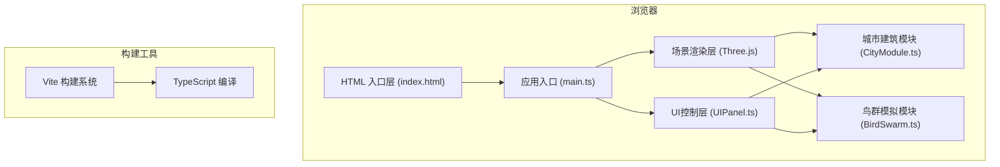

## 1. 架构设计



## 2. 技术描述
- **前端框架**: 原生 TypeScript 5.x + Three.js 0.160
- **构建工具**: Vite 5.x
- **辅助库**: lodash (工具函数), uuid (唯一标识生成)
- **类型声明**: @types/three
- **后端**: 无，纯前端单页应用
- **数据**: 所有数据在前端动态生成，无持久化存储

## 3. 文件结构
| 文件路径 | 用途 |
|---------|-----|
| `/package.json` | 项目依赖与脚本配置 |
| `/index.html` | 入口HTML页面 |
| `/tsconfig.json` | TypeScript编译配置 |
| `/vite.config.js` | Vite构建配置 |
| `/src/main.ts` | 应用主入口，场景初始化与动画循环 |
| `/src/CityModule.ts` | 城市建筑生成与灯光控制 |
| `/src/BirdSwarm.ts` | 鸟群粒子系统与飞行行为模拟 |
| `/src/UIPanel.ts` | HTML/CSS UI面板，数据展示与交互控制 |

## 4. 核心数据模型

### 4.1 建筑数据结构
```typescript
interface BuildingData {
  id: string;
  position: { x: number; z: number };
  height: number;
  width: number;
  depth: number;
  colorTemperature: number; // 2700K - 6500K
  brightness: number; // 0 - 1
  blinkMode: 'steady' | 'slow' | 'fast';
  windowGrid: { cols: number; rows: number };
}
```

### 4.2 鸟群粒子数据结构
```typescript
interface BirdParticle {
  id: string;
  position: THREE.Vector3;
  velocity: THREE.Vector3;
  basePathProgress: number; // 0 - 1 主路径进度
  flockId: number;
  speed: number;
  affectedLevel: number; // 0 - 1 受灯光影响程度
}
```

### 4.3 时间时段配置
```typescript
interface TimePeriod {
  id: 'dusk' | 'night' | 'dawn';
  name: string;
  ambientBrightness: number; // 环境亮度基值 0-1
  backgroundTint: THREE.Color; // 环境色调
  birdActivity: number; // 鸟群活跃度 0-1
  birdCountMultiplier: number; // 鸟群数量倍率
  speedMultiplier: number; // 飞行速度倍率
}
```

## 5. 模块接口定义

### 5.1 CityModule 接口
```typescript
class CityModule {
  constructor(scene: THREE.Scene);
  generateBuildings(count: number): void;
  setBuildingColorTemp(buildingId: string, kelvin: number): void;
  setBuildingBlinkMode(buildingId: string, mode: 'steady' | 'slow' | 'fast'): void;
  setBuildingBrightness(buildingId: string, brightness: number): void;
  dimArea(minX: number, maxX: number, minZ: number, maxZ: number): void;
  warmArea(minX: number, maxX: number, minZ: number, maxZ: number): void;
  getBuildingAtPosition(x: number, z: number): BuildingData | null;
  getAllBuildings(): BuildingData[];
  update(time: number): void;
  applyTimePeriod(period: TimePeriod): void;
}
```

### 5.2 BirdSwarm 接口
```typescript
class BirdSwarm {
  constructor(scene: THREE.Scene, cityModule: CityModule);
  generateFlocks(flockCount: number, birdsPerFlock: number): void;
  update(deltaTime: number): void;
  getTotalCount(): number;
  getAffectedPercentage(): number;
  getAverageSpeed(): number;
  applyTimePeriod(period: TimePeriod): void;
  setActivityLevel(level: number): void;
}
```

### 5.3 UIPanel 接口
```typescript
class UIPanel {
  constructor();
  onTimeChange(callback: (period: TimePeriod, progress: number) => void): void;
  onBuildingSelect(callback: (buildingId: string | null) => void): void;
  onColorTempChange(callback: (buildingId: string, kelvin: number) => void): void;
  onBlinkModeChange(callback: (buildingId: string, mode: 'steady' | 'slow' | 'fast') => void): void;
  onAreaAction(callback: (action: 'dim' | 'warm', bounds: Bounds) => void): void;
  updateStats(total: number, affectedPct: number, avgSpeed: number): void;
  showBuildingPanel(buildingData: BuildingData): void;
  hideBuildingPanel(): void;
}
```
