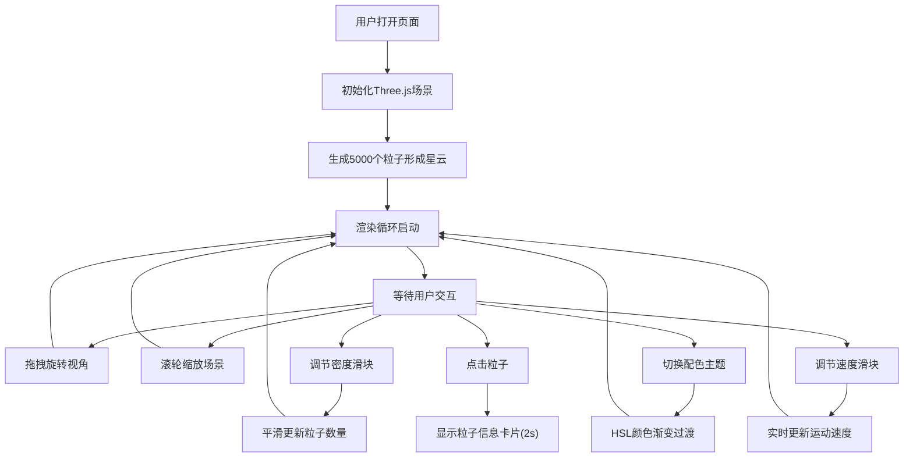

## 1. 产品概述

星尘视界是一个基于浏览器的3D宇宙尘埃与星云粒子系统交互可视化应用，让用户通过太空望远镜式的视角沉浸式探索动态生成的星云粒子。

- 主要目的：提供沉浸式的宇宙星云可视化体验，让用户能够自由旋转、缩放观察动态粒子系统
- 目标用户：天文爱好者、科学教育工作者、数字艺术创作者
- 市场价值：将复杂的粒子系统可视化技术以优雅直观的方式呈现，兼具科学教育与艺术欣赏价值

## 2. 核心功能

### 2.1 用户角色

无需用户注册，面向所有访问者开放全部功能。

### 2.2 功能模块

1. **3D星云粒子场景**：动态渲染数千个粒子组成的星云，支持鼠标拖拽旋转和滚轮缩放
2. **粒子密度调节**：通过滑块动态调节粒子总数（1-20千），平滑过渡
3. **配色主题切换**：4种预设星云配色主题（星云紫、烈焰橙、寒冰蓝、生命绿），支持1.5秒HSL渐变过渡
4. **粒子点击交互**：点击粒子显示本地密度和主色HEX值的信息卡片
5. **运动速度控制**：滑块控制粒子自转速度和漂移幅度（0-5倍速）

### 2.3 页面详情

| 页面名称 | 模块名称 | 功能描述 |
|---------|---------|---------|
| 主页面 | 3D星云视图 | 渲染5000+粒子的动态星云，支持拖拽旋转、滚轮缩放 |
| 主页面 | 密度控制面板 | 滑块调节粒子密度1-20千，实时显示粒子总数 |
| 主页面 | 速度控制面板 | 滑块调节粒子运动速度0-5倍，默认值1 |
| 主页面 | 配色主题面板 | 4个40x40px色块横向排列，选中时白框动画缩放1.1倍 |
| 主页面 | 粒子信息卡片 | 点击粒子弹出密度和光谱数据卡片，2秒后淡出 |

## 3. 核心流程

用户打开应用 → 系统初始化3D场景并渲染5000个粒子的星云 → 用户拖拽旋转视角/滚轮缩放观察 → 用户调节密度滑块平滑增加/减少粒子 → 用户切换配色主题触发颜色渐变 → 用户点击粒子查看密度和光谱数据 → 用户调节速度控制粒子运动快慢

## 4. 用户界面设计

### 4.1 设计风格

- **主色调**：深空黑 #000011（背景）、星云紫 #8b5cf6（主强调色）
- **辅助色**：蓝色 #3b82f6、粉色 #ec4899、青色 #06b6d4
- **控制面板**：半透明深蓝 #0a0a2e，磨砂玻璃效果，边框 #2a2a5e，圆角8px
- **字体**：白色细字体，标题带淡紫色发光效果
- **交互反馈**：滑块和按钮hover时轻微放大+光晕（transition 0.2s）

### 4.2 页面设计概述

| 页面名称 | 模块名称 | UI元素 |
|---------|---------|--------|
| 主页面 | 布局容器 | 左侧主视图80%宽，右侧控制面板20%宽，桌面端横向布局 |
| 主页面 | 3D视图区域 | 全屏Canvas，背景#000011，支持鼠标交互 |
| 主页面 | 控制面板标题 | "星尘视界"白色细字体，淡紫色发光，居中 |
| 主页面 | 密度滑块区 | 标签"粒子密度"，滑块轨道#2a2a5e，滑块按钮#8b5cf6渐变 |
| 主页面 | 速度滑块区 | 标签"运动速度"，滑块设计同上 |
| 主页面 | 配色主题区 | 4个40x40px色块横向排列，选中时白框+缩放1.1 |
| 主页面 | 粒子计数区 | 实时粒子总数，白色细字体 |
| 主页面 | 粒子信息卡片 | 半透明暗色背景，白色文字，2秒淡出 |

### 4.3 响应式适配

- 桌面端（>768px）：左侧主视图80%宽，右侧控制面板20%宽，横向布局
- 移动端（≤768px）：主视图占高70%，控制面板移至底部占高30%，纵向布局

### 4.4 3D场景指导

- **环境**：深空黑背景，无HDRI，营造宇宙深空氛围
- **光照**：粒子自发光（PointsMaterial），无需额外光源
- **相机**：PerspectiveCamera，初始位置(0,2,10)，FOV适合广角观察
- **控制器**：OrbitControls，支持拖拽旋转，滚轮缩放范围3-20单位
- **粒子系统**：Three.js Points + BufferGeometry，5000+粒子
- **动画**：星云整体缓慢自转（100秒/圈）+ 每个粒子随机小幅度漂移
- **性能**：60fps流畅渲染最多10000个粒子
