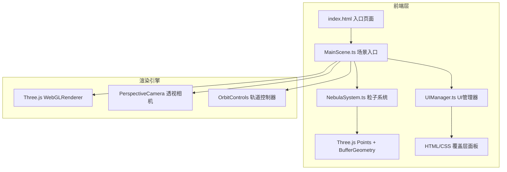

## 1. 架构设计



## 2. 技术描述

- **前端框架**：原生 TypeScript（无React/Vue框架），面向对象架构
- **3D引擎**：Three.js@0.160，使用Points和BufferGeometry进行高性能粒子渲染
- **构建工具**：Vite@5，TypeScript@5
- **工具库**：lodash（工具函数）、uuid（唯一标识）
- **类型支持**：@types/three
- **后端**：无，纯前端项目

## 3. 模块定义

### 3.1 文件结构

| 文件 | 职责 |
|------|------|
| `package.json` | 项目依赖和脚本配置 |
| `index.html` | 入口页面，包含Canvas和UI容器 |
| `tsconfig.json` | TypeScript严格模式配置，目标ES2020 |
| `vite.config.js` | Vite构建配置 |
| `src/MainScene.ts` | 场景初始化入口，创建Three.js场景、相机、控制器，协调NebulaSystem和UIManager |
| `src/NebulaSystem.ts` | 粒子系统核心：粒子生成、运动更新、密度调整、颜色渐变 |
| `src/UIManager.ts` | UI面板管理：滑块渲染、色块切换、光线投射检测点击、信息卡片显示 |

### 3.2 核心类设计

#### MainScene
```typescript
class MainScene {
  scene: THREE.Scene
  camera: THREE.PerspectiveCamera
  renderer: THREE.WebGLRenderer
  controls: OrbitControls
  nebulaSystem: NebulaSystem
  uiManager: UIManager
  
  init(): void          // 初始化所有组件
  animate(): void       // 渲染循环
  onResize(): void      // 窗口尺寸响应
}
```

#### NebulaSystem
```typescript
class NebulaSystem {
  points: THREE.Points
  geometry: THREE.BufferGeometry
  particleCount: number
  speedMultiplier: number
  
  generateParticles(count: number): void      // 生成指定数量粒子
  updateParticles(delta: number): void        // 每帧更新粒子位置
  setDensity(level: number): void             // 设置密度级别(1-20)，平滑过渡
  setColorTheme(theme: ColorTheme): void      // 切换配色主题，HSL渐变
  setSpeed(multiplier: number): void          // 设置运动速度倍数
  getParticleDensity(index: number): number   // 获取指定粒子的本地密度
  getParticleColorHex(index: number): string  // 获取指定粒子的HEX颜色
}
```

#### UIManager
```typescript
class UIManager {
  onDensityChange: (level: number) => void
  onSpeedChange: (speed: number) => void
  onThemeChange: (theme: ColorTheme) => void
  onParticleClick: (index: number, worldPos: THREE.Vector3) => void
  
  init(): void                                          // 创建UI面板DOM
  updateParticleCount(count: number): void              // 更新粒子计数显示
  showParticleInfo(pos: {x:number,y:number}, density: number, colorHex: string): void  // 显示信息卡片
  handleClick(event: MouseEvent, camera: THREE.Camera, points: THREE.Points): void  // 光线投射检测
}
```

## 4. 数据模型

### 4.1 粒子数据结构（BufferGeometry属性）

| 属性名 | 类型 | 维度 | 说明 |
|--------|------|------|------|
| position | Float32BufferAttribute | 3 | 粒子xyz位置 |
| color | Float32BufferAttribute | 3 | 粒子当前RGB颜色 |
| targetColor | Float32Array | 3 | 粒子目标RGB颜色（用于渐变） |
| size | Float32BufferAttribute | 1 | 粒子大小（0.05-0.2） |
| opacity | Float32BufferAttribute | 1 | 粒子透明度（0.3-1.0） |
| originPosition | Float32Array | 3 | 粒子原始位置（用于旋转计算） |
| driftOffset | Float32Array | 3 | 粒子漂移累积偏移 |
| driftSpeed | Float32Array | 3 | 粒子漂移速度向量 |

### 4.2 配色主题定义

```typescript
enum ColorTheme {
  NEBULA_PURPLE = 'nebula_purple',  // #8b5cf6, #3b82f6, #ec4899, #06b6d4
  FLAME_ORANGE = 'flame_orange',    // #f97316, #ef4444, #eab308, #fb923c
  ICE_BLUE = 'ice_blue',           // #0ea5e9, #06b6d4, #22d3ee, #67e8f9
  LIFE_GREEN = 'life_green'        // #22c55e, #10b981, #14b8a6, #84cc16
}
```

## 5. 性能优化策略

1. **BufferGeometry批量渲染**：所有粒子使用单个Points对象，减少Draw Call
2. **TypedArray直接操作**：直接修改BufferAttribute的array属性，避免频繁创建对象
3. **密度节流更新**：密度滑块变化时使用setTimeout节流（1秒最多触发1次重建）
4. **增量粒子更新**：调整密度时复用现有粒子数据，仅增加或截断数组
5. **颜色渐变帧计算**：HSL插值每帧更新，1.5秒完成过渡，中途切换重置渐变
6. **光线投射优化**：点击检测时先做视锥体剔除，仅检测可见粒子

## 6. 关键算法

### 6.1 球壳分布粒子生成
```
for each particle:
  θ = random(0, 2π)      // 方位角
  φ = arccos(random(-1, 1))  // 极角（均匀球面分布）
  r = random(4, 8) * clusterFactor  // 半径，偏向密度中心
  x = r * sin(φ) * cos(θ)
  y = r * sin(φ) * sin(θ)
  z = r * cos(φ)
```

### 6.2 HSL颜色插值
```
function hslLerp(colorA: HSL, colorB: HSL, t: number): HSL:
  h = colorA.h + (colorB.h - colorA.h) * t
  s = colorA.s + (colorB.s - colorA.s) * t
  l = colorA.l + (colorB.l - colorA.l) * t
  return { h, s, l }
```

### 6.3 本地密度计算
```
function getLocalDensity(particleIndex: number): number:
  count = 0
  pos = positions[particleIndex]
  for each other particle:
    if distance(pos, otherPos) < 0.5:
      count++
  maxCount = π * 0.5² * surfaceDensity
  return count / maxCount
```
