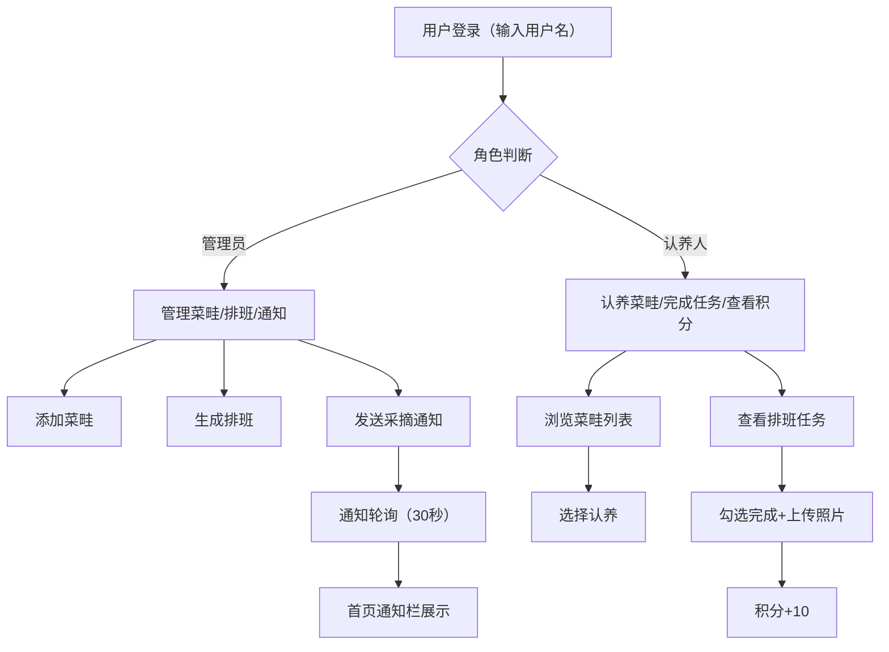

## 1. 产品概述

社区菜园认养与劳动排班管理系统，为小型社区花园园丁团队提供轻量级在线管理工具，解决菜畦认养、劳动排班、积分记录和通知广播等日常运营痛点。

- 核心目标：替代手动发消息的低效模式，实现菜畦认养数字化、劳动排班可视化、通知推送自动化
- 目标用户：社区花园管理员、认养成员
- 产品价值：降低沟通成本、提高管理效率、增强社区参与感

## 2. 核心功能

### 2.1 用户角色

| 角色 | 登录方式 | 核心权限 |
|------|----------|----------|
| 管理员 | 用户名登录（admin） | 菜畦CRUD、排班生成、通知发送、删除通知 |
| 认养人 | 用户名登录（任意用户名） | 认养菜畦、完成劳动任务、查看积分、接收通知 |

### 2.2 功能模块

1. **认养列表页**：菜畦卡片网格、种植日历、认养操作、生长进度展示
2. **排班看板页**：周视图网格、任务分配、完成打卡、积分累计
3. **通知管理页**：通知列表、时间线展示、已读标记、删除归档
4. **个人主页**：我的认养、劳动历史、积分展示、排行榜

### 2.3 页面详情

| 页面名称 | 模块名称 | 功能描述 |
|----------|----------|----------|
| 认养列表页 | 菜畦卡片网格 | flex-wrap布局，卡片宽280px，圆角12px，显示作物emoji、生长进度条、认养人信息 |
| 认养列表页 | 种植日历管理 | 管理员添加/编辑/删除菜畦，设置编号、位置、作物、预计收获日期 |
| 认养列表页 | 认养操作 | 认养人选择菜畦认养，更换作物保留历史记录 |
| 排班看板页 | 周视图网格 | 横轴日期、纵轴菜畦编号，固定表头可滚动布局 |
| 排班看板页 | 任务管理 | 管理员每周生成浇水/除虫/施肥任务，分配1-2名认养人 |
| 排班看板页 | 完成打卡 | 认养人勾选完成，填写备注、上传照片（base64，≤200KB），自动+10积分 |
| 通知管理页 | 采摘通知 | 管理员标记可采摘→弹出编辑面板→默认模板含菜畦编号和时间窗口→一键发送 |
| 通知管理页 | 通知列表 | 时间线布局，按日期分组，未读带蓝色竖条，点击展开详情并标记已读 |
| 通知管理页 | 通知归档 | 30天自动归档（isArchived字段），管理员可手动删除 |
| 个人主页 | 个人资料 | 头像、昵称、累计积分、认养菜畦列表、劳动历史 |
| 个人主页 | 积分排行榜 | 按积分降序，前三名金银铜奖牌动画，当前用户高亮 |
| 全站通知栏 | 底部通知条 | 固定底部，显示最近4条未读摘要，点击跳转通知管理页 |

## 3. 核心流程

## 4. 用户界面设计

### 4.1 设计风格

- **主色调**：草绿 #4a7c59，米白辅色 #f4e1c1，番茄红强调色 #c0392b
- **按钮风格**：圆角 8-12px，hover 放大 scale(1.05)，轻微阴影过渡
- **字体**：采用圆润友好的无衬线字体，标题稍大加粗，正文清晰易读
- **布局风格**：卡片式布局，柔和圆润手绘感边框，田园自然气息
- **图标风格**：使用作物 emoji（🍅🥕🥬🌽🍆）作为视觉元素，配合 lucide-react 图标库

### 4.2 页面设计概述

| 页面名称 | 模块名称 | UI元素 |
|----------|----------|--------|
| 认养列表页 | 菜畦卡片 | 草绿边框、米白背景、作物emoji、渐变进度条（#e74c3c→#27ae60）、剩余天数数字、逐张淡入动画（100ms间隔） |
| 排班看板页 | 周视图网格 | 固定表头、可滚动主体、日期tab导航条、任务格子点击弹出半透明模糊模态框 |
| 通知管理页 | 时间线列表 | 左侧日期分隔线、右侧展开卡片、未读浅蓝色竖条标记、从顶部滑入动效（translateY(-20px)→0） |
| 个人主页 | 排行榜 | 前三名金银铜奖牌BounceIn浮动动画、当前用户高亮行、降序排列实时更新 |

### 4.3 响应式

- 桌面端优先设计
- 平板及以下（≤768px）：
  - 卡片网格变为单列全宽
  - 排班表变为竖向折叠每日视图
  - 排行榜移至页面底部
  - 触摸操作优化

### 4.4 动效细节

- 卡片加载：逐张 fadeIn，animation-delay 递增 100ms
- 奖牌图标：@keyframes bounceIn，微微上下浮动
- 通知卡片：slideDown 从 -20px 到 0
- 按钮 hover：scale(1.05) + box-shadow 过渡 0.2s
