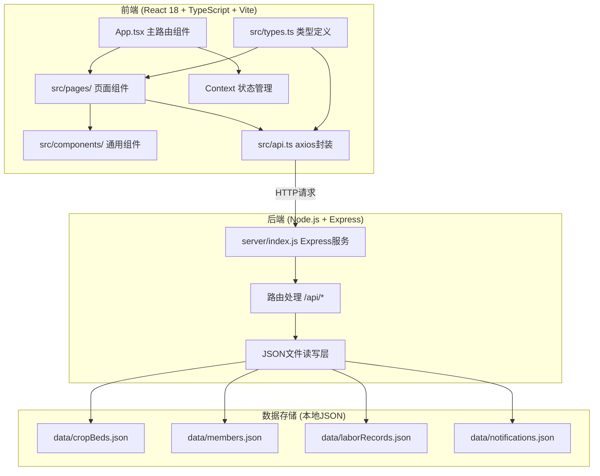
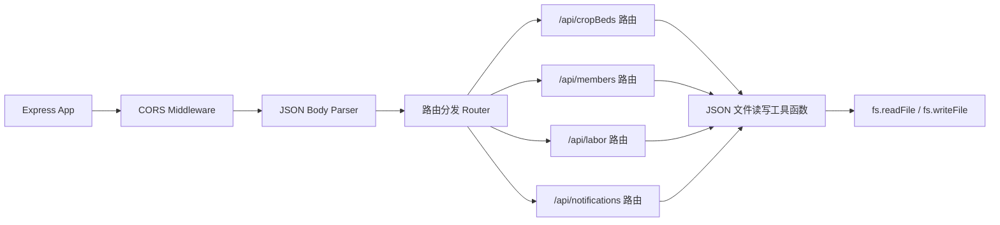
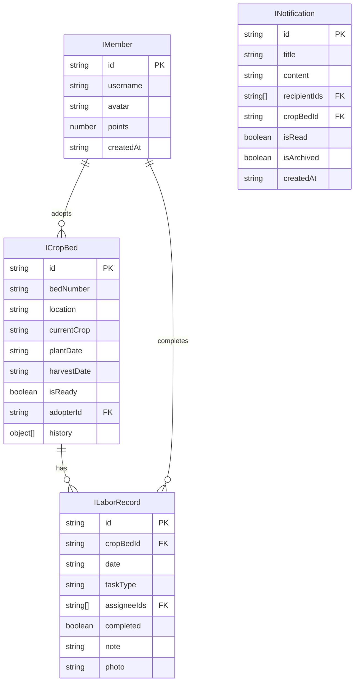

## 1. 架构设计



**文件调用关系与数据流向：**
- `src/types.ts` → 被所有前端组件和 `src/api.ts` 引用，定义共享数据结构
- `src/api.ts` → 被 `App.tsx` 和各页面组件调用，封装 axios 向后端 `/api/*` 发起请求
- `App.tsx` → 挂载时调用 `api.ts` 初始化数据，通过 Context 将状态分发给子组件
- `server/index.js` → 接收前端请求，读写 `./data/*.json` 文件，返回 JSON 响应

## 2. 技术描述

- **前端**：React 18 + TypeScript 5 + Vite 5 + React Router DOM 6 + Axios + date-fns + lucide-react
- **构建工具**：Vite 5，配置 `@vitejs/plugin-react`
- **后端**：Express 4 + CORS + uuid + date-fns
- **数据库**：本地 JSON 文件模拟（`data/` 目录下 4 个数据文件）
- **状态管理**：React Context + useState/useReducer
- **样式方案**：原生 CSS（使用 CSS 变量管理主题色），不引入 Tailwind

## 3. 路由定义

| 前端路由 | 页面组件 | 用途 |
|----------|----------|------|
| `/` | CropBedsPage | 认养列表页（首页） |
| `/schedule` | SchedulePage | 排班看板页 |
| `/notifications` | NotificationsPage | 通知管理页 |
| `/profile` | ProfilePage | 个人主页与排行榜 |
| `/login` | LoginPage | 登录页（用户名输入） |

## 4. API 定义

### 4.1 菜畦接口 `/api/cropBeds`

| 方法 | 路径 | 功能 | 请求体 | 响应 |
|------|------|------|--------|------|
| GET | `/api/cropBeds` | 获取所有菜畦 | - | `ICropBed[]` |
| GET | `/api/cropBeds/:id` | 获取单个菜畦 | - | `ICropBed` |
| POST | `/api/cropBeds` | 新增菜畦 | `Omit<ICropBed, 'id' \| 'history'>` | `ICropBed` |
| PUT | `/api/cropBeds/:id` | 更新菜畦 | `Partial<ICropBed>` | `ICropBed` |
| DELETE | `/api/cropBeds/:id` | 删除菜畦 | - | `{ success: boolean }` |
| PUT | `/api/cropBeds/:id/adopt` | 认养菜畦 | `{ memberId: string }` | `ICropBed` |
| PUT | `/api/cropBeds/:id/crop` | 更换作物（保留历史） | `{ crop: string, harvestDate: string }` | `ICropBed` |
| PUT | `/api/cropBeds/:id/ready` | 标记可采摘 | - | `ICropBed` |

### 4.2 认养人接口 `/api/members`

| 方法 | 路径 | 功能 | 请求体 | 响应 |
|------|------|------|--------|------|
| GET | `/api/members` | 获取所有认养人 | - | `IMember[]` |
| GET | `/api/members/:id` | 获取单个认养人 | - | `IMember` |
| POST | `/api/members` | 新增/登录认养人 | `{ username: string }` | `IMember` |
| PUT | `/api/members/:id` | 更新认养人（+积分等） | `Partial<IMember>` | `IMember` |

### 4.3 劳动记录接口 `/api/labor`

| 方法 | 路径 | 功能 | 请求体 | 响应 |
|------|------|------|--------|------|
| GET | `/api/labor` | 获取劳动记录（支持 `weekStart` 查询） | - | `ILaborRecord[]` |
| GET | `/api/labor/:id` | 获取单条记录 | - | `ILaborRecord` |
| POST | `/api/labor` | 新增排班任务 | `Omit<ILaborRecord, 'id' \| 'completed'>` | `ILaborRecord` |
| POST | `/api/labor/batch` | 批量生成一周排班 | `{ records: Omit<ILaborRecord, 'id' \| 'completed'>[] }` | `ILaborRecord[]` |
| PUT | `/api/labor/:id` | 完成任务打卡 | `{ completed: true, note?: string, photo?: string }` | `ILaborRecord` |
| DELETE | `/api/labor/:id` | 删除任务 | - | `{ success: boolean }` |

### 4.4 通知接口 `/api/notifications`

| 方法 | 路径 | 功能 | 请求体 | 响应 |
|------|------|------|--------|------|
| GET | `/api/notifications` | 获取通知（支持 `If-Modified-Since`，`archived` 过滤） | - | `INotification[]` |
| GET | `/api/notifications/:id` | 获取单条通知 | - | `INotification` |
| POST | `/api/notifications` | 发送通知 | `Omit<INotification, 'id' \| 'createdAt' \| 'isRead' \| 'isArchived'>` | `INotification` |
| PUT | `/api/notifications/:id/read` | 标记已读 | - | `INotification` |
| PUT | `/api/notifications/read-all` | 全部标记已读 | - | `{ success: boolean }` |
| DELETE | `/api/notifications/:id` | 删除通知 | - | `{ success: boolean }` |
| POST | `/api/notifications/archive` | 归档30天前通知 | - | `{ archived: number }` |

## 5. 服务端架构



## 6. 数据模型

### 6.1 ER 图



### 6.2 TypeScript 类型定义

```typescript
// 认养菜畦
export interface ICropBed {
  id: string;
  bedNumber: string;
  location: string;
  currentCrop: string;
  plantDate: string;
  harvestDate: string;
  isReady: boolean;
  adopterId: string | null;
  history: Array<{
    crop: string;
    plantDate: string;
    harvestDate: string;
    adopterId: string | null;
  }>;
}

// 认养人
export interface IMember {
  id: string;
  username: string;
  avatar: string;
  points: number;
  createdAt: string;
}

// 劳动记录 / 排班任务
export interface ILaborRecord {
  id: string;
  cropBedId: string;
  date: string;
  taskType: '浇水' | '除虫' | '施肥';
  assigneeIds: string[];
  completed: boolean;
  completerId?: string;
  note?: string;
  photo?: string;
  completedAt?: string;
}

// 通知
export interface INotification {
  id: string;
  title: string;
  content: string;
  recipientIds: string[];
  cropBedId?: string;
  isRead: boolean;
  isArchived: boolean;
  createdAt: string;
}
```

### 6.3 初始种子数据

- **cropBeds.json**：6-8 个示例菜畦，涵盖不同作物（番茄🍅、萝卜🥕、生菜🥬、玉米🌽、茄子🍆），部分已认养
- **members.json**：4-6 位示例认养人（含 admin 管理员），不同积分值
- **laborRecords.json**：最近一周的排班任务示例（20-30 条）
- **notifications.json**：3-5 条示例通知（含已读/未读、归档/未归档）
