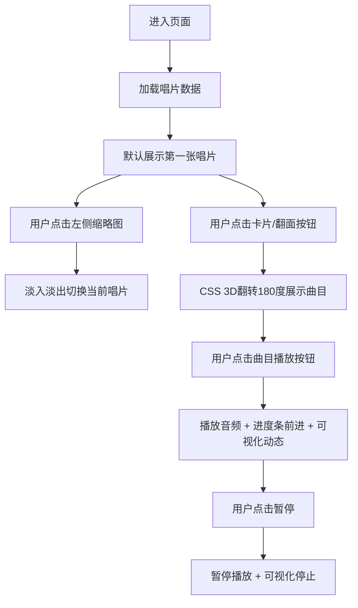

## 1. 产品概述

Vinyl Deck 是一个为小型独立唱片店及黑胶爱好者打造的线上黑胶唱片展示与试听播放面板。该产品整合了黑胶唱片的封面、盘面、曲目列表和音频预览等多维信息，让用户在一个页面内即可浏览唱片详情并试听音轨，解决了传统社交平台推广方式中信息分散、交互低效的问题。

- 核心目标：提供沉浸式的黑胶唱片浏览体验，模拟真实翻唱片动作
- 目标用户：独立唱片店主、黑胶收藏家、音乐爱好者
- 市场价值：为黑胶文化传播提供专业的数字展示工具

## 2. 核心功能

### 2.1 用户角色

| 角色 | 注册方式 | 核心权限 |
|------|----------|----------|
| 访客用户 | 无需注册 | 浏览唱片列表、查看唱片详情、试听音频片段 |

### 2.2 功能模块

1. **唱片缩略图列表**：左侧竖排展示，显示小封面和歌手名字
2. **唱片卡片展示**：主展示区，支持CSS 3D翻面动画
3. **曲目播放功能**：背面曲目列表，每首曲目独立播放控制和进度条
4. **音频可视化**：Canvas实时音频柱状图可视化
5. **唱片切换**：点击缩略图切换当前展示唱片，带淡入淡出动画

### 2.3 页面详情

| 页面名称 | 模块名称 | 功能描述 |
|----------|----------|----------|
| 主页 | 唱片缩略图列表 | 左侧竖排展示所有唱片，点击切换主展示区 |
| 主页 | 唱片卡片正面 | 展示唱片封面大图，支持点击翻面 |
| 主页 | 唱片卡片背面 | 展示曲目列表，每曲含编号、歌名、时长、播放按钮、进度条 |
| 主页 | 音频可视化条 | Canvas实现的实时音频振幅柱状图，仅播放时动态 |

## 3. 核心流程

用户进入页面后，默认选中第一张唱片。用户可点击左侧缩略图切换唱片，点击卡片或翻面按钮查看曲目列表，点击曲目旁播放按钮试听30秒片段，播放时可视化条动态跳动。

## 4. 用户界面设计

### 4.1 设计风格

- **主色调**：深黑色 #1a1a1a（背景）、金色 #c8a96e（强调色）、暗红色 #8b0000（辅助色）
- **按钮风格**：圆形播放按钮，金色边框，悬停时金色填充
- **字体**：复古黑胶风格字体，标题使用装饰性衬线字体，正文使用简洁无衬线字体
- **布局风格**：左右分栏布局，左侧缩略图列表，右侧主展示区居中
- **视觉元素**：唱片卡片带阴影和金色边框装饰，模拟真实黑胶封套质感

### 4.2 页面设计概述

| 页面名称 | 模块名称 | UI元素 |
|----------|----------|--------|
| 主页 | 唱片缩略图列表 | 小封面图（80x80）、歌手名字、金色高亮选中态、悬停动效 |
| 主页 | 唱片卡片（正面） | 480x480封面大图、金色装饰边框、翻面提示按钮、阴影效果 |
| 主页 | 唱片卡片（背面） | 深黑背景、金色文字、曲目列表（编号/歌名/时长/播放按钮/进度条） |
| 主页 | 音频可视化条 | Canvas元素、16-24根金色柱状图、随音频振幅跳动 |

### 4.3 响应式设计

- 桌面端（≥1024px）：左侧3列缩略图网格，右侧居中展示480x480卡片
- 平板端（768px-1023px）：左侧1列缩略图列表，右侧卡片
- 卡片尺寸固定480x480不变
- 播放按钮和进度条触摸友好，最小触摸区域48x48px

### 4.4 动效要求

- 卡片翻转动画：CSS 3D transform rotateY(180deg)，60fps，持续0.6s
- 唱片切换：framer-motion淡入淡出，opacity 0→1，持续0.3s
- 播放按钮悬停：scale(1.1) + 金色填充过渡
- 进度条：平滑宽度过渡
