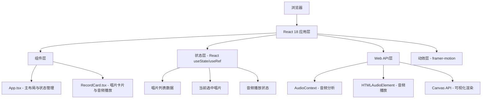

## 1. 架构设计



## 2. 技术描述

- **前端框架**：React@18 + TypeScript@5
- **构建工具**：Vite@5 + @vitejs/plugin-react
- **动效库**：framer-motion@10
- **音频处理**：原生 Web Audio API (AudioContext, AnalyserNode)
- **音频播放**：HTML5 Audio Element
- **可视化**：Canvas 2D API
- **样式方案**：CSS Modules + CSS Variables
- **无后端**：纯前端应用，Mock数据内置

## 3. 路由定义

| 路由 | 用途 |
|------|------|
| / | 主页，包含唱片列表和展示区 |

纯单页应用，无需路由配置。

## 4. 类型定义

```typescript
interface Track {
  id: string;
  number: number;
  title: string;
  duration: string; // "3:42"
  durationSeconds: number;
  audioUrl: string;
}

interface Record {
  id: string;
  artist: string;
  album: string;
  coverImage: string;
  discImage: string;
  tracks: Track[];
}

interface PlayerState {
  currentTrackId: string | null;
  isPlaying: boolean;
  currentTime: number;
  duration: number;
}
```

## 5. 组件结构

### 5.1 App.tsx 主组件
- 职责：整体布局、唱片列表管理、选中状态、唱片切换动效
- 状态：records[], selectedRecordId, selectedRecord
- 子组件：RecordCard

### 5.2 RecordCard.tsx 唱片卡片组件
- 职责：3D翻面、封面展示、曲目列表、音频播放、Canvas可视化
- 状态：isFlipped, playerState, animationId
- Refs：audioRef, audioContextRef, analyserRef, canvasRef, sourceRef
- Hooks：useEffect（音频播放控制、可视化动画）

## 6. 性能指标

| 指标 | 目标值 | 实现方案 |
|------|--------|----------|
| 播放/暂停响应时间 | < 100ms | 预创建Audio实例，直接调用play/pause |
| 翻转动画帧率 | 60fps | CSS transform + backface-visibility，避免重排重绘 |
| 可视化帧率 | 60fps | requestAnimationFrame + 低频数据采样 |
| 首屏加载 | < 2s | 代码精简，无多余依赖，图片懒加载 |

## 7. 文件结构

```
.
├── index.html
├── package.json
├── tsconfig.json
├── vite.config.js
└── src/
    ├── main.tsx
    ├── App.tsx
    ├── RecordCard.tsx
    ├── data/
    │   └── mockRecords.ts
    ├── types/
    │   └── index.ts
    └── styles/
        └── global.css
```
