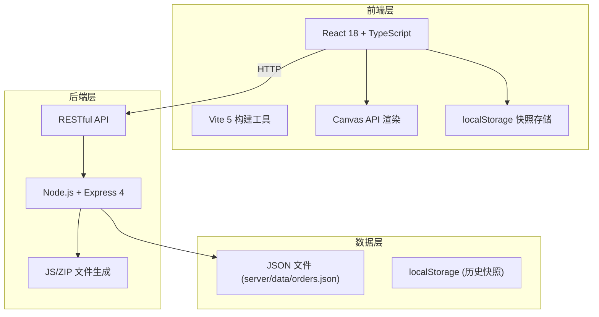
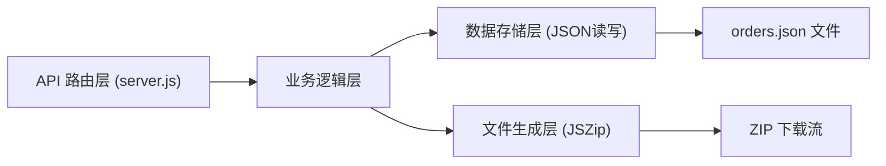
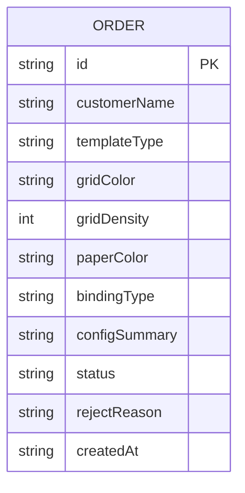

## 1. 架构设计



## 2. 技术说明

- **前端**：React 18（函数组件 + Hooks）+ TypeScript（strict 模式）+ Vite 5
- **初始化工具**：Vite 脚手架
- **后端**：Express 4（Node.js）
- **数据存储**：本地 JSON 文件模拟数据库（server/data/orders.json）+ localStorage（历史快照）
- **主要依赖**：date-fns、file-saver、jszip、uuid、cors

## 3. 路由定义

| 路由 | 用途 |
|------|------|
| / | 主工作台页面（唯一页面，SPA） |

## 4. API 定义

### TypeScript 类型定义

```typescript
type TemplateType = 'dot' | 'grid' | 'line' | 'blank';
type BindingType = 'saddle' | 'perfect' | 'coil';
type OrderStatus = 'pending' | 'producing' | 'completed';

interface TemplateConfig {
  templateType: TemplateType;
  gridColor: string;
  gridDensity: number; // 5-20 mm
  paperColor: string;
  bindingType: BindingType;
}

interface Order {
  id: string;
  customerName: string;
  config: TemplateConfig;
  configSummary: string;
  status: OrderStatus;
  rejectReason?: string;
  createdAt: string;
}

interface Snapshot {
  id: string;
  timestamp: string;
  config: TemplateConfig;
  summary: string;
}
```

### RESTful API

| 方法 | 路径 | 请求 | 响应 | 说明 |
|------|------|------|------|------|
| GET | /api/orders | - | Order[] | 获取所有订单列表 |
| POST | /api/orders/accept/:id | - | { success: true, order: Order } | 接受订单（状态 pending → producing） |
| POST | /api/orders/reject/:id | { reason: string } | { success: true, order: Order } | 拒绝订单，记录原因 |
| POST | /api/export | { orderIds: string[] } | application/zip (binary) | 批量导出所选订单的 PNG 预览图为 ZIP |

## 5. 服务端架构图



## 6. 数据模型

### 6.1 数据模型定义



### 6.2 初始数据（orders.json）

```json
[
  {
    "id": "order-001",
    "customerName": "李小姐",
    "config": {
      "templateType": "dot",
      "gridColor": "#444444",
      "gridDensity": 10,
      "paperColor": "#fdf5e6",
      "bindingType": "perfect"
    },
    "configSummary": "奶油底+深灰点阵10mm+胶装",
    "status": "pending",
    "createdAt": "2025-04-05T14:22:00.000Z"
  },
  {
    "id": "order-002",
    "customerName": "王先生",
    "config": {
      "templateType": "grid",
      "gridColor": "#aaaaaa",
      "gridDensity": 5,
      "paperColor": "#f9f6f0",
      "bindingType": "saddle"
    },
    "configSummary": "米白底+浅灰方格5mm+骑马订",
    "status": "producing",
    "createdAt": "2025-04-04T10:15:00.000Z"
  }
]
```

## 7. 项目文件结构

```
.
├── package.json
├── index.html
├── tsconfig.json
├── vite.config.js
├── src/
│   ├── App.tsx              # 主组件，全局状态（useReducer）
│   ├── TemplateEditor.tsx   # 左侧编辑面板
│   ├── CanvasPreview.tsx    # 右侧画布预览
│   ├── OrderManager.tsx     # 底部订单管理面板
│   ├── api.ts               # API 请求封装
│   └── styles.css           # 全局样式
└── server/
    ├── server.js            # Express 后端入口
    └── data/
        └── orders.json      # 订单数据存储
```
