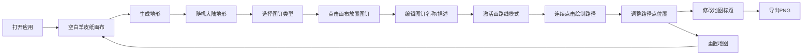

## 1. 产品概述

中世纪地图工坊是一款面向独立桌游设计师与历史教育爱好者的浏览器端交互式古地图生成与标注工具。用户可通过参数调节快速生成仿羊皮纸质感的随机地形、放置手工风格的城镇图标和路线标记，并实时导出高分辨率PNG印刷图。

- **目标用户**：独立桌游设计师、历史教育工作者、TRPG爱好者
- **解决问题**：传统地图制作工具操作复杂，无法快速生成仿羊皮纸质感地图、手工风格图标和高分辨率导出
- **产品定位**：轻量级、纯前端、即开即用的中世纪风格数字羊皮纸地图制作工具

---

## 2. 核心功能

### 2.1 功能模块

1. **地图画布模块**：1400x1000像素固定画布，仿羊皮纸背景，柏林噪声地形生成
2. **图钉工具模块**：五种可拖拽地图元素（城镇、村庄、城堡、森林、矿山），支持命名、描述、位置调整、删除
3. **贸易路线模块**：折线绘制模式，路径点可拖拽微调，路线命名与管理
4. **装饰元素模块**：可编辑标题、固定比例尺、指北针
5. **导出重置模块**：300dpi PNG导出，一键重置确认

### 2.2 页面详情

| 页面名称 | 模块名称 | 功能描述 |
|-----------|-------------|---------------------|
| 主工作台 | 左侧控制面板 | 地形生成按钮、当前工具状态显示 |
| 主工作台 | 中央地图画布 | 1400x1000像素画布，羊皮纸底纹，地形/图钉/路线渲染与交互 |
| 主工作台 | 右侧工具栏 | 五种图钉类型选择、路线绘制开关、路线列表管理 |
| 主工作台 | 顶部全局栏 | 导出PNG按钮、重置地图按钮 |
| 主工作台 | 画布装饰层 | 左上角可编辑标题、右上角比例尺与指北针 |
| 主工作台 | 弹窗组件 | 图钉编辑气泡、重置确认对话框 |

---

## 3. 核心流程

### 3.1 主工作流程

用户打开应用 → 看到空白羊皮纸画布 → 点击"生成地形"创建随机大陆 → 从右侧选择图钉类型 → 在画布上点击放置图钉并编辑名称 → 激活"画路线"模式 → 连续点击绘制贸易路线 → 调整路线点位置 → 修改地图标题 → 点击"导出PNG"下载成品图 / 点击"重置地图"清空重来

### 3.2 流程图

---

## 4. 用户界面设计

### 4.1 设计风格

- **主色调**：暖黄旧纸色 `#e8d5a3`（羊皮纸底）、深褐 `#7a5d3c`（边框/文字）、草绿 `#c5d6a8`（陆地）、浅蓝 `#b0d4e8`（海洋）、赭石 `#6b4226`（路线）
- **按钮风格**：圆角细边框（`#7a5d3c`）、内阴影营造旧纸浮雕效果、悬停轻微加深
- **字体**：标题使用 Georgia / Playfair Display 衬线字体，正文使用 Georgia 仿手抄本字迹
- **布局**：三栏布局（左控制面板 + 中央画布 + 右工具栏），顶部全局操作栏
- **视觉质感**：CSS径向渐变 + 噪点滤镜实现羊皮纸纹理，所有面板带有旧纸浮雕内阴影

### 4.2 页面设计概述

| 页面名称 | 模块名称 | UI 元素 |
|-----------|-------------|-------------|
| 主工作台 | 左侧控制面板 | 羊皮纸质感面板、"生成地形"大按钮、当前选中工具显示 |
| 主工作台 | 中央画布 | 1400x1000固定尺寸、羊皮纸底纹噪点、响应式缩放保持比例 |
| 主工作台 | 右侧工具栏 | 五种图钉选择按钮（带图标预览）、路线绘制开关、路线列表（可重命名/删除） |
| 主工作台 | 顶部全局栏 | "导出PNG"按钮、"重置地图"按钮、工具状态指示 |
| 主工作台 | 画布装饰层 | 左上角标题（可编辑，衬线字体24px）、右上角比例尺（横线刻度）+ 指北针（箭头） |
| 主工作台 | 弹窗组件 | 图钉气泡编辑框（渐变透明度过渡）、重置确认对话框（模态框） |

### 4.3 响应式设计

- **桌面优先**：标准视口 ≥ 1200px，三栏完整布局
- **中等视口**（< 1200px）：画布自动缩小至容器宽度，保持宽高比；控制面板转为可滚动
- **交互优化**：图钉拖拽带 ease-out 200ms 弹性动画，路径点悬停/激活闪烁提示，气泡渐变过渡

### 4.4 性能指标

- **帧率**：30个图钉 + 10条路线（每条12点）下保持 60FPS
- **交互延迟**：点击操作反馈 ≤ 50ms
- **导出时间**：PNG导出响应 ≤ 2秒

---

## 5. 数据设计

### 5.1 核心数据结构

- **地形数据**：种子值（number）、柏林噪声参数
- **图钉数据**：唯一ID、类型（town/village/castle/forest/mine）、坐标 x/y、名称（≤10字）、描述（≤50字）
- **路线数据**：唯一ID、名称、路径点数组（[{x,y}]）
- **地图标题**：字符串（默认"未知之地"）
