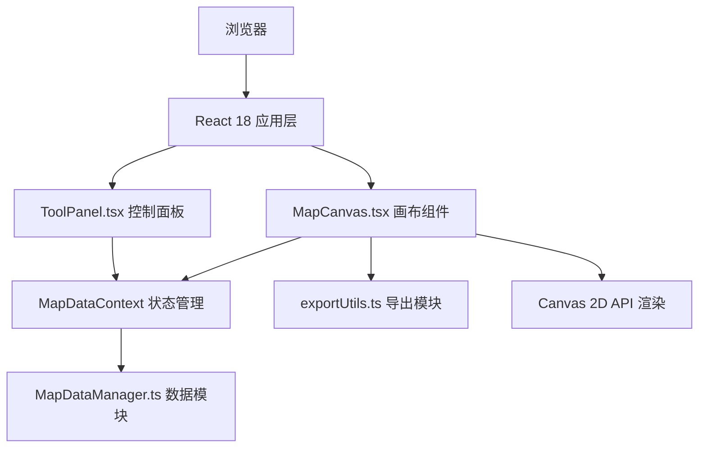

## 1. 架构设计

### 1.1 系统架构图



- **渲染层**：React 18 组件管理 DOM 与生命周期，Canvas 2D API 负责地图绘制
- **状态层**：React Context + useReducer 管理全局地图状态
- **工具层**：纯函数模块处理数据操作和PNG导出
- **纯前端**：无需后端，所有逻辑在浏览器端执行

---

## 2. 技术选型说明

| 层级 | 技术栈 | 说明 |
|------|--------|------|
| 前端框架 | React 18 | 组件化开发，Hooks 管理状态与生命周期 |
| 语言 | TypeScript 5 | 严格模式，目标 ES2020，类型安全 |
| 构建工具 | Vite 5 | 快速开发服务器，@vitejs/plugin-react |
| 渲染技术 | Canvas 2D API | 原生浏览器API，无需外部地图库 |
| 状态管理 | React Context | 轻量级全局状态，无需额外依赖 |
| 唯一ID | uuid | 生成图钉和路线的唯一标识 |
| 样式方案 | 原生 CSS + CSS 变量 | 无需 Tailwind，精细控制中世纪复古质感 |

---

## 3. 文件结构

```
project-root/
├── package.json
├── index.html
├── tsconfig.json
├── vite.config.js
└── src/
    ├── main.tsx
    ├── App.tsx
    ├── index.css
    ├── MapCanvas.tsx
    ├── ToolPanel.tsx
    ├── MapDataManager.ts
    ├── MapDataContext.tsx
    └── exportUtils.ts
```

### 模块职责

| 文件 | 职责 |
|------|------|
| [MapCanvas.tsx](file:///e:/solo/VersionFast/tasks/auto283/src/MapCanvas.tsx) | 主画布组件，羊皮纸背景、地形绘制、图钉渲染、路线绘制、鼠标交互（放置/拖拽/删除/绘制） |
| [ToolPanel.tsx](file:///e:/solo/VersionFast/tasks/auto283/src/ToolPanel.tsx) | 控制面板，地形生成、图钉类型选择、路线模式、导出/重置、路线列表 |
| [MapDataManager.ts](file:///e:/solo/VersionFast/tasks/auto283/src/MapDataManager.ts) | 纯函数数据模块，地形种子、图钉数组、路线数组的增删改查 |
| [MapDataContext.tsx](file:///e:/solo/VersionFast/tasks/auto283/src/MapDataContext.tsx) | React Context Provider，注入全局状态与操作方法 |
| [exportUtils.ts](file:///e:/solo/VersionFast/tasks/auto283/src/exportUtils.ts) | 导出工具，离屏Canvas合成，300dpi PNG Blob生成，触发下载 |

---

## 4. 数据模型

### 4.1 类型定义

```typescript
type PinType = 'town' | 'village' | 'castle' | 'forest' | 'mine';

interface MapPin {
  id: string;
  type: PinType;
  x: number;
  y: number;
  name: string;       // max 10 chars
  description: string; // max 50 chars
}

interface RoutePoint {
  x: number;
  y: number;
}

interface MapRoute {
  id: string;
  name: string;
  points: RoutePoint[];
}

interface TerrainData {
  seed: number;
  landMask: boolean[][]; // 1400x1000 陆地/海洋掩码
}

interface MapState {
  title: string;
  terrain: TerrainData | null;
  pins: MapPin[];
  routes: MapRoute[];
  selectedTool: PinType | 'route' | null;
  isDrawingRoute: boolean;
  currentRoutePoints: RoutePoint[];
  selectedPinId: string | null;
}
```

### 4.2 状态操作

- `generateTerrain(seed?)` → 生成新地形，使用柏林噪声算法
- `addPin(type, x, y)` → 新增图钉
- `updatePin(id, patch)` → 更新图钉位置/名称/描述
- `deletePin(id)` → 删除图钉
- `startRoute()` → 开始路线绘制
- `addRoutePoint(x, y)` → 添加路径点
- `finishRoute()` → 完成路线（自动命名"路线N"）
- `updateRoute(id, patch)` → 更新路线名称/路径点
- `deleteRoute(id)` → 删除路线
- `updateTitle(title)` → 更新地图标题
- `resetMap()` → 清空所有数据

---

## 5. Canvas 渲染策略

### 5.1 分层渲染

1. **底层**：羊皮纸背景（CSS 渐变 + Canvas 噪点）
2. **中层**：地形（大陆填充 + 海洋）
3. **上层**：贸易路线（深褐虚线 #6b4226，线宽3px，虚线间隔5px）
4. **顶层**：图钉图标 + 名称标签 + 画布装饰（标题、比例尺、指北针）

### 5.2 交互处理

- **鼠标点击**：根据当前工具状态放置图钉或添加路线点
- **鼠标按下 + 移动**：拖拽图钉或路线点，使用 requestAnimationFrame 确保流畅
- **右键点击**：删除图钉（阻止默认菜单）
- **Esc 键**：退出路线绘制模式，取消当前未完成路线
- **悬停检测**：命中测试（hit-testing）检测图钉/路线点，显示名称提示

---

## 6. 性能优化

- **离屏缓存**：地形生成后缓存到离屏 Canvas，避免重复绘制
- **脏区域渲染**：仅重绘变化区域，而非全帧重绘
- **防抖节流**：导出操作防抖，拖拽使用 rAF 合并事件
- **对象池**：路线点和图钉对象复用，减少 GC 压力

---

## 7. 导出实现

1. 创建离屏 Canvas（1400 × 1000 物理像素，300dpi → 4.67 × 3.33 英寸）
2. 按层合成：羊皮纸底纹 → 地形 → 路线 → 图钉 → 装饰元素
3. `canvas.toBlob('image/png')` 生成 Blob
4. 创建临时 `<a>` 元素触发下载，文件名 `Map_YYYYMMDD_HHMMSS.png`
