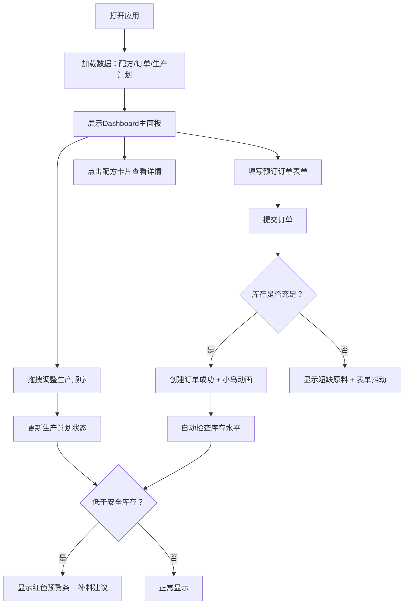

## 1. 产品概述

面包坊工坊是一款面向小型独立面包店和烘焙爱好者的全栈Web管理应用，帮助用户高效管理每日产品生产计划、原料库存以及客户预订订单。通过直观的拖拽式界面、自动成本计算和智能库存预警，提升烘焙运营效率并降低物料浪费。

- 目标用户：小型面包店经营者、家庭烘焙工作室、烘焙爱好者
- 核心价值：简化生产流程、精准成本控制、智能库存管理

## 2. 核心功能

### 2.1 用户角色
| 角色 | 注册方式 | 核心权限 |
|------|----------|----------|
| 面包师/经营者 | 无需注册，本地使用 | 全部功能：生产计划、配方管理、订单处理、库存查看 |

### 2.2 功能模块
1. **Dashboard主面板**：每日生产计划卡片网格、拖拽排序、状态管理、库存预警条、历史统计图表
2. **配方卡片组件**：配料清单展示、成本自动计算、预估毛利标签、展开/收起详情
3. **预订订单表单**：产品选择、数量校验、日期限制、库存充足性验证
4. **后端API服务**：配方CRUD、订单管理、生产计划更新、库存检查

### 2.3 页面详情
| 页面名称 | 模块名称 | 功能描述 |
|-----------|-------------|---------------------|
| 主面板 | 库存预警条 | 当原料低于安全库存时红色警告，显示补料建议 |
| 主面板 | 生产计划卡片网格 | 展示当日计划，显示开始时间、配料状态、完成进度，支持拖拽排序 |
| 主面板 | 历史统计区域 | 过去7天销量/退货条形图、总收入/成本对比 |
| 右侧面板 | 配方详情卡片 | 展示配料清单、成本计算、预估毛利，点击展开 |
| 右侧面板 | 订单创建表单 | 产品下拉、数量输入、日期选择、库存验证提交 |

## 3. 核心流程

用户打开应用后，首先看到Dashboard主面板，展示当日生产计划和库存预警。用户可以拖拽调整生产顺序、点击配方卡片查看详情、在右侧填写订单表单。提交订单时后端会校验库存，成功后显示动画并更新数据，系统会自动检查库存并生成补料建议。

## 4. 用户界面设计

### 4.1 设计风格
- **主色调**：暖色调背景 #faf3e0（米黄色），深棕色字体 #5c3a21，卡片白色 #ffffff
- **辅助色**：进度条绿色，预警红色，毛利标签金色
- **按钮样式**：圆角按钮，悬停变为深棕色 #5c3a21，点击水波纹效果
- **字体**：标题衬线体 Georgia，正文无衬线 Arial
- **布局风格**：桌面端左右两栏布局（左60%生产计划+统计，右40%配方+订单），平板上下叠放，手机全宽卡片
- **图标风格**：使用 lucide-react 图标库，面包、日历、库存相关图标

### 4.2 页面设计概览
| 页面名称 | 模块名称 | UI元素 |
|-----------|-------------|-------------|
| 主面板 | 库存预警条 | 红色背景条，白色文字，带警示图标和补料建议列表 |
| 主面板 | 生产计划卡片 | 白色圆角卡片，细微阴影，状态徽章，进度条，拖拽时半透明占位符，状态变更时向上弹跳动画 |
| 主面板 | 统计图表 | CSS绘制条形图，显示销量（绿色）和退货（红色）对比，右侧标注总收入和成本 |
| 右侧面板 | 配方卡片 | 可展开卡片，配料表格，成本明细，金色毛利标签，展开/收起过渡动画 |
| 右侧面板 | 订单表单 | 产品下拉框，数量输入（带最大限制提示），日期选择器，提交按钮，成功/失败动画 |

### 4.3 响应式设计
- **桌面端（>1024px）**：两栏布局，左侧60%生产计划+统计，右侧40%配方+订单
- **平板（768-1024px）**：上下叠放布局，先生产计划+统计，后配方+订单
- **手机（<768px）**：单列全宽布局，字体缩小，卡片紧凑排列，支持触摸拖拽

### 4.4 动效设计
- 卡片状态变更：transform: translateY(-4px) + box-shadow 加深的弹跳动画
- 拖拽排序：半透明占位符，平滑过渡
- 按钮悬停：背景色渐变至深棕色，点击水波纹
- 订单提交成功：绿色小鸟飞过关键帧动画
- 订单提交失败：表单轻微抖动动画
- 配方卡片展开/收起：高度平滑过渡
