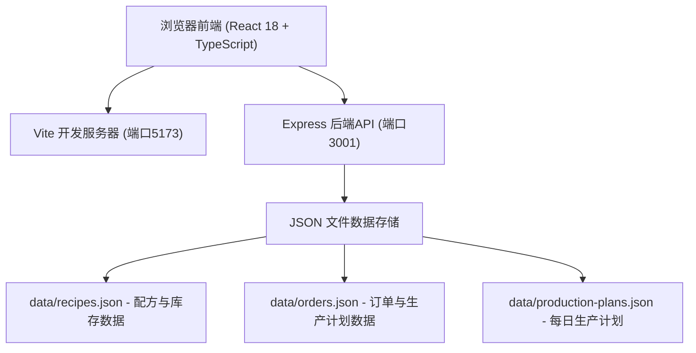
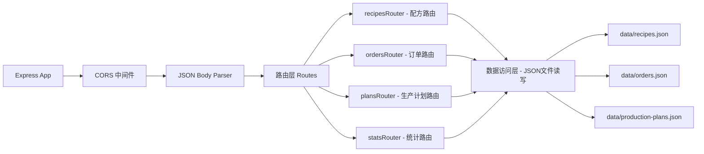
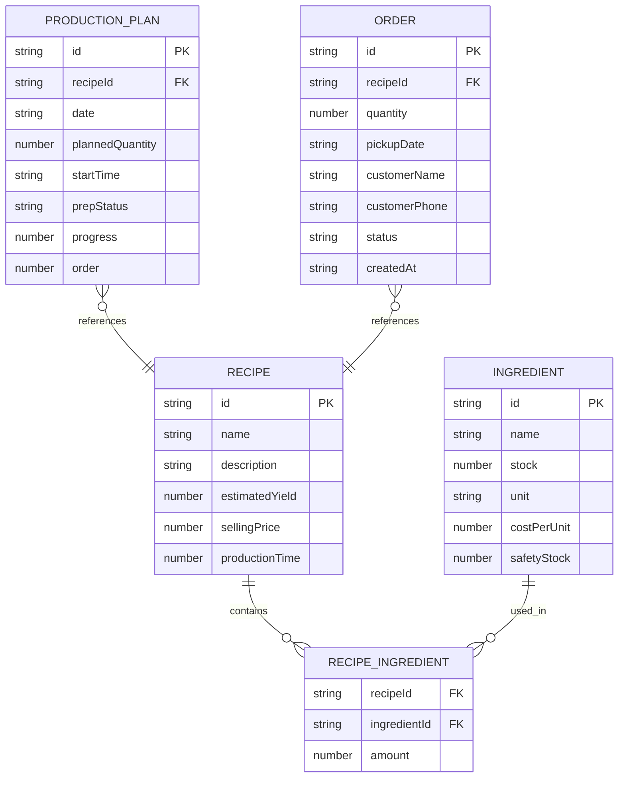

## 1. 架构设计



## 2. 技术说明

- **前端**：React 18 + TypeScript 5 + Vite 5
- **构建工具**：Vite 5 + @vitejs/plugin-react
- **后端**：Node.js + Express 4
- **数据库**：本地 JSON 文件模拟（data/ 目录下）
- **状态管理**：React useState/useEffect 组件级状态管理
- **拖拽库**：react-beautiful-dnd
- **工具库**：uuid（ID生成）、date-fns（日期处理）、cors（跨域）

## 3. 路由定义

| 路由 | 用途 |
|-------|---------|
| / | 主应用入口，Dashboard仪表盘 |

## 4. API 定义

### 4.1 配方相关 API

```typescript
// Ingredient 配料类型
interface Ingredient {
  id: string;
  name: string;
  quantity: number;
  unit: string;
  costPerUnit: number;
  stock: number;
  safetyStock: number;
}

// Recipe 配方类型
interface Recipe {
  id: string;
  name: string;
  description: string;
  ingredients: { ingredientId: string; amount: number }[];
  estimatedYield: number;
  sellingPrice: number;
  productionTime: number; // 分钟
}

// GET /api/recipes - 获取所有配方
// Response: Recipe[]

// GET /api/ingredients - 获取所有原料库存
// Response: Ingredient[]
```

### 4.2 订单相关 API

```typescript
// Order 订单类型
interface Order {
  id: string;
  recipeId: string;
  quantity: number;
  pickupDate: string; // ISO date
  customerName: string;
  customerPhone: string;
  status: 'pending' | 'completed' | 'cancelled';
  createdAt: string;
}

// POST /api/orders - 创建订单
// Request: { recipeId: string; quantity: number; pickupDate: string; customerName: string; customerPhone: string }
// Response: 
//   成功: { success: true; order: Order }
//   失败: { success: false; error: string; shortages: { name: string; needed: number; available: number }[] }

// GET /api/orders - 获取所有订单
// Response: Order[]
```

### 4.3 生产计划相关 API

```typescript
// ProductionPlan 生产计划类型
interface ProductionPlan {
  id: string;
  recipeId: string;
  date: string; // ISO date
  plannedQuantity: number;
  startTime: string; // HH:mm
  prepStatus: 'pending' | 'in-progress' | 'completed';
  progress: number; // 0-100
  order: number; // 排序顺序
}

// GET /api/production-plans?date=YYYY-MM-DD - 获取指定日期的生产计划
// Response: ProductionPlan[]

// PUT /api/production-plans/:id - 更新生产计划
// Request: Partial<ProductionPlan>
// Response: { success: true; plan: ProductionPlan }

// PUT /api/production-plans/reorder - 批量更新排序
// Request: { orders: { id: string; order: number }[] }
// Response: { success: true }
```

### 4.4 统计与库存预警 API

```typescript
// GET /api/stats/weekly - 获取过去7天统计数据
// Response: {
//   daily: { date: string; sales: { recipeId: string; quantity: number; returns: number }[] }[];
//   totalRevenue: number;
//   totalCost: number;
// }

// GET /api/inventory/alerts - 获取库存预警和补料建议
// Response: {
//   alerts: { ingredient: Ingredient; shortage: number }[];
//   suggestions: { ingredient: Ingredient; recommendedOrder: number }[];
// }
```

## 5. 服务器架构图



## 6. 数据模型

### 6.1 数据模型定义



### 6.2 初始数据 JSON 结构

**recipes.json** 包含配料和配方数据：
```json
{
  "ingredients": [
    { "id": "ing-1", "name": "高筋面粉", "stock": 25, "unit": "kg", "costPerUnit": 8.5, "safetyStock": 10 },
    { "id": "ing-2", "name": "黄油", "stock": 5, "unit": "kg", "costPerUnit": 45, "safetyStock": 3 }
  ],
  "recipes": [
    {
      "id": "rec-1",
      "name": "酸种面包",
      "description": "经典法式酸种面包，外皮酥脆内部柔软",
      "ingredients": [{ "ingredientId": "ing-1", "amount": 0.5 }],
      "estimatedYield": 1,
      "sellingPrice": 38,
      "productionTime": 480
    }
  ]
}
```

**orders.json** 包含订单和历史销量数据：
```json
{
  "orders": [],
  "salesHistory": [
    { "date": "2026-06-09", "recipeId": "rec-1", "quantity": 25, "returns": 1 }
  ]
}
```

**production-plans.json** 包含每日生产计划：
```json
{
  "plans": [
    {
      "id": "plan-1",
      "recipeId": "rec-1",
      "date": "2026-06-10",
      "plannedQuantity": 30,
      "startTime": "06:00",
      "prepStatus": "in-progress",
      "progress": 35,
      "order": 0
    }
  ]
}
```
