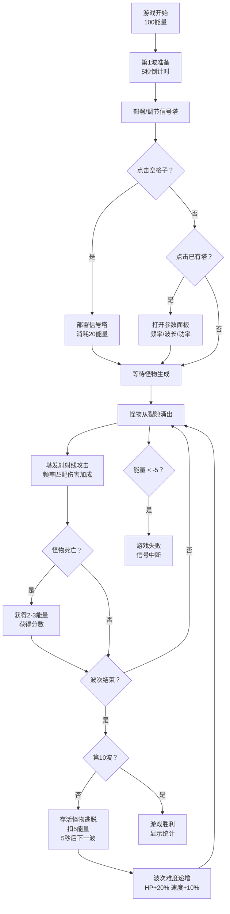

## 1. 产品概述
"深渊信号塔"是一款在浏览器中运行的2D策略防守游戏，玩家通过部署信号塔并动态调节其发射频率、波长和功率参数，干扰和击退从中央深渊裂隙中涌出的信号怪物。本产品旨在解决传统塔防游戏策略单一性问题，让玩家通过参数配置而非单纯堆砌高伤害塔来取胜。

- 核心玩法：10波怪物递进防守，调节塔参数匹配怪物频率弱点
- 目标用户：喜欢策略塔防、喜欢参数调节类玩法的浏览器游戏玩家
- 产品价值：提供深度策略体验，强调动态参数调整的即时反馈

## 2. 核心特性

### 2.1 用户角色
| 角色 | 注册方式 | 核心权限 |
|------|----------|----------|
| 玩家 | 无需注册，直接进入游戏 | 完整游戏体验 |

### 2.2 功能模块
1. **游戏主界面**：15x10网格地图、中央深渊裂隙、HUD信息栏
2. **信号塔系统**：部署、参数调节（频率/波长/功率）、发热冷却、射线攻击
3. **怪物系统**：3种怪物类型（低频魔/拟态妖/脉冲兽）、波次生成、频率弱点机制
4. **资源管理**：能量获取/消耗、塔部署成本、紧急降温消耗
5. **游戏状态**：波次管理、暂停/继续、胜负判定、重玩

### 2.3 页面详情
| 页面名称 | 模块名称 | 功能描述 |
|----------|----------|----------|
| 游戏主界面 | 网格地图 | 15x10格子，显示塔和怪物，支持点击放置塔 |
| 游戏主界面 | 深渊裂隙 | 中央动态粒子动画，紫色到黑色渐变脉冲 |
| 游戏主界面 | 顶部HUD | 显示波次（金色#ffd700）、剩余怪物数、能量值、总分数（蓝色发光） |
| 游戏主界面 | 塔交互面板 | 半透明#2a2a4e浮窗，三个圆形滑块（频率/波长/功率），紧急降温按钮 |
| 游戏主界面 | 塔预览 | 部署状态下悬停格子显示淡绿色#00ff8844半透明预览 |
| 游戏结束 | 失败覆盖层 | 全屏暗红色半透明，中央"信号中断"白色大字，本局得分和"重新连接"按钮 |
| 游戏结束 | 胜利统计 | 10波通关后显示最终得分、总击杀数、最高连续击杀、能量花费总和 |

## 3. 核心流程
玩家进入游戏 → 初始100能量，第1波倒计时 → 点击非裂隙格子部署信号塔（消耗20能量，最多6座）→ 点击塔打开参数面板 → 调节频率/波长/功率匹配怪物弱点 → 怪物从裂隙涌出 → 塔自动发射射线攻击（频率匹配弱点伤害最高）→ 击杀怪物获得2-3能量和分数 → 功率过高发热超过85%强制冷却5秒 → 每波结束5秒后自动下一波（存活怪物HP重置，扣5能量）→ 完成10波胜利/能量低于-5失败 → 点击重新连接重玩

## 4. 用户界面设计

### 4.1 设计风格
- 主色调：深灰渐变背景 #0f0f1a → #1a1a2e
- 强调色：紫色 #5a4a8a / #4a4a8a（网格边框、塔面板）、金色 #ffd700（波次信息）、蓝色发光（分数）
- 怪物颜色：低频魔（蓝紫色）、拟态妖（绿色系）、脉冲兽（红橙色）
- 字体：像素风格白色字体，标题紫色发光
- 按钮/滑块：圆形滑块直径48px，外圈渐变 #5a4a8a → #3a2a6a
- 动画：所有交互0.2秒淡入/缩放/颜色过渡，裂隙sin波缩放动画周期1.5秒

### 4.2 页面设计概览
| 页面名称 | 模块名称 | UI元素 |
|----------|----------|--------|
| 游戏主界面 | 网格地图 | 15x10格子，半透明淡紫色边框#4a4a8a，塔部署预览淡绿色#00ff8844 |
| 游戏主界面 | 深渊裂隙 | 径向渐变#3b0a6a→#000000，sin波缩放周期1.5s，动态粒子 |
| 游戏主界面 | 怪物图形 | 低频魔：等边三角形+↓、拟态妖：六边形+?、脉冲兽：菱形+⚡，上方血条（绿>50%#44ff44，黄20-50%#ffaa00，红<20%#ff4444） |
| 游戏主界面 | 塔图形 | 信号塔基座+天线，发射时射线连接目标 |
| 游戏主界面 | HUD | 半透明黑底白字悬浮顶部，波次金色，分数蓝色text-shadow发光 |
| 游戏主界面 | 塔面板 | 半透明#2a2a4e浮窗，三个圆形滑块（频率/波长/功率）显示百分比白色字体，紧急降温按钮 |
| 结束界面 | 失败层 | 全屏暗红半透明覆盖，中央白色大字"信号中断"，"重新连接"按钮 |

### 4.3 响应式
- 桌面优先（1920px），自适应到768px
- 网格和塔面板在窄屏下等比例缩小，不出现滚动条
- Canvas画布使用CSS scale实现等比缩放，保持15:10网格比例

### 4.4 性能要求
- 每秒生成8只怪物、6座塔同时发射射线时，帧率不低于40FPS
- Canvas 2D优化：脏矩形渲染、对象池复用怪物/射线对象
