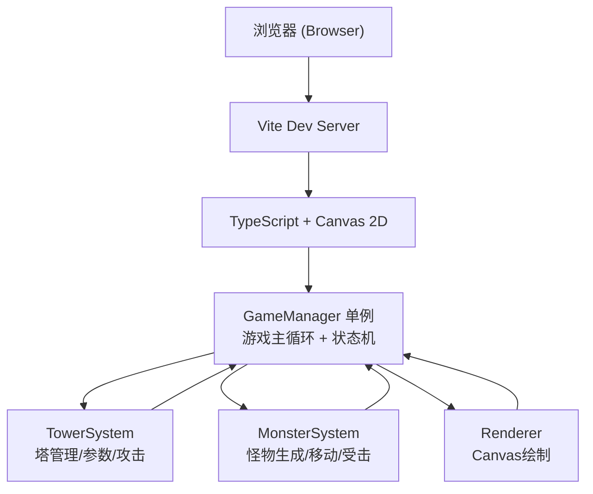

## 1. 架构设计



## 2. 技术描述
- **前端框架**：纯 TypeScript（无 React/Vue）+ Canvas 2D API
- **构建工具**：Vite@5
- **依赖库**：
  - typescript@5（类型系统）
  - lodash（工具函数、防抖节流、深拷贝）
  - uuid（唯一ID生成）
- **渲染引擎**：原生 HTML5 Canvas 2D Context
- **状态管理**：GameManager 单例模式，内部维护状态机

## 3. 文件结构

```
项目根目录/
├── package.json
├── index.html                  # 入口页面，Canvas容器
├── tsconfig.json               # TS配置（严格模式，ES2020）
├── vite.config.js              # Vite构建配置
└── src/
    ├── main.ts                 # 入口文件，初始化GameManager
    ├── types.ts                # 全局类型定义
    ├── GameManager.ts          # 核心游戏循环、波次管理、状态机（单例）
    ├── TowerSystem.ts          # 塔对象管理、参数调节、发热冷却、攻击逻辑
    ├── MonsterSystem.ts        # 怪物对象管理、生成移动、频率弱点、难度缩放
    └── Renderer.ts             # Canvas绘制：网格、裂隙、塔、怪物、HUD、面板
```

## 4. 核心数据模型

### 4.1 游戏状态

```typescript
type GameState = 'prepare' | 'combat' | 'paused' | 'victory' | 'defeat';

interface GameStats {
  wave: number;               // 当前波次 1-10
  energy: number;             // 能量值
  score: number;              // 总分
  totalKills: number;         // 总击杀数
  comboKills: number;         // 当前连续击杀
  maxCombo: number;           // 最高连续击杀
  totalEnergySpent: number;   // 总能量花费
  remainingMonsters: number;  // 本波剩余怪物
}
```

### 4.2 信号塔

```typescript
interface Tower {
  id: string;
  gridX: number;              // 网格坐标X
  gridY: number;              // 网格坐标Y
  frequency: number;          // 频率 0.5-10 Hz，步进0.1
  wavelength: number;         // 波长 100-1000 m
  power: number;              // 功率 5%-100%
  heat: number;               // 发热 0%-100%
  isCooling: boolean;         // 是否强制冷却中
  coolEndTime: number;        // 强制冷却结束时间戳
  lastFireTime: number;       // 上次攻击时间
  emergencyCooldown: number;  // 紧急降温剩余冷却
  targetId: string | null;    // 当前目标ID
  firingRay: Ray | null;      // 当前发射射线
}

interface Ray {
  fromX: number;
  fromY: number;
  toX: number;
  toY: number;
  alpha: number;              // 用于渐隐
}
```

### 4.3 怪物

```typescript
type MonsterType = 'lowFreq' | 'mimic' | 'pulse';

interface Monster {
  id: string;
  type: MonsterType;
  x: number;                  // 像素坐标
  y: number;
  hp: number;
  maxHp: number;
  speed: number;
  baseSpeed: number;
  // 频率免疫/弱点
  immuneFreq: 'low' | 'mid' | 'high' | null;
  weakFreq: 'low' | 'mid' | 'high';
  // 拟态妖专用
  mimicTimer: number;         // 下次切换时间
  // 脉冲兽专用
  pulseTimer: number;         // 下次脉冲时间
  // 方向
  dirX: number;
  dirY: number;
}
```

## 5. 核心算法

### 5.1 伤害系数计算
```
频率匹配度 freqMatch:
  - 塔频率 ∈ 怪物弱点频段 → 2.0x
  - 塔频率 ∈ 怪物免疫频段 → 0.0x
  - 否则 → 1.0x

波长穿透系数 penetration:
  - 短波(100-200m): 1.2x 穿透, 射程系数 0.7x
  - 中波(200-500m): 1.0x 穿透, 射程系数 1.0x
  - 长波(500-1000m): 0.8x 穿透, 射程系数 1.4x

最终伤害 = baseDamage × (power/100) × freqMatch × penetration
```

### 5.2 发热计算
```
每秒发热增加 = (power / 10) × 15%
每秒自然散热 = 5%
发热 > 85% → 强制冷却5秒，期间无法攻击
紧急降温: 消耗5能量 → 瞬间降温40%，冷却10秒
```

### 5.3 波次难度缩放
```
第N波怪物:
  HP = baseHp × (1 + 0.2 × (N-1))
  速度 = baseSpeed × (1 + 0.1 × (N-1))
  数量 = random(8, 12) + floor(N/3)
```

### 5.4 塔攻击判定
```
每帧遍历所有塔:
  若冷却中 → 跳过
  筛选射程内怪物
  选择HP最低的怪物为目标
  根据频率计算伤害
  发射射线（渲染用）
  更新目标HP
  发热 += 每发射发热增量
```

## 6. 渲染优化策略
- 使用 `requestAnimationFrame` 驱动主循环
- Canvas 背景使用 CSS 渐变，避免每帧重绘纯色背景
- 怪物/塔对象复用，避免频繁GC
- 射线使用半透明线条，alpha渐隐实现余辉效果
- 响应式缩放通过 Canvas CSS transform: scale() 实现，内部坐标系不变
