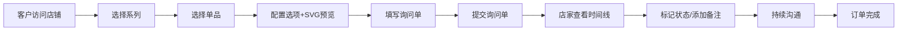

## 1. 产品概述

"粼光手作"是一款面向小型独立手作饰品工作室和个人设计师的全栈Web应用，帮助设计师在线管理作品系列、材料库存和客户定制询问流程。通过系统化的作品管理、可视化的客户定制配置、以及可追溯的询问单时间线，解决手工饰品行业在定制沟通和版本追踪上的效率痛点。

## 2. 核心功能

### 2.1 用户角色

| 角色 | 使用场景 | 核心权限 |
|------|----------|----------|
| 设计师/店家 | 后台管理作品系列、单品配置和客户询问单 | 系列/单品CRUD、选项配置、询问单管理、状态更新、备注增删改 |
| 客户 | 浏览店铺、配置饰品、提交定制询问 | 浏览系列和单品、在线配置选项、查看SVG预览、提交询问单 |

### 2.2 功能模块

1. **系列管理页**：左侧系列卡片列表、右侧单品列表、单品编辑、选项配置
2. **客户配置页**：单品选择、选项面板、SVG实时预览、询问单提交表单
3. **后台询问单页**：询问单列表、时间线视图、对话记录、状态追踪、备注管理

### 2.3 页面详情

| 页面名称 | 模块名称 | 功能描述 |
|----------|----------|----------|
| 系列管理 | 系列卡片列表 | 展示封面图、系列名、单品数量，支持点击切换 |
| 系列管理 | 单品列表 | 展示选中系列下所有单品，支持编辑名称/描述/价格/主图/标签 |
| 系列管理 | 选项配置 | 为单品添加最多5个自定义选项，每个选项可配置多个值及价格调整，支持拖拽排序 |
| 客户配置 | 单品展示 | 显示单品名称、描述、基础价格、主图 |
| 客户配置 | 选项选择 | 根据单品配置渲染可选字段，切换时实时更新预览 |
| 客户配置 | SVG预览 | 画布动态渲染首饰组合效果，包含珠子/链子/耳钩等元素，300ms淡入过渡 |
| 客户配置 | 询问单提交 | 客户填写联系方式和备注后提交定制询问 |
| 询问单后台 | 时间线视图 | 按时间顺序展示状态变更、对话记录、备注，带渐变色进度条 |
| 询问单后台 | 备注管理 | 支持在任意节点添加、编辑、删除备注 |
| 询问单后台 | 状态管理 | 标记订单状态：待沟通、已报价、制作中、已完成 |

## 3. 核心流程

客户浏览店铺 → 选择系列 → 选择单品 → 配置选项（实时预览SVG效果）→ 填写联系信息和备注 → 提交询问单 → 店家在后台查看时间线 → 标记状态/添加备注 → 持续沟通直至完成

## 4. 用户界面设计

### 4.1 设计风格

- **主色调**：暖白 #fef9f0（背景）、珊瑚粉 #ff7f7f（强调色）、深灰 #2d2d2d（文字）
- **卡片样式**：12px 圆角 + 2px 细边框
- **按钮效果**：悬停时缩小至 0.98 的微动效
- **字体**：使用优雅的衬线字体作为标题，无衬线字体作为正文
- **布局**：CSS Grid 实现，桌面端多列布局，平板/手机端单列流式布局

### 4.2 页面设计概述

| 页面名称 | 模块名称 | UI元素 |
|----------|----------|--------|
| 系列管理 | 系列卡片 | 封面图、系列名、单品数量标签、悬停高亮效果 |
| 系列管理 | 单品编辑表单 | 输入框、文本域、价格输入、标签选择器、图片URL输入 |
| 系列管理 | 选项编辑器 | 可拖拽列表项、选项名称输入、值列表、价格调整输入 |
| 客户配置 | SVG预览区 | 居中画布、带柔和阴影的容器、淡入动画 |
| 客户配置 | 选项面板 | 选项标签组、单选按钮/下拉选择、选中状态高亮 |
| 询问单后台 | 时间线 | 左侧时间轴、右侧事件卡片、渐变色进度条在顶部 |

### 4.3 响应式设计

- 桌面端（≥1024px）：CSS Grid 多列布局，系列管理左右分栏
- 平板端（768px-1023px）：主要区域两列布局，次要内容堆叠
- 移动端（<768px）：所有区域单列纵向流式布局，触摸友好的按钮尺寸
