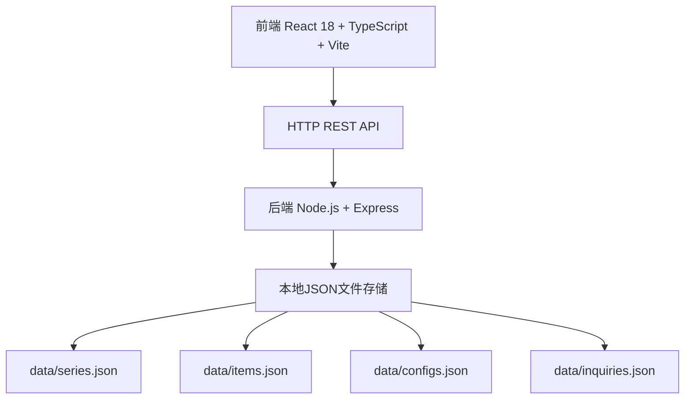
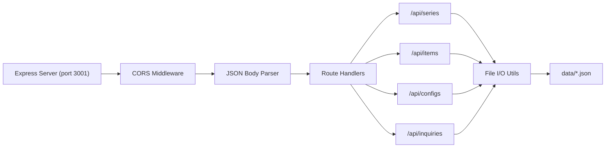
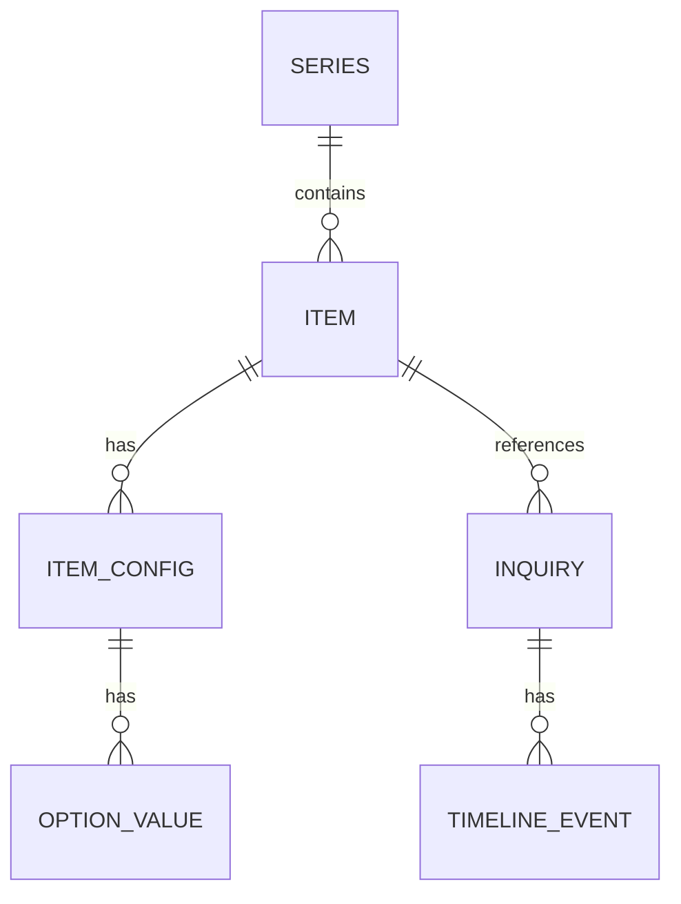

## 1. 架构设计



## 2. 技术说明

- **前端**：React 18 + TypeScript 5 + Vite 5 + @vitejs/plugin-react
- **状态管理**：React useState/useEffect 组件级状态，不引入额外状态管理库
- **后端**：Node.js + Express 4，提供 RESTful API
- **跨域**：cors 中间件，允许前端 3000 端口访问后端 3001 端口
- **数据存储**：本地 JSON 文件模拟数据库（data/ 目录）
- **工具库**：uuid（ID生成）、date-fns（日期处理）、react-beautiful-dnd（拖拽排序）
- **样式方案**：纯 CSS + CSS Grid/Flexbox，通过 CSS 变量实现主题色

## 3. 路由定义

| 前端路由 | 页面 | 说明 |
|----------|------|------|
| / | 客户配置页 | 默认入口，展示系列和单品选择 |
| /admin/series | 系列管理页 | 设计师后台管理系列和单品 |
| /admin/inquiries | 询问单后台页 | 查看和管理客户询问单 |

## 4. API 定义

### 4.1 系列 (Series)

```typescript
interface Series {
  id: string;
  name: string;
  coverImage: string;
  description: string;
  createdAt: string;
}
```

| 方法 | 路径 | 说明 | 请求体 | 响应 |
|------|------|------|--------|------|
| GET | /api/series | 获取所有系列 | - | Series[] |
| POST | /api/series | 创建系列 | Series | Series |
| PUT | /api/series/:id | 更新系列 | Partial<Series> | Series |
| DELETE | /api/series/:id | 删除系列 | - | { success: true } |

### 4.2 单品 (Items)

```typescript
interface Item {
  id: string;
  seriesId: string;
  name: string;
  description: string;
  basePrice: number;
  mainImage: string;
  tags: string[];
  createdAt: string;
}
```

| 方法 | 路径 | 说明 | 请求体 | 响应 |
|------|------|------|--------|------|
| GET | /api/items | 获取所有单品（可按 seriesId 过滤） | - | Item[] |
| GET | /api/items/:id | 获取单品详情 | - | Item |
| POST | /api/items | 创建单品 | Item | Item |
| PUT | /api/items/:id | 更新单品 | Partial<Item> | Item |
| DELETE | /api/items/:id | 删除单品 | - | { success: true } |

### 4.3 选项配置 (Configs)

```typescript
interface OptionValue {
  id: string;
  label: string;
  priceAdjustment: number;
  color?: string;
  size?: string;
}

interface ItemConfig {
  id: string;
  itemId: string;
  name: string;
  order: number;
  values: OptionValue[];
}
```

| 方法 | 路径 | 说明 | 请求体 | 响应 |
|------|------|------|--------|------|
| GET | /api/configs | 获取所有配置（可按 itemId 过滤） | - | ItemConfig[] |
| POST | /api/configs | 创建配置 | ItemConfig | ItemConfig |
| PUT | /api/configs/:id | 更新配置（含重新排序） | Partial<ItemConfig> | ItemConfig |
| PUT | /api/configs/reorder | 批量更新配置顺序 | { orders: { id: string; order: number }[] } | { success: true } |
| DELETE | /api/configs/:id | 删除配置 | - | { success: true } |

### 4.4 询问单 (Inquiries)

```typescript
type InquiryStatus = 'pending' | 'quoted' | 'making' | 'completed';

interface TimelineEvent {
  id: string;
  type: 'status_change' | 'message' | 'note';
  timestamp: string;
  content: string;
  author: 'customer' | 'shop';
  status?: InquiryStatus;
}

interface Inquiry {
  id: string;
  itemId: string;
  selectedOptions: { [configId: string]: string };
  totalPrice: number;
  customerName: string;
  customerEmail: string;
  customerMessage: string;
  status: InquiryStatus;
  timeline: TimelineEvent[];
  createdAt: string;
}
```

| 方法 | 路径 | 说明 | 请求体 | 响应 |
|------|------|------|--------|------|
| GET | /api/inquiries | 获取所有询问单 | - | Inquiry[] |
| GET | /api/inquiries/:id | 获取询问单详情 | - | Inquiry |
| POST | /api/inquiries | 创建询问单（客户提交） | Omit<Inquiry, 'id' 'createdAt' 'timeline'> | Inquiry |
| PUT | /api/inquiries/:id | 更新询问单状态 | { status: InquiryStatus } | Inquiry |
| POST | /api/inquiries/:id/notes | 添加备注 | { content: string; author: 'shop' } | TimelineEvent |
| PUT | /api/inquiries/:id/notes/:eventId | 编辑备注 | { content: string } | TimelineEvent |
| DELETE | /api/inquiries/:id/notes/:eventId | 删除备注 | - | { success: true } |

## 5. 服务端架构图



## 6. 数据模型

### 6.1 数据模型关系图



### 6.2 JSON 文件结构

**data/series.json**
```json
[
  {
    "id": "uuid",
    "name": "系列名称",
    "coverImage": "图片URL",
    "description": "系列描述",
    "createdAt": "ISO时间戳"
  }
]
```

**data/items.json**
```json
[
  {
    "id": "uuid",
    "seriesId": "关联系列ID",
    "name": "单品名称",
    "description": "单品描述",
    "basePrice": 99,
    "mainImage": "主图URL",
    "tags": ["古典", "波西米亚"],
    "createdAt": "ISO时间戳"
  }
]
```

**data/configs.json**
```json
[
  {
    "id": "uuid",
    "itemId": "关联单品ID",
    "name": "链长",
    "order": 0,
    "values": [
      { "id": "uuid", "label": "40cm", "priceAdjustment": 0 },
      { "id": "uuid", "label": "45cm", "priceAdjustment": 5 }
    ]
  }
]
```

**data/inquiries.json**
```json
[
  {
    "id": "uuid",
    "itemId": "单品ID",
    "selectedOptions": { "configId": "valueId" },
    "totalPrice": 104,
    "customerName": "客户姓名",
    "customerEmail": "email@example.com",
    "customerMessage": "定制需求描述",
    "status": "pending",
    "timeline": [
      {
        "id": "uuid",
        "type": "status_change",
        "timestamp": "ISO时间戳",
        "content": "订单创建",
        "author": "shop",
        "status": "pending"
      }
    ],
    "createdAt": "ISO时间戳"
  }
]
```
