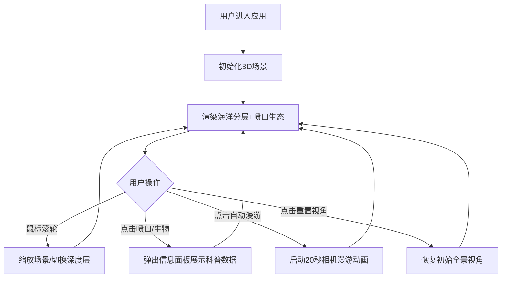

## 1. 产品概述
深蓝秘境是一款基于WebGL的深海热液喷口生态虚拟现实交互可视化应用，面向海洋生物学教育场景，帮助学生直观理解从海面到海底4000米的垂直分层结构及热液喷口周围独特的生物群落分布。
- 主要目标：解决传统2D剖面图难以展现深海3D空间结构和生态分布的教学痛点
- 目标用户：海洋生物学教育工作者、学生及深海生态爱好者

## 2. 核心功能

### 2.1 功能模块
1. **深海场景分层展示**：0-4000米深度的四层海洋结构（透光层、弱光层、黑暗层、深渊层）可视化
2. **热液喷口生态系统**：2-4个随机分布的热液喷口，含粒子烟柱、管虫、盲虾、巨型贝类
3. **生物信息交互面板**：点击喷口或生物簇，右上角弹出带毛玻璃效果的科普信息面板
4. **相机自动漫游**：预定义路径的20秒自动游览，带缓动动画
5. **光照与体积光系统**：海面平行光、喷口橙红点光源、水下体积雾效果

### 2.2 页面详情
| 页面名称 | 模块名称 | 功能描述 |
|-----------|-------------|---------------------|
| 主场景页 | 海洋分层渲染 | 四层半透明渐变水体，随缩放平滑过渡 |
| 主场景页 | 喷口粒子系统 | 黑色高温烟柱粒子升腾扩散效果 |
| 主场景页 | 生物群落动画 | 管虫弯曲生长、盲虾粒子游动动画 |
| 主场景页 | 信息面板 | 毛玻璃半透明面板，展示名称/深度/温度/科普 |
| 主场景页 | 控制按钮组 | 自动漫游、重置视角按钮 |
| 主场景页 | 相机漫游系统 | 20秒预设路径缓动动画漫游 |

## 3. 核心流程
用户打开应用后进入3D深海场景，可通过鼠标滚轮缩放浏览不同深度层，点击喷口或生物查看科普信息，也可启动自动漫游模式全程观赏。

## 4. 用户界面设计

### 4.1 设计风格
- 主色调：深蓝黑渐变背景（#000814到#001d3d）
- 文字色：白色（#ffffff）、淡蓝色（#88c0d0）
- 按钮风格：圆角矩形半透明（rgba(255,255,255,0.1)），悬停rgba(255,255,255,0.3)，0.2s过渡
- 信息面板：backdrop-filter: blur(10px)毛玻璃，背景rgba(0,0,0,0.3)，0.3s淡入
- 标题发光：text-shadow: 0 0 8px #00aaff
- 字体：系统默认无衬线体

### 4.2 页面设计概述
| 页面名称 | 模块名称 | UI元素 |
|-----------|-------------|-------------|
| 主场景页 | 标题区 | 左上角"深蓝秘境"白色细体字带淡蓝发光 |
| 主场景页 | 信息面板 | 右上角毛玻璃面板，0.4s交叉淡入切换内容 |
| 主场景页 | 按钮组 | 右下角固定竖排按钮组（自动漫游/重置视角） |
| 主场景页 | 3D画布 | 全屏Canvas，深蓝黑渐变背景 |

### 4.3 响应式
- 桌面优先（1280x720+）：比例居中布局
- 移动端（≤768px）：UI元素缩小80%，竖排布局优化

### 4.4 3D场景指导
- **环境与氛围**：深海幽蓝主调，从海面亮蓝渐变到海底深黑，体积光雾营造水下朦胧感
- **光照设置**：海面平行光模拟阳光（角度微变），喷口橙红点光源（强度1.5），FogExp2体积雾（密度0.012）
- **相机设置**：PerspectiveCamera，初始俯视全景，支持鼠标滚轮缩放、拖拽旋转
- **构图与焦点**：海底喷口为视觉焦点，管虫和盲虾形成生物群落簇，海面透光层为上方边界
- **交互与动画**：粒子烟柱持续升腾，管虫轻微摇曳，盲虾随机游动，相机漫游使用缓动曲线
- **后处理与性能**：总粒子数≤8000，确保Intel i5集成显卡稳定30FPS+
